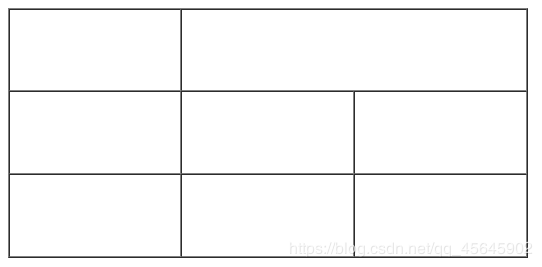
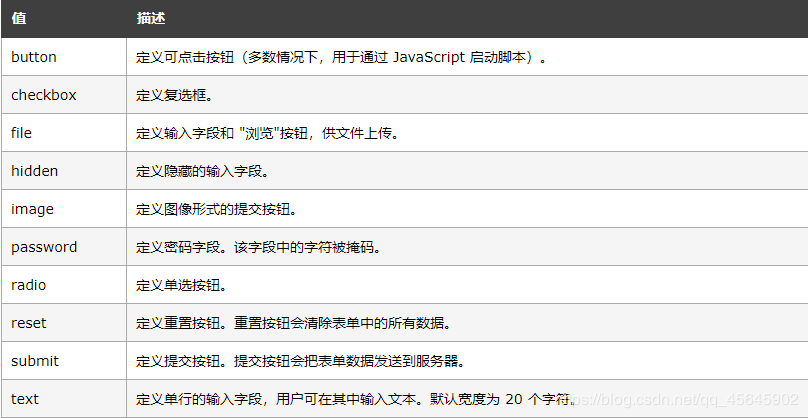
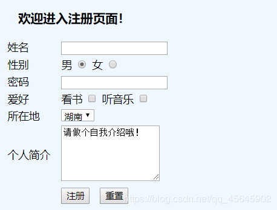

[TOC]

#### 一、表格标签
> 不是用来布局页面的，而是用来显示、展示数据的。
```html
  <table></table>	表格
  <tr></tr>		表格中的行
  <td></td>		表格中的列
  <th></th>		表头
  <caption></caption>	表格标题
```

##### 1、基本使用
**1.1、语法**
```html
  <table>
    <tr>
      <td>内容</td>
		....
    </tr>	
	...
  </table>
```

**1.2、定义和用法：**
&emsp;1、`<table>` 标签定义`HTML`表格。
&emsp;2、简单的`HTML`表格由`table`元素以及一个或多个`tr`、`th`或`td`元素组成。
&emsp;3、`tr`元素定义表格行，`th`元素定义表头，`td`元素定义表格单元。
##### 2、表头单元格标签
> 表头单元格标签里面的文本内容加粗居中显示

**语法**
```html
  <table>
    <tr>
      <th>内容</th>
        ...
    </tr>	
        ...
  </table>
```
##### 3、&lt;table&gt; 中的属性
| 属性 | 值 | 描述 |
|--|--|--|
| align | 	left<br/>center<br/>right | 不赞成使用。<br/>规定表格相对周围元素的对齐方式。|
| bgcolor | rgb(x,x,x)<br/>#xxxxxx<br/>colorname | 不赞成使用。<br/>规定表格的背景颜色。 |
| border | pixels | 规定表格边框的宽度。<br/>默认为""，或者设置为 border="0"，表示显示没有边框的表格。 |
| cellpadding | pixels<br/>% | 规定单元边沿与其内容之间的空白。<br/>默认1像素 |
| cellspacing | pixels<br/>% | 规定单元格之间的空白。<br/>默认2像素 |
| frame | void<br/>above<br/>below<br/>hsides<br/>lhs<br/>rhs<br/>vsides<br/>box<br/>border | 规定外侧边框的哪个部分是可见的。 |
| rules | none<br/>groups<br/>rows<br/>cols<br/>all | 规定内侧边框的哪个部分是可见的。 |
| summary | text | 规定表格的摘要。 |
| width | pixels<br/>% | 规定表格的宽度 |
| height | pixels<br/>% | 规定表格的高度 |

**注释：**
&emsp;&emsp;1、所有浏览器都支持`<table>` 标签。
&emsp;&emsp;2、在 HTML 4.01 中，`table`元素的 `align`和`bgcolor`属性是不被赞成使用的。
&emsp;&emsp;在 XHTML 1.0 Strict DTD，`table`元素的`align`和`bgcolor`属性是不被支持的。
&emsp;&emsp;3、不常用，多用css来设置。

##### 4、表格结构标签
&emsp;表格可能很长，为了更好地表示表格的语义，可以将表格分割成表格头部和表格主体两大部分。
&emsp;`<thead>`标签为表格头部区域，内部必须有`<tr>`标签，一般位于第一行。
&emsp;`<tbody>`标签为表格主体区域，用于存放数据本体。
&emsp;`<thead>`标签和`<tbody>`标签都放在`<table></table>`标签中。

##### 5、合并单元格
&emsp;`rowspan`  —— 跨行合并
&emsp;`colspan` —— 跨列合并

**方法**
&emsp;1、先确定跨行还是跨列合并
&emsp;2、找到目标单元格，合并
&emsp;3、删除多余单元格

**示例：**
```html
    <table border="1" width="520" height="250" cellspacing="0">
        <!-- 第一行 -->
        <tr>
            <td></td>
            <td colspan="2"></td>
            <!-- <td></td>  删除它 -->
        </tr>
        <!-- 第二行 -->
        <tr>
            <td></td>
            <td></td>
            <td></td>
        </tr>
        <!-- 第三行 -->
        <tr>
            <td></td>
            <td></td>
            <td></td>
        </tr>
    </table>
```

**运行结果：**



---
#### 二、列表标签
##### 1、==无序列表==
**语法**
```html
    <ul>
        <li> </li>
        <li> </li>
        ...
    </ul>
```

**注释**
&emsp;&emsp;1、无序列表的各个列表项之间没有顺序级别之分，是并列的(整齐没有空隙)，默认使用粗体圆点（典型的小黑圆圈）进行标记。
&emsp;&emsp;2、`<ul></ul>`常用的属性参数：type设定的符号样式(可选值：disc，circle(默认)，square，分别对应于实心圆、空心圆和正方形)。但我们一般用css来设置样式(取消符号样式：**list-style: none;** )。
&emsp;&emsp;3、`<ul></ul>`中只能嵌套`<li></li>`，直接在`<ul></ul>` 标签中输入其他标签或文字的做法是不被允许的。
&emsp;&emsp;4、`<li>`与`</li>`之间相当于一个容器，可以容纳所有元素，内部可以使用段落、换行符、图片、链接以及其他列表等等。

##### 2、有序列表
**语法**
```html
    <ol>
        <li> </li>
        <li> </li>
        ...
    </ol>
```

**注释**
&emsp;&emsp;1、有序列表的各个列表项之间会按照一定的顺序排列，默认使用数字进行标记。
&emsp;&emsp;2、排序列表标签`<ol></ol>`常用的属性参数：type设定编号的样式(可选值：1(默认值)，a，A，I，i，分别对应于正整数、小写英文字母、大写英文字母、大写罗马数字、小写罗马数字)，start设定开始的编号。但我们一般用css来设置样式(取消符号样式：**list-style: none;** )。
&emsp;&emsp;3、`<ol></ol>`中只能嵌套`<li></li>`，直接在`<ol></ol>`标签中输入其他标签或文字的做法是不被允许的。
&emsp;&emsp;4、`<li>`与`</li>`之间相当于一个容器，可以容纳所有元素，内部可以使用段落、换行符、图片、链接以及其他列表等等。

##### 3、==自定义列表==
> 常用于对术语或名词进行解释和描述，定义列表的列表项前没有任何项目符号。

**语法**
```html
    <dl>
        <dt> 名词1 </dt>
        <dd> 名词1解释1 </dd>
        <dd> 名词1解释2 </dd>
        ...
        <dt> 名词2 </dt>
        <dd> 名词2解释1 </dd>
        <dd> 名词2解释2 </dd>
        ...
        ...
    </dl>
```

**注释**
&emsp;&emsp;1、`<dl></dl>`里面只能包含`</dt>`和`</dd>`。
&emsp;&emsp;2、`</dt>`和`</dd>`个数没有限制，经常是一个`</dt>`对应多个`</dd>`。
&emsp;&emsp;3、内部可以使用段落、换行符、图片、链接以及其他列表等等。

---
#### 三、==表单标签==
##### 1、目的
> 收集用户信息，比如注册、登录

##### 2、组成
###### 2.1、表单域
```html
    <form></form>
```
		
###### 2.2、表单控件(或表单元素)
**==`<input></input>` 表单元素==**

```html
    <input type="属性">
```



&emsp;
除了type属性外，还有其他常用属性：
| 属性 | 用法 | 描述 |
|--|--|--|
| name | name="名称" | 定义input元素的名称 |
| value | value="值" | 规定input元素的值 |
| checked | checked="checked" | 规定此input元素首次加载时应当被选中 |
| maxlength | maxlength="正整数" | 规定输入字段中的字符的最大长度 |

示例：
```html
    性别：
    <!-- 此处性别单选按钮名字name必须相同 -->
    男 <input type="radio" name="sex">
    女 <input type="radio" name="sex" checked="checked">
    爱好：
    <!-- 此处爱好复选框名字name可以相同可以不同，最好有区别 -->
    玩耍 <input type="checkbox" name="hobby">
    睡觉 <input type="checkbox" name="hobby" checked="checked">
    看书 <input type="checkbox" name="hobby">
```

**注释：**
&emsp;&emsp;1、`name`和`value`是每个表单元素都有的属性，主要给后台人员使用。
&emsp;&emsp;2、`name`表单元素的名称，要求同一组单选按钮的`name`值必须相同，因为一组单选按钮必须有相同的`name`才能实现只选中其一的效果；而复选框没有要求，最好不一样，方便程序员区分。
&emsp;&emsp;3、`checked`属性主要针对于单选按钮和复选框，主要作用是默认选中这个表单元素。
&emsp;&emsp;4、`maxlength`是用户在表单元素输入的最大字符数，很少使用。

**==`label`标签==**
&emsp;`<label>`标签为`input`元素定义标注(标签)。用于绑定一个表单元素，当点击`<label>`标签内的文本时，浏览器会自动将焦点(光标)转到(或选择)对应的表单元素上，用来增加用户体验。

语法：
```html
    <label for="name"> 文本 </label>
    <input type="属性" id="name" />
```

示例：
```html
    <label for="sex"> 男 </label>
    <input type="radio" name="sex" id="nan" />
    <!-- 点击"男"，光标会自动选中单选按钮 -->
```

**注释**
&emsp;`<label>`标签的`for`属性应当与相关元素的`id`属性相同。

**==`<select></select>`下拉表单元素==**

**语法：**
```html
    <select>
        <option> 文本1 </option>
        <option> 文本2 </option>
        ...
    </select>
```

**示例：**
```html
    <p>
        所在地：
        <select name="place">
            <option value="shandong">山东</option>
            <option value="hunan" selected="selected">湖南</option>
            <!--属性=“属性”，默认选中，若无selected="selected"，则默认选中“山东”-->
            <option value="hebei">河北</option>
        </select>
    </p>
```

**注释**
&emsp;&emsp;`<select></select>`中至少包含一对`<option></option>`。
&emsp;&emsp;在`<option></option>`中定义`selected="selected"`时，默认选中此项。

**==`<textarea></textarea>`文本域元素==**
> 可滚动的多行文本输入控件

##### 3、问问时间
&emsp;问：页面中的表单元素很多，如何区别不同的表单元素？
&emsp;答：`name`属性：当前`input`表单的名字。后台可以通过`name`属性找到这个表单，从而区别不同的表单。

&emsp;问：区分表单域、文件域、文本域
&emsp;答：
| 域名 | 标签 | 说明 |
|--|--|--|
| 表单域 | form | 提交区域内表单元素给后台服务器 |
| 文件域 | file | 是input  type 属性值，用于上传文件 |
| 文本域 | textarea | 可以输入多行文字 |

##### 4、案例：注册



&emsp;

代码参考：HTML/register.html