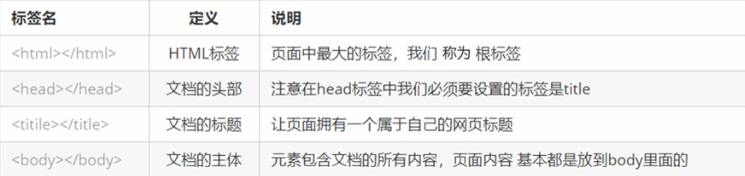
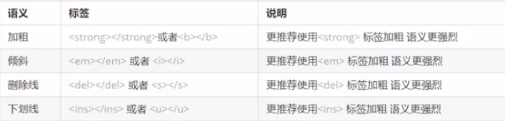
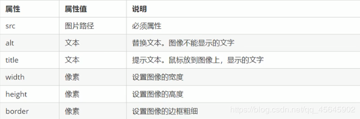
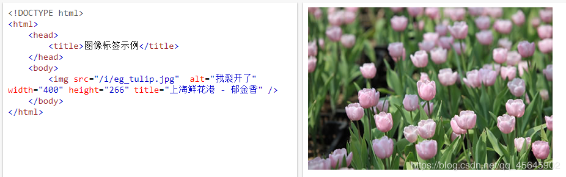
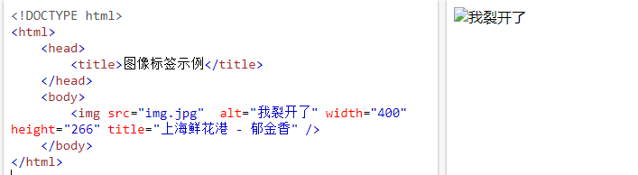
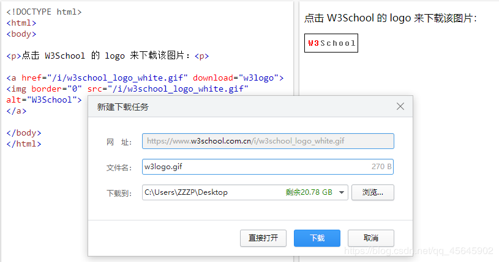
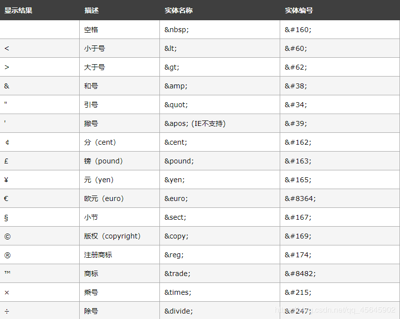

[TOC]

#### 1、预备知识
##### 1.1、标签

```html
	<html></html>  <!-- 此形式称为双标签 -->
	<br/>  <!-- 称为单标签 -->
```
双标签关系：包含关系、并列关系

包含关系：
```html
	<html>
		<head>
			<title>  </title>
		</head>
	<html/>
```

并列关系
```html
	<head>  </head>
	<body>  </body>
```

##### 1.2、html结构标签(骨架标签)
```html
	<html>
		<head>
			<title> 样例 </title>
		</head>
	
		<body>
			哈哈
		</body>
	<html/>
```


&emsp;
#### 2、网页开发工具
##### 2.1、文档类型声明标签
> `<!DOCTYPE>`
> 文档类型声明，作用就是告诉浏览器使用哪种HTML版本来显示网页

> `<!DOCTYPE html>`
> 表示当前页面采取的是HTML5版本来显示网页

**注释：**
`<!DOCTYPE>` 声明位于文档中的最前面的位置，处于`<html>`标签之前
`<!DOCTYPE>`不是`html`标签，是文档类型声明标签

##### 2.2、lang语言种类
`lang [language]`

> 用来定义当前文档显示的语言

**注释**
1、`en`定义语言为英语[english]
2、`zh-CN`定义语言为中文
简单来说，定义为`en`就是英文网页，定义为`zh-CN`就是中文网页
其实对于文档显示来说，定义成en的文档也可以显示中文，定义成zh-CN的文档也可以显示英文

> 对浏览器和搜索引擎有一定作用

##### 2.3、字符集
> 字符集(Character set)是多个字符的集合，以便计算机能够识别和存储各种文字。

在`<head>`标签内，可以通过`<meta>`标签的`charset`属性来规定`html`文档应该使用哪种字符编码。

```html
<meta charset="UTF-8"/>
```

**注释：**
&emsp;&emsp;必需。否则可能引起乱码。
&emsp;&emsp;`charset`常用的值有GB2312、BIG5、GBK、UTF-8，其中UTF-8也被称为万国码，基本包含了全世界所有国家需要用到的字符。

#### 3、HTML常用标签
> 让页面结构更清晰规范

##### 3.1、标题标签
```html
	<h1></h1> ~ <h6></h6>
```

##### 3.2、段落和换行标签
###### 段落标签
```html
    <p> </p>  <!-- 文本在一个段落中会根据浏览器窗口大小自动换行 -->
```

换行标签
```html
    <br/>  <!-- 强制换行 -->
```
##### 3.3、文本格式化标签



##### 3.4、`<div>`和`<span>`标签
&emsp;&emsp;没有语义，就是一个盒子，用来装饰内容。

&emsp;&emsp;一行只能放一个`<div>` (大盒子)
&emsp;&emsp;一行可以多个`<span>` (小盒子)

##### 3.5、图像标签
```html
	  <!-- src是图像标签的必需属性，用于指定图像文件的路径和文件名。 -->
```

**其他属性**



&emsp;
图像标签示例1
```html
	<!DOCTYPE html>
		<html>
			<head>
				<title>图像标签示例</title>
			</head>
			<body>
				
			</body>
	</html>
```
运行结果：


&emsp;
图像标签示例2：
```html
	<!DOCTYPE html>
		<html>
			<head>
				<title>图像标签示例</title>
			</head>
			<body>
			    
			</body>
	</html>
```
运行结果：


&emsp;

**注释：**
&emsp;&emsp;1、可以拥有多个属性，但必须写在标签名后面。
&emsp;&emsp;2、属性之间不分先后顺序，标签名与属性、属性与属性之间均以空格分开。
&emsp;&emsp;3、属性采取键值对的格式，即属性="属性值"。
##### 3.6、路径
&emsp;1、目录文件夹和根目录
&emsp;2、相对路径
&emsp;&emsp;以引用文件所在位置为参考基础，而建立出的目录路径，即文件相对于当前html页面的位置。
| 相对路径分类 | 符号 | 说明 |
|--|--|--|
| 同一级路径 |  | 文件位于html文件同一级 |
| 下一级路径 | **/** | 文件位于html文件下一级 |
| 上一级路径 | **. . /** | 文件位于html文件上一级 |
&emsp;3、绝对路径
&emsp;&emsp;指目录下的绝对位置，直接到达的目标位置，通常是从盘符开始的路径，例"D:\Web\imgs\img.jpg"
##### 3.7、链接标签
```html
    <a href="跳转目标URL" target="目标窗口的打开方式">文本或图像</a>
```

|属性| 作用 |
|--|--|
| href | 必需。用于指定链接目标的url地址 |
| target | 用于指定链接页面的打开方式。_self为默认值，表示在本页面打开新页面；_blank为在新窗口打开新页面 |

&emsp;1、**外部链接**
&emsp;&emsp;例：`<a href="https://www.baidu.com/"&gt;百度&lt;/a>`

&emsp;2、**内部链接**
&emsp;&emsp;网站内部页面之间的相互链接，直接链接内部页面名称即可。例：`<a href="index.html"&gt;首页&lt;/a>`

&emsp;3、**空连接**
&emsp;&emsp;`<a href="#"&gt;哈哈&lt;/a>`

&emsp;4、**下载链接**
&emsp;&emsp;1、如果`href`里面的地址是一个文件(.exe)、压缩包(.zip)等，会下载这个文件
&emsp;&emsp;2、使用`download`属性

```html
	<a download="filename">
	[filename：规定下载文件的名称]
```

**示例**
```html
	<!DOCTYPE html>
	<html>
		<body>
			<p>点击 W3School 的 logo 来下载该图片：<p>
			<a href="/i/w3school_logo_white.gif" download="w3logo">
				
			</a>
		</body>
	</html>
```
运行结果：



&emsp;

**注释：**
&emsp;&emsp;1、只有 Firefox 和 Chrome 支持`download`属性
&emsp;&emsp;2、在`<a>`标签中必须设置`href`属性。
&emsp;&emsp;3、该属性也可以设置一个值来规定下载文件的名称。所允许的值没有限制，浏览器将自动检测正确的文件扩展名并添加到文件 (.img, .pdf, .txt, .html, 等等)。

&emsp;5、**锚点链接**
> 作用
> 点击链接可以快速定位到页面中的某个位置

> 用法
> 在链接文本的`href`属性中，设置属性为 # 名字的形式，例 `<a href="#haha">`哈哈`</a>`
> 找到目标位置标签，里面添加一个`"id属性"="刚才的名字"`，例 `<p id="haha">`哈哈大本营`</p>` [此处的p可以改成其它的，例如`span`、`a`、`h1~h6`等]。还可以使用`<a name="haha">`哈哈大本营`</a>`

```html
	<!DOCTYPE HTML>
	<html>
	<head>
		<title>锚点链接示例</title>
	</head>
	<body>
		<ul>
			<li><a href="#haha">哈哈</a></li>
			<li><a href="#heihei">嘿嘿</a></li>
		</ul>
		<a name="haha">哈哈大本营1</a><!--设置锚点方法1-->
		<h3 id="haha">哈哈大本营2</h3><!--设置锚点方法2-->
		<p>哈了个哈</p><p>哈了个哈</p><p>哈了个哈</p><p>哈了个哈</p><p>哈了个哈</p><p>哈了个哈</p><p>哈了个哈</p><p>哈了个哈</p><p>哈了个哈</p>
		<a id="heihei" style="color:red;">嘿嘿大本营</a>
		<p>嘿嘿嘿</p><p>嘿嘿嘿</p><p>嘿嘿嘿</p><p>嘿嘿嘿</p><p>嘿嘿嘿</p><p>嘿嘿嘿</p><p>嘿嘿嘿</p><p>嘿嘿嘿</p><p>嘿嘿嘿</p><p>嘿嘿嘿</p><p>嘿嘿嘿</p><p>嘿嘿嘿</p><p>嘿嘿嘿</p><p>嘿嘿嘿</p>
		<p>嘿嘿嘿</p><p>嘿嘿嘿</p><p>嘿嘿嘿</p><p>嘿嘿嘿</p><p>嘿嘿嘿</p><p>嘿嘿嘿</p><p>嘿嘿嘿</p><p>嘿嘿嘿</p><p>嘿嘿嘿</p>
  	</body>
	</html>
```
**注释：**
&emsp;&emsp;用此方法进行页面内跳转，可以设置出一键回顶部效果，但看起来没有那么炫酷 (ˉ▽￣～)

~~~html
<!DOCTYPE html>
<html lang="en">

<head>
    <meta charset="UTF-8">
    <meta name="viewport" content="width=device-width, initial-scale=1.0">
    <script>
    </script>
</head>

<body>
    <span>本例来自w3school官网</span>
    <span>本例在安装邮件客户端程序后才能工作!</span>
    <p>简单创建电子邮件链接
        <a href="mailto:someone@microsoft.com?subject=Hello%20again">发送邮件</a>
    </p>

    <p>复杂创建电子邮件链接
        <a
            href="mailto:someone@microsoft.com?cc=someoneelse@microsoft.com&bcc=andsomeoneelse2@microsoft.com&subject=Summer%20Party&body=You%20are%20invited%20to%20a%20big%20summer%20party!">
            发送邮件!
        </a>
    </p>
    <!-- 单词直接空格使用 %20 代替，以确保浏览器可以正常显示文本。 -->
</body>

</html>
~~~

#### 4、HTML中的注释和特殊字符
##### 4.1、注释
	<!-- 注释语句 -->	[快捷键Ctrl+/]

##### 4.2、字符实体
> 在html页面中，一些特殊符号很难或不方便直接使用，此时需要字符实体来替代。


&emsp;

**注释**
&emsp;&emsp;1、使用实体名而不是数字的好处是，名称易于记忆。不过坏处是，浏览器也许并不支持所有实体名称（对实体数字的支持却很好）。
&emsp;&emsp;2、HTML 中的常用字符实体是不间断空格(&nbsp;)。
&emsp;&emsp;浏览器总是会截短 HTML 页面中的空格。如果在文本中写 10 个空格，在显示该页面之前，浏览器会删除它们中的 9 个。如需在页面中增加空格的数量，需要使用&amp;nbsp;字符实体.
&emsp;&emsp;3、实体名称对大小写敏感！
