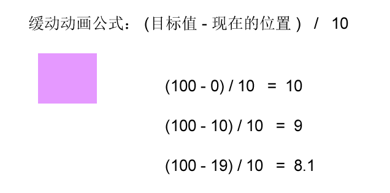
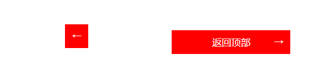

[TOC]


### 5、`mouseenter`和`mouseover`的区别
- 当鼠标移动到元素上时就会触发`mouseenter`事件
- 类似`mouseover`，它们两者之间的差别是
  -`mouseover`鼠标经过自身盒子会触发，经过子盒子还会触发
  -`mouseenter`只会经过自身盒子触发(鼠标经过盒子后，只要不离开盒子，即使是父盒子，都不会触发)
- 之所以这样，就是因为`mouseenter`不会冒泡
- 跟`mouseenter`搭配的鼠标离开`mouseleave`同样不会冒泡

### 6、动画函数封装
#### 6.1、动画实现原理
> 核心原理：通过定时器`setInterval()`不断移动盒子位置。

**示例**
**实现步骤**
1. 获得盒子当前位置
2. 让盒子在当前位置加上1个移动距离
3. 利用定时器不断重复这个操作
4. 加一个结束定时器的条件
5. 注意此元素需要添加定位，才能使用`element.style.left`

~~~js
<!DOCTYPE html>
<html lang="en">

<head>
    <meta charset="UTF-8">
    <meta name="viewport" content="width=device-width, initial-scale=1.0">
    <meta http-equiv="X-UA-Compatible" content="ie=edge">
    <title>Document</title>
    <style>
        div {
            /* 添加定位，为了使用 element.style.left */
            position: absolute;
            left: 0;
            width: 100px;
            height: 100px;
            background-color: red;
        }
    </style>
</head>

<body>
    <div></div>
    <script>
        // div.offsetLeft 获得盒子当前位置
        var div = document.querySelector('div');
        var timer = setInterval(function () {
            if (div.offsetLeft >= 400) {
                // 停止动画 本质是停止定时器
                clearInterval(timer);
            }
            div.style.left = div.offsetLeft + 1 + 'px';
        }, 30);
    </script>
</body>

</html>
~~~

#### 6.2、简单动画函数封装
函数需要传递2个参数，**动画对象**和**移动到的距离**

~~~js
<!DOCTYPE html>
<html lang="en">

<head>
    <meta charset="UTF-8">
    <meta name="viewport" content="width=device-width, initial-scale=1.0">
    <meta http-equiv="X-UA-Compatible" content="ie=edge">
    <title>Document</title>
    <style>
        div {
            position: absolute;
            left: 0;
            width: 100px;
            height: 100px;
            background-color: red;
        }

        span {
            position: absolute;
            left: 0;
            top: 200px;
            display: block;
            width: 150px;
            height: 150px;
            background-color: skyblue;
        }
    </style>
</head>

<body>
    <div></div>
    <span>我是一颗小小的石头</span>
    <script>
        // 简单动画函数封装：obj 目标对象、target 目标位置
        function animate(obj, target) {
            var timer = setInterval(function () {
                if (obj.offsetLeft >= target) {
                    // 停止动画 本质是停止定时器
                    clearInterval(timer);
                }
                obj.style.left = obj.offsetLeft + 1 + 'px';
            }, 30);
        }
        // 获取元素
        var div = document.querySelector('div');
        var span = document.querySelector('span');
        // 调用函数
        animate(div, 300);
        animate(span, 200);
    </script>
</body>

</html>
~~~

#### 6.3、动画函数给不同元素记录不同定时器
如果多个元素都使用这个动画函数，每次都要`var`声明定时器。我们可以给不同的元素使用不同的定时器（自己专门用自己的定时器）。

```js
<!DOCTYPE html>
<html lang="en">

<head>
    <meta charset="UTF-8">
    <meta name="viewport" content="width=device-width, initial-scale=1.0">
    <title>Document</title>
    <style>
        div {
            position: absolute;
            left: 0;
            width: 100px;
            height: 100px;
            background-color: red;
        }

        span {
            position: absolute;
            left: 0;
            top: 200px;
            display: block;
            width: 150px;
            height: 150px;
            background-color: skyblue;
        }
    </style>
</head>

<body>
    <button>点击我开启动画</button>
    <div></div>
    <span>点击按钮让我走</span>
    <script>
        function animate(obj, target) {
            // 当我们不断的点击按钮，这个元素的速度会越来越快，因为开启了太多的定时器
            // 解决方案就是：让我们元素只有一个定时器执行。先清除以前的定时器，只保留当前的一个定时器执行
            clearInterval(obj.timer);
            // 给不同的元素指定了不同的定时器。div传过来，这个obj就是div；span传过来，这个obj就是span
            obj.timer = setInterval(function () {
                if (obj.offsetLeft >= target) {
                    // 停止动画 本质是停止定时器
                    clearInterval(obj.timer);
                }
                obj.style.left = obj.offsetLeft + 1 + 'px';
            }, 30);
        }

        var div = document.querySelector('div');
        var span = document.querySelector('span');
        var btn = document.querySelector('button');
        // 调用函数
        animate(div, 300);
        // 点击按钮 span盒子调用函数能走了
        btn.addEventListener('click', function () {
            animate(span, 200);
        })
    </script>
</body>

</html>
```

#### 6.4、缓动效果原理
缓动动画就是让元素运动速度有所变化，最常见的是让速度慢慢停下来

**思路**
1. 让盒子每次移动的距离慢慢变小，速度就会慢慢落下来。
2. 核心算法： (目标值 - 现在的位置)   /  10    做为每次移动的距离步长



3. 停止的条件是： 让当前盒子位置等于目标位置就停止定时器  
4. 注意步长值需要取整

**总结**
匀速动画：盒子当前的位置 +  固定的值
缓动动画：盒子当前的位置 + 变化的值(目标值 - 现在的位置) / 10）
~~~js
<!DOCTYPE html>
<html lang="en">

<head>
    <meta charset="UTF-8">
    <meta name="viewport" content="width=device-width, initial-scale=1.0">
    <meta http-equiv="X-UA-Compatible" content="ie=edge">
    <title>Document</title>
    <style>
        div {
            position: absolute;
            left: 0;
            width: 100px;
            height: 100px;
            background-color: red;
        }

        span {
            position: absolute;
            left: 0;
            top: 200px;
            display: block;
            width: 150px;
            height: 150px;
            background-color: skyblue;
        }
    </style>
</head>

<body>
    <button>点击</button>
    <span>启动</span>
    <script>
        function animate(obj, target) {
            // 先清除以前的定时器，只保留当前的一个定时器执行
            clearInterval(obj.timer);
            obj.timer = setInterval(function () {
                // 步长值写到定时器的里面
                var step = (target - obj.offsetLeft) / 10;
                if (obj.offsetLeft == target) {
                    // 停止动画 本质是停止定时器
                    clearInterval(obj.timer);
                }
                // 把每次加1这个步长值改为一个慢慢变小的值:step
                // 步长(step)公式：(目标值 - 现在的位置) / 10
                obj.style.left = obj.offsetLeft + step + 'px';

            }, 15);
        }
        var span = document.querySelector('span');
        var btn = document.querySelector('button');

        btn.addEventListener('click', function () {
            // 调用函数
            animate(span, 500);
        })
    </script>
</body>

</html>
~~~

##### 6.4.1、动画函数多个目标值之间移动
可以让动画函数从 800 移动到 500。

点击按钮时，判断步长是正值还是负值
​	1.如果是正值，则步长往大了取整
​	2.如果是负值，则步长往小了取整

~~~js
<!DOCTYPE html>
<html lang="en">

<head>
    <meta charset="UTF-8">
    <meta name="viewport" content="width=device-width, initial-scale=1.0">
    <meta http-equiv="X-UA-Compatible" content="ie=edge">
    <title>Document</title>
    <style>
        div {
            position: absolute;
            left: 0;
            width: 100px;
            height: 100px;
            background-color: red;
        }

        span {
            position: absolute;
            left: 0;
            top: 200px;
            display: block;
            width: 150px;
            height: 150px;
            background-color: skyblue;
        }
    </style>
</head>

<body>
    <button class="btn500">点击500</button>
    <button class="btn800">点击800</button>
    <span>启动</span>
    <script>
        function animate(obj, target) {
            // 先清除以前的定时器，只保留当前的一个定时器执行
            clearInterval(obj.timer);
            obj.timer = setInterval(function () {
                // 步长值写到定时器的里面
                // 把步长值改为整数，不要出现小数的问题
                // 还要考虑步长是正值、负值
                // 所以这个要修改 var step = Math.ceil((target - obj.offsetLeft) / 10);
                var step = (target - obj.offsetLeft) / 10;
                step = step > 0 ? Math.ceil(step) : Math.floor(step);
                if (obj.offsetLeft == target) {
                    // 停止动画 本质是停止定时器
                    clearInterval(obj.timer);
                }
                // 把每次加1这个步长值改为一个慢慢变小的值:step
                // 步长(step)公式：(目标值 - 现在的位置) / 10
                obj.style.left = obj.offsetLeft + step + 'px';
            }, 15);
        }
        var span = document.querySelector('span');
        var btn500 = document.querySelector('.btn500');
        var btn800 = document.querySelector('.btn800');

        btn500.addEventListener('click', function () {
            // 调用函数
            animate(span, 500);
        })
        btn800.addEventListener('click', function () {
            // 调用函数
            animate(span, 800);
        })
    </script>
</body>

</html>
~~~
##### 6.4.2、缓动函数添加回调函数
回调函数原理：函数可以作为一个参数。将这个函数作为参数传到另一个函数里面，当那个函数执行完之后，再执行传进去的这个函数，这个过程就叫做回调。

回调函数写的位置：定时器结束的位置。

~~~js
<!DOCTYPE html>
<html lang="en">

<head>
    <meta charset="UTF-8">
    <meta name="viewport" content="width=device-width, initial-scale=1.0">
    <meta http-equiv="X-UA-Compatible" content="ie=edge">
    <title>Document</title>
    <style>
        div {
            position: absolute;
            left: 0;
            width: 100px;
            height: 100px;
            background-color: pink;
        }

        span {
            position: absolute;
            left: 0;
            top: 200px;
            display: block;
            width: 150px;
            height: 150px;
            background-color: purple;
        }
    </style>
</head>

<body>
    <button class="btn500">点击500</button>
    <button class="btn800">点击800</button>
    <span>启动</span>
    <script>
        function animate(obj, target, callback) {
            // 相当于 callback = function() {}  调用：callback()

            // 先清除以前的定时器，只保留当前的一个定时器执行
            clearInterval(obj.timer);
            obj.timer = setInterval(function () {
                // 步长值写到定时器的里面
                // 把我们步长值改为整数 不要出现小数的问题
                // var step = Math.ceil((target - obj.offsetLeft) / 10);
                var step = (target - obj.offsetLeft) / 10;
                step = step > 0 ? Math.ceil(step) : Math.floor(step);
                if (obj.offsetLeft == target) {
                    // 停止动画 本质是停止定时器
                    clearInterval(obj.timer);
                    // 回调函数写到定时器结束里面
                    // if (callback) {
                    //     // 调用函数
                    //     callback();
                    // }
                    callback && callback();
                    }
                }
                // 把每次加1 这个步长值改为一个慢慢变小的值  步长公式：(目标值 - 现在的位置) / 10
                obj.style.left = obj.offsetLeft + step + 'px';

            }, 15);
        }
        var span = document.querySelector('span');
        var btn500 = document.querySelector('.btn500');
        var btn800 = document.querySelector('.btn800');

        btn500.addEventListener('click', function () {
            // 调用函数
            animate(span, 500);
        })
        btn800.addEventListener('click', function () {
            // 调用函数
            animate(span, 800, function () {
                // 将函数传给 callback
                span.style.backgroundColor = 'red';
            });
        })
    </script>
</body>

</html>
~~~

#### 6.5、节流阀
**目的**
> 当上一个函数动画内容执行完毕，再去执行下一个函数动画，让事件无法连续触发。
> 
例如：防止轮播图按钮连续点击造成播放过快。

**思路**
> 利用回调函数，添加一个变量来控制，锁住函数和解锁函数。

- 开始设置一个变量 `var flag= true;`
- 关闭水龙头 `if (flag) { flag = false; do something }`
- 利用回调函数动画执行完毕
- 打开水龙头 `flag = true`

#### 6.6、案例
##### 6.6.1、动画函数封装 —— 网页轮播图
> 轮播图也称为焦点图，是网页中比较常见的网页特效。


代码参考：WebAPI/PC端网页特效2/rotationChart

##### 6.6.2、类似于右侧弹出返回顶部按钮
**思路**
- 鼠标经过小盒子时让大盒子滑动到左侧，同时改变箭头方向，经过 mouseenter
- 鼠标离开小盒子时让大盒子滑动到右侧，同时改变箭头方向，离开 mouseleave
- 采取回调函数
- 使用步长公式达到缓动效果：步长(step)公式：(目标值 - 现在的位置) / 10
- 当前盒子位置等于目标位置就停止定时器
- 把步长值改为整数，不要出现小数的问题
- 不要忘记先清除以前的定时器，只保留当前的一个定时器执行



代码参考：WebAPI/PC端网页特效2/goTop1.html

##### 6.6.3、元素滚动scroll+动画函数封装 —— 返回顶部
**要求**
带有动画的返回顶部

**思路**
1. 此时可以继续使用我们封装的动画函数
2. 只需要把所有的left 相关的值改为跟页面垂直滚动距离相关就可以了
3. 页面滚动了多少，可以通过 window.pageYOffset 得到
4. 最后是页面滚动，使用 window.scroll(x,y) 


代码参考：WebAPI/PC端网页特效2/goTop2.html

##### 6.6.4、动画函数封装 —— 筋头云图案跟随鼠标移动
**要求**
利用动画函数做动画效果

**思路**
1. 原先筋斗云的起始位置是0
2. 鼠标经过某个 li，把当前 li 的 offsetLeft 位置做为目标值即可
3. 鼠标离开某个 li，就把目标值设为 0
4. 如果点击了某个 li， 就把 li 当前的位置存储起来，做为筋斗云的起始位置


代码参考：WebAPI/PC端网页特效2/TumblingCloudCase