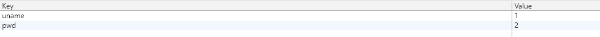
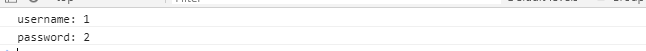
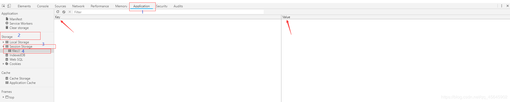
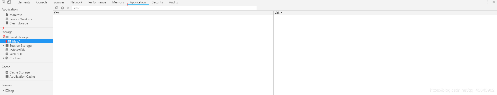
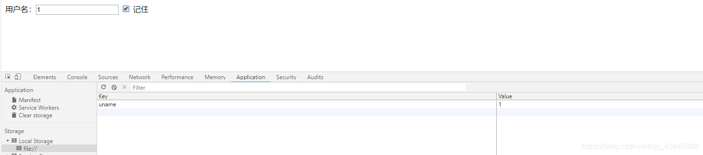

[TOC]
&emsp;
&emsp;

随着互联网的快速发展，基于网页的应用越来越普遍，同时也变的越来越复杂，为了满足各种各样的需求，会经常性在本地存储大量的数据，HTML5规范提出了相关解决方案。

### 1、本地存储特性
- 数据存储在用户浏览器中
- 设置、读取方便、甚至页面刷新不丢失数据
- 容量较大，`sessionStorage`约 5M、`localStorage`约 20M
- 只能存储字符串，可以将对象`JSON.stringify()`编码后存储
### 2、window.sessionStorage
- 生命周期为关闭浏览器窗口
- 在同一个窗口(页面)下数据可以共享
- 以键值对的形式存储使用

**存储数据**

```javascript
sessionStorage.setItem(key, value);
```

**获取数据**

```javascript
sessionStorage.getItem(key)
```

**删除数据**

```javascript
sessionStorage.removeItem(key)
```

**清空数据(所有都清除掉)**

```javascript
sessionStorage.clear()
```

**示例**
~~~js
<!DOCTYPE html>
<html lang="en">

<head>
    <meta charset="UTF-8">
    <meta name="viewport" content="width=device-width, initial-scale=1.0">
    <meta http-equiv="X-UA-Compatible" content="ie=edge">
    <title>Document</title>
</head>

<body>
    用户名：<input type="text" class="uname">
    密码：<input type="password" class="pwd">
    <button class="set">存储数据</button>
    <button class="get">获取数据</button>
    <button class="removeUname">删除用户名</button>
    <button class="removePassword">删除密码</button>
    <button class="del">清空所有数据</button>
    <script>
        // 生命周期为关闭浏览器窗口
        // 获取元素
        var uname = document.querySelector('.uname');
        var pwd = document.querySelector('.pwd');
        var set = document.querySelector('.set');
        var get = document.querySelector('.get');
        var removeUname = document.querySelector('.removeUname');
        var removepwd = document.querySelector('.removePassword');
        var del = document.querySelector('.del');
        set.addEventListener('click', function () {
            // 当我们点击了之后，就可以把表单里面的值存储起来
            var unameValue = uname.value;
            var pwdValue = pwd.value;
            sessionStorage.setItem('uname', unameValue);
            sessionStorage.setItem('pwd', pwdValue);
        });
        get.addEventListener('click', function () {
            // 当我们点击了之后，就可以把表单里面的值获取过来
            console.log('username: ' + sessionStorage.getItem('uname'));
            console.log('password: ' + sessionStorage.getItem('pwd'));
        });
        removeUname.addEventListener('click', function () {
            // 当我们点击了之后，删除用户名数据
            sessionStorage.removeItem('uname');
        });
        removepwd.addEventListener('click', function () {
            // 当我们点击了之后，删除用户密码
            sessionStorage.removeItem('pwd');
        });
        del.addEventListener('click', function () {
            // 当我们点击了之后，清除所有的数据
            sessionStorage.clear();
        });
    </script>
</body>

</html>
~~~


&emsp;

&emsp;


&emsp;
**查看会话存储方法**



### 3、window.localStorage
1、生命周期永久生效，除非手动删除，否则关闭浏览器也会存在
2、可以多窗口（页面）共享（同一浏览器可以共享）
3、以键值对的形式存储使用

**存储数据**

```javascript
localStorage.setItem(key, value)
```

**获取数据**

```javascript
localStorage.getItem(key)
```

**删除数据**

```javascript
localStorage.removeItem(key)
```

**清空数据(所有都清除掉)**

```javascript
localStorage.clear()
```

&emsp;
**查看本地存储方法**



#### 案例：记住用户名
**要求**
如果勾选记住用户名， 下次用户打开浏览器，就在文本框里面自动显示上次登录的用户名

**思路**
1. 把数据存起来，用到本地存储
2. 关闭页面，也可以显示用户名，所以用到localStorage
3. 打开页面，先判断是否有这个用户名，如果有，就在表单里面显示用户名，并且勾选复选框
4. 当复选框发生改变的时候change事件
5. 如果勾选，就存储，否则就移除

~~~js
<!DOCTYPE html>
<html lang="en">

<head>
    <meta charset="UTF-8">
    <meta name="viewport" content="width=device-width, initial-scale=1.0">
    <meta http-equiv="X-UA-Compatible" content="ie=edge">
    <title>Document</title>
</head>

<body>
    用户名：<input type="text" class="uname"> <input type="checkbox" name="" id="remember"> 记住
    <script>
        var uname = document.querySelector('.uname');
        var remember = document.querySelector('#remember');
        if (localStorage.getItem('uname')) {
            uname.value = localStorage.getItem('uname');
            remember.checked = true;
        }
        remember.addEventListener('change', function () {
            if (this.checked) {
                localStorage.setItem('uname', uname.value);
            } else {
                localStorage.removeItem('uname');
            }
        })
    </script>
</body>

</html>
~~~

