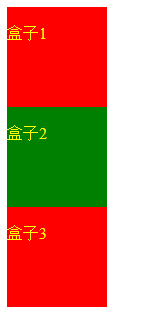

### CSS基础选择器
#### 目录
- 一、初识css
  - 1、css简介
  - 2、css语法
- 二、css基础选择器
  - 1、标签选择器
  - 2、类选择器
  - 3、id选择器
  - 4、通配符选择器

#### 一、初识css
##### 1、css简介
&emsp;css是层叠样式表(Cascading Style Sheets)，也可称为css样式表或级联样式表。样式通常存储在样式表中。
<br/>
&emsp;css也是一种标记语言。用于设置html页面中的文本内容、图片外形、版面布局和外观样式。
<br/>
&emsp;把样式添加到 HTML 4.0 中，是为了解决结构(html)与样式(css)分离的问题。
<br/>
&emsp;外部样式表可以极大提高了工作效率，通常存储在 CSS 文件中。

**多重样式将层叠为一个**
<br/>
&emsp;当同一个 HTML 元素被不止一个样式定义时，会使用哪个样式呢？
<br/>
&emsp;一般而言，所有的样式会根据下面的规则层叠于一个新的虚拟样式表中，其中 4) 拥有最高的优先权。
<br/>
- 1)、浏览器缺省设置
- 2)、外部样式表
- 3)、内部样式表（位于`<head>`标签内部）
- 4)、内联样式（在 HTML 元素内部）

##### 2、css语法
&emsp;css规则由两个主要的部分构成：选择器，以及一条或多条声明。


#### 二、css基础选择器
##### 1、标签选择器
> 用html标签名称作为选择器

**语法**
```css
标签名 {
	属性1: 属性值1 ；
	属性2: 属性值2 ；
	...
}
```

**优点**
<br/>
&emsp;可以把某一类标签全部选择出来，快速为页面中的同类型标签统一设置样式。
<br/>

**缺点**
<br/>
&emsp;不能设计差异化样式。

##### 2、类选择器
**语法**
```css
.类名 {
	属性1: 属性值1 ;
	...
}
```

**注释**
- 类名是自己命名的。
- 不要使用纯数字、中文等命名，尽量使用英文字母来表示，第一个字符不能使用数字。
- 命名要有意义。
- 需要用class属性来调用。
- 可以把一些标签元素相同的样式放到一个类里面，然后用class先调用这个类，再调用自己独有的类。

**示例**
```html
<!DOCTYPE html>
<html>

<head>
    <style>
        /* 类选择器 */
        .box {
            width: 100px;
            height: 100px;
        }

        .box1 {
            background-color: red;
        }

        .box2 {
            background-color: green;
        }

        /* 标签选择器 */
        span {
            color: yellow;
        }
    </style>
</head>

<body>
    <!-- class调用多个类 -->
    <div class="box box1">
        <span>
            <br />盒子1
        </span>
    </div>
    <div class="box box2">
        <span>
            <br />盒子2
        </span>
    </div>
    <div class="box box1">
        <span>
            <br />盒子3
        </span>
    </div>
</body>

</html>
```



##### 3、id选择器
> 以id属性来设置的id选择器

**语法**
```css
#id名 {
	属性1: 属性值1;
	...
}
```

**注释**
- id属性只能在每个html文档中调用一次(css中可以重复调用，但在使用js时，会不能正常获取)。
- 需要用id来调用

##### 4、通配符选择器
**语法**
```css
* {
	属性1: 属性值1;
	...
}
```

**注释**
- 不需要调用，自动给所有元素使用样式(包括body)。
- 特殊情况才使用
