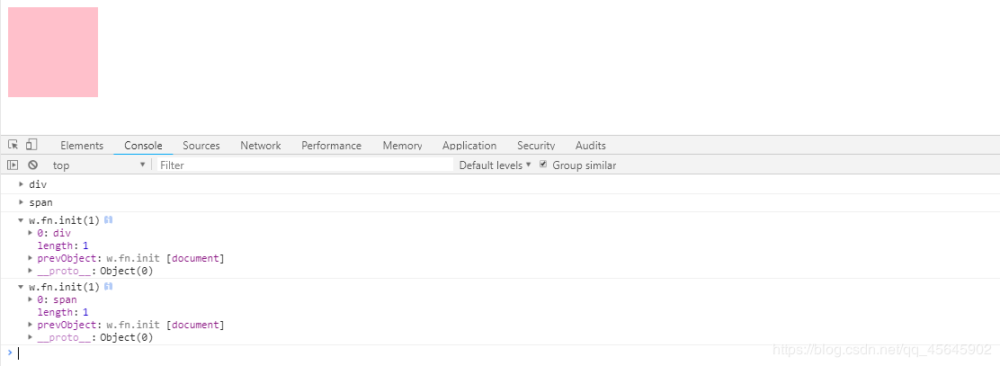

[TOC]

### 一、jQuery介绍
#### 1、JavaScript 库
仓库：可以把很多东西放到这个仓库里面，找东西只需要到仓库里面查找到就可以了。

> JavaScript库：即 library，是一个封装好的特定的集合（方法和函数）。从封装一大堆函数的角度理解库，就是在这个库中，封装了很多预先定义好的函数在里面，比如动画 animate、hide、show，比如获取元素等。

> 简单理解： 就是一个 js 文件，里面对我们原生 js 代码进行了封装，存放到里面。这样我们可以快速高效的使用这些封装好的功能了。

jQuery，就是为了快速方便的操作 DOM，里面基本都是函数（方法）。

**常见的JavaScript 库**
- jQuery
- Prototype
- YUI
- Dojo
- Ext JS
- 移动端的 zepto 等

这些库都是对原生 JavaScript 的封装，内部都是用 JavaScript 实现的。

#### 2、jQuery的概念
> jQuery 是一个快速、简洁的 JavaScript 库，其设计的宗旨是“write Less，Do More”，即倡导写更少的代码，做更多的事情。

- j 就是 JavaScript；   Query 查询； 意思就是查询 js，把 js 中的 DOM 操作做了封装，我们可以快速的查询使用里面的功能。
- jQuery 封装了 JavaScript 常用的功能代码，优化了 DOM 操作、事件处理、动画设计和 Ajax 交互。
- 学习 jQuery 的本质就是学习调用这些函数（方法）。
- jQuery 出现的目的是加快前端人员的开发速度，我们可以非常方便的调用和使用它，从而提高开发效率。


#### 3、jQuery的优点
1. 轻量级。核心文件才几十kb，不会影响页面加载速度。
2. 跨浏览器兼容，基本兼容了现在主流的浏览器。
3. 链式编程、隐式迭代。
4. 对事件、样式、动画支持，大大简化了 DOM 操作。
5. 支持插件扩展开发，有着丰富的第三方的插件，例如：树形菜单、日期控件、轮播图等。
6. 免费、开源。
###  二、jQuery 的基本使用
#### 1、jQuery 的下载
jQuery的官网地址：[https://jquery.com/](https://jquery.com/)

各个版本的下载：[https://code.jquery.com/](https://code.jquery.com/)

**版本**
> 1x ：兼容 IE 678 等低版本浏览器， 官网不再更新
> 2x ：不兼容 IE 678 等低版本浏览器， 官网不再更新
> 3x ：不兼容 IE 678 等低版本浏览器， 是官方主要更新维护的版本

**使用步骤**
- 引入 jQuery 文件。
` <script src="jquery.min.js"></script> `

- 在文档最末尾插入 script 标签，书写体验代码。

**示例**
* $('div').hide() 可以隐藏盒子

~~~js
// 盒子被隐藏
<!DOCTYPE html>
<html lang="en">

<head>
    <meta charset="UTF-8">
    <meta name="viewport" content="width=device-width, initial-scale=1.0">
    <title>Document</title>
    <script src="jquery.min.js"></script>
    <style>
        div {
            width: 200px;
            height: 200px;
            background-color: red;
        }
    </style>
</head>

<body>
    <div></div>
    <script>
        $('div').hide();
    </script>
</body>

</html>
~~~
但是这样写，盒子不能被隐藏
~~~js
<body>
    <script>
        $('div').hide();
    </script>
    <div></div>
</body>
~~~
我们用下面的入口函数解决：
#### 2、jQuery的入口函数
​jQuery中常见的两种入口函数：

```javascript
// // 等着页面 DOM 加载完毕再去执行 js 代码

// 第一种: 简单易用。
$(function () {   
    ...  // 此处是页面 DOM 加载完成的入口
}) ; 

// 第二种: 繁琐，但是也可以实现
$(document).ready(function(){
   ...  //  此处是页面DOM加载完成的入口
});
```

示例
~~~js
<body>
    <script>
        $(function () {
            $('div').hide();
        })
        // 或
        $(document).ready(function () {
            $('div').hide();
        })
    </script>
    <div></div>
</body>
~~~

​**注释**
1. 等着 DOM 结构渲染完毕即可执行内部代码，不必等到所有外部资源加载完成，jQuery 帮我们完成了封装。
2. 相当于原生 js 中的 DOMContentLoaded。
3. 不同于原生 js 中的 load 事件是等页面文档、外部的 js 文件、css 文件、图片加载完毕才执行内部代码。
4. 更推荐使用第一种方式。
#### 3、jQuery中的顶级对象$
1.  $ 是 jQuery 的**别称**，在代码中可以使用 jQuery 代替，但一般为了方便，通常都直接使用 $ 。
2.  $ 是jQuery的**顶级对象**，相当于原生JavaScript 中的 window，把元素利用 $ 包装成 jQuery 对象，就可以调用jQuery 的方法。

**示例**
~~~js
    <script>
        $(function () {
            alert(11)
        });
        jQuery(function () {
            alert(11)
        });
    </script>
~~~
#### 4、jQuery 对象和 DOM 对象
使用 jQuery 方法和原生 JS 获取的元素是不一样的，总结如下 : 
1. 用原生 JS 获取来的对象就是 DOM 对象
2. jQuery 方法获取的元素就是 jQuery 对象。
3. jQuery 对象本质是： 利用 $ 对 DOM 对象包装后产生的对象（伪数组形式存储）。

**示例**
~~~js
<!DOCTYPE html>
<html lang="en">

<head>
    <meta charset="UTF-8">
    <meta name="viewport" content="width=device-width, initial-scale=1.0">
    <title>Document</title>
    <script src="jquery.min.js"></script>
    <style>
        div {
            width: 100px;
            height: 100px;
            background-color: pink;
        }
    </style>
</head>

<body>
    <div></div>
    <span></span>
    <script>
        // DOM 对象：用原生js 获取过来的对象就是 DOM 对象
        var myDiv = document.querySelector('div'); // myDiv 是 DOM 对象
        var mySpan = document.querySelector('span'); // mySpan 是 DOM 对象
        console.dir(myDiv);
        console.dir(mySpan);
        // jQuery对象：用 jquery 方式获取过来的对象是 jQuery 对象。 本质：通过 $ 把 DOM 元素进行了包装
        $('div'); // $('div')是一个jQuery 对象
        $('span'); // $('span')是一个jQuery 对象
        console.dir($('div'));
        console.dir($('span'));
    </script>
</body>

</html>
~~~



> 只有 jQuery 对象才能使用 jQuery 方法，DOM 对象则使用原生的 JavaScirpt 方法。

**示例**
~~~js
    <script>
        // DOM 对象：用原生js 获取过来的对象就是 DOM 对象
        var myDiv = document.querySelector('div'); // myDiv 是 DOM 对象
        var mySpan = document.querySelector('span'); // mySpan 是 DOM 对象

        // Query 对象只能使用 jQuery 方法，DOM 对象则使用原生的 JavaScirpt 属性和方法
        myDiv.style.display = 'none';
        // myDiv.hide(); myDiv 是一个 dom 对象不能使用 jquery 里面的 hide 方法

        $('div').hide();
        // $('div').style.display = 'none'; 这个 $('div') 是一个 jQuery 对象不能使用原生 js 的属性和方法
    </script>
~~~


#### 5、jQuery 对象和 DOM 对象转换
​DOM 对象与 jQuery 对象之间是可以相互转换的，因为原生 js 比 jQuery 更大，原生的一些属性和方法 jQuery 没有封装，要想使用这些属性和方法需要把 jQuery 对象转换为 DOM 对象才能使用。

* DOM 对象转换成 jQuery 对象： `$(DOM对象)`

~~~js
var box = document.getElementById('box');  // 获取DOM对象
var jQueryObject = $(box);  // 把 DOM 对象转换为 jQuery 对象
~~~

* jQuery 对象转换为 DOM 对象
  * `$('标签')[index]`
  * `$('标签').get(index)`
  *   // index是索引号

~~~js
// 1、jQuery对象[索引值]
var domObject1 = $('div')[0]
// 2、jQuery对象.get(索引值)
var domObject2 = $('div').get(0)
~~~

**注释**
实际开发比较常用的是把 DOM 对象转换为 jQuery 对象，这样能够调用功能更加强大的 jQuery 中的方法。