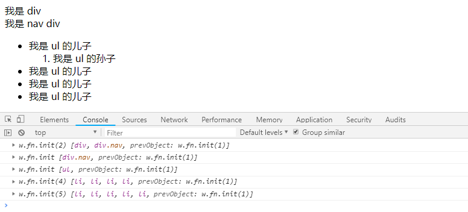
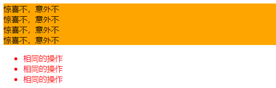
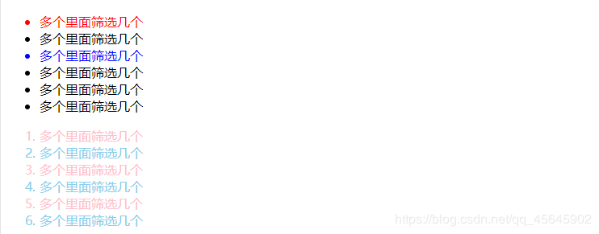
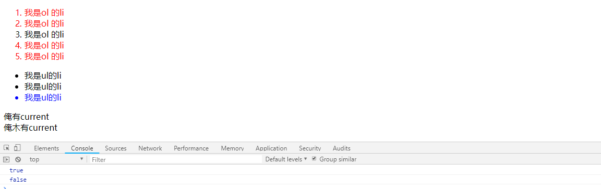

 [TOC]

### jQuery 选择器
原生 JS 获取元素方式很多，很杂，而且兼容性情况不一致，因此 jQuery 给我们做了封装，使获取元素统一标准。
#### 1、基础选择器
```js
  $("选择器")   // 里面的选择器直接写 CSS 选择器即可，但是要加引号 
```

|名称|用法|描述
|--|--|--|
ID选择器| `$('#id')` |获取指定 ID 的元素
全选选择器| `$('*')` |匹配所有元素
类选择器| `$('.class')` |获取同一类 class 的元素
标签选择器| `$('div')` |获取同一类标签的所有元素
并集选择器| `$('div,p,li')` |选取多个元素
交集选择器| `$('li.current')` |交集元素
#### 2、层级选择器
层级选择器最常用的两个分别为：后代选择器和子代选择器。

|名称|示例|描述
|--|--|--|
子代选择器| `$('ul>li')` | 使用 > 号，获取亲儿子层级的元素；注意，并不会获取孙子层级的元素
后代选择器| `$('ul li')` | 使用空格，代表后代选择器，获取 ul 下的所有 li 元素，包括孙子等

**基础选择器和层级选择器示例**

```js
<body>
    <div>我是 div</div>
    <div class="nav">我是 nav div</div>
    <ul>
        <li>我是 ul 的儿子
            <ol>
                <li>我是 ul 的孙子</li>
            </ol>
        </li>
        <li>我是 ul 的儿子</li>
        <li>我是 ul 的儿子</li>
        <li>我是 ul 的儿子</li>
    </ul>
    <script>
        $(function () {
            console.log($('div'));
            console.log($('.nav'));
            console.log($('ul'));
            console.log($('ul>li'));
            console.log($('ul li'));
        })
    </script>
</body>
```


##### 隐式迭代
> 把匹配的所有元素内部进行遍历循环，执行相应的方法，而不用再进行循环，简化了操作，方便调用。

**jQuery 设置样式**
~~~js
  $('div').css('属性','值')  // jquery对象不能使用style
~~~

~~~js
<body>
    <div>惊喜不，意外不</div>
    <div>惊喜不，意外不</div>
    <div>惊喜不，意外不</div>
    <div>惊喜不，意外不</div>
    <ul>
        <li>相同的操作</li>
        <li>相同的操作</li>
        <li>相同的操作</li>
    </ul>
    <script>
        // 给每个元素添加 css 方法
        // 获取四个div元素 
        var all = $("div");
        // 给四个div设置背景颜色为橙色
        all.css("background", "orange");
        // 将所有 li 的字体颜色设置为红色
        $("ul li").css("color", "red");
    </script>
</body>
~~~



#### 3、筛选选择器
> 顾名思义就是在所有的选项中选择满足条件的进行筛选选择

|名称|用法|描述
|--|--|--|
:first| `$('li:first')`| 获取第一个 li 元素
:last| `$('li:last')`| 获取最后一个 li 元素
:eq(index)| `$('li:eq(2)')`| 获取到的 li 元素中，选择索引号为2的元素，索引号 index 从0开始
:odd| `$('li:odd')`| 获取到的 li 元素中，选择索引号为奇数的元素
:even| `$('li:even')`| 获取到的 li 元素中，选择索引号为偶数的元素
示例**

```js
<body>
    <ul>
        <li>多个里面筛选几个</li>
        <li>多个里面筛选几个</li>
        <li>多个里面筛选几个</li>
        <li>多个里面筛选几个</li>
        <li>多个里面筛选几个</li>
        <li>多个里面筛选几个</li>
    </ul>
    <ol>
        <li>多个里面筛选几个</li>
        <li>多个里面筛选几个</li>
        <li>多个里面筛选几个</li>
        <li>多个里面筛选几个</li>
        <li>多个里面筛选几个</li>
        <li>多个里面筛选几个</li>
    </ol>
    <script>
        $(function () {
            $("ul li:first").css("color", "red");
            $("ul li:eq(2)").css("color", "blue");
            $("ol li:odd").css("color", "skyblue");
            $("ol li:even").css("color", "pink");
        })
    </script>
</body>
```



 jQuery 中还有一些筛选方法，类似 DOM 中的通过一个节点找另外一个节点，父、子、兄以外有所加强。
 **重点**


~~~js
<body>
    <ol>
        <li>我是ol 的li</li>
        <li>我是ol 的li</li>
        <li class="item">我是ol 的li</li>
        <li>我是ol 的li</li>
        <li>我是ol 的li</li>
    </ol>
    <ul>
        <li>我是ul的li</li>
        <li>我是ul的li</li>
        <li>我是ul的li</li>
    </ul>
    <div class="current">俺有current</div>
    <div>俺木有current</div>
    <script>
        // 注意一下都是方法 带括号
        $(function () {
            // 兄弟元素 siblings 除了自身元素之外的所有亲兄弟
            $("ol .item").siblings("li").css("color", "red");

            // 第n个元素
            var index = 2;
            // 1、利用选择器的方式选择
            $("ul li:eq(2)").css("color", "blue");
            $("ul li:eq(" + index + ")").css("color", "blue");
            // 2、利用选择方法的方式选择，更推荐这种写法
            $("ul li").eq(2).css("color", "blue");
            $("ul li").eq(index).css("color", "blue");

            // 判断是否有某个类名
            console.log($("div:first").hasClass("current"));
            console.log($("div:last").hasClass("current"));
        });
    </script>
</body>
~~~



##### 案例：仿新浪下拉菜单

- 代码参考 jQuery/2、jQuery常用的API/2.1、jQuery选择器/copySinaPullDownMenu.html

#### 4、jQuery 里面的排他思想
> 想要多选一的效果，排他思想：当前元素设置样式，其余的兄弟元素清除样式。

```js
        $(this).css("color", "red");
        $(this).siblings().css("color", "");
```

**示例**
~~~js
<body>
    <button>点击</button>
    <button>点击</button>
    <button>点击</button>
    <script>
        $(function () {
            // 隐式迭代 给所有的按钮都绑定了点击事件
            $("button").click(function () {
                // 当前的元素变化背景颜色
                $(this).css("background", "pink");
                // 其余的兄弟去掉背景颜色 隐式迭代
                $(this).siblings("button").css("background", "");
            });
        })
    </script>
</body>
~~~


#### 5、链式编程
为了节省代码量，看起来更优雅

```js
  $(this).css('color', 'red').sibling().css('color', ''); 
  // 相当于
  $(this).css('color', 'red');
  $(this).sibling().css('color', ''); 
```

#### 6、案例：淘宝精品服饰
**要求**
鼠标经过左侧导航，右侧相应的图片显示，其余图片隐藏


**思路** 
1.鼠标经过左侧盒子某个 li，就让内容区盒子相对应图片显示，其余的图片隐藏。
2.需要得到当前 li 的索引号，就可以显示对应索引号的图片
3.jQuery 得到当前元素索引号 $(this).index()
4.中间对应的图片可以通过  eq(index) 方法去选择
5.显示元素 show()   隐藏元素 hide()

- 代码参考 jQuery/2、jQuery常用的API/2.1、jQuery选择器/taobaoBoutiqueClothing.html