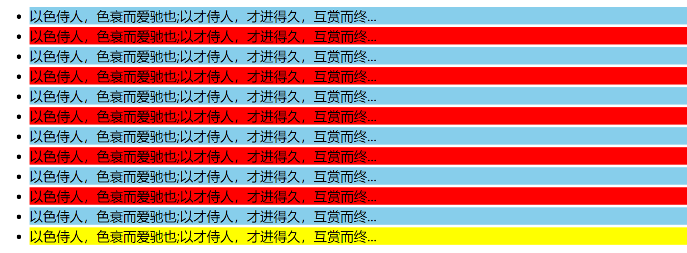

[TOC]

### jQuery 样式操作
jQuery中常用的样式操作有两种：css() 和 设置类样式方法
#### 1、操作 css 方法
> jQuery 可以使用 css 方法来修改简单元素样式；也可以操作类，修改多个样式。

​常用以下三种形式：
- 参数只写属性名，则是返回属性值
`$(this).css('属性名')`
~~~js
  var strColor = $(this).css('color');
~~~

- 参数是属性名，属性值，逗号分隔，是设置一组样式。属性必须加引号，值如果是数字可以不用跟单位和引号
`$(this).css('属性名','属性值')`
~~~js
  $(this).css(''color'', ''red'');
  
  $("div").css("width", 300);
~~~

- 参数可以是对象形式，方便设置多组样式。属性名和属性值用冒号隔开， 属性可以不用加引号
~~~js
  $(this).css({ "color":"white","font-size":"20px"});
  
  $("div").css({
      width: 400,
      height: 400,
      // 如果是复合属性则必须采取驼峰命名法，如果值不是数字，则需要加引号
      backgroundColor: "red"
   })
~~~
> css() 多用于样式少时操作，多了则不太方便。

##### 案例：图片突出显示

&emsp;


- 代码参考 jQuery/2、jQuery常用的API/2.2、jQuery样式操作/图片突出显示.html

##### 案例：隔行变色加高亮显示

**要求**
1.所有展示数据隔行变色，颜色自定义。
2.鼠标经过时高亮显示，移开后恢复。
3.代码要求：jQuery 的选择器、样式操作 css()



**思路**
  1.获取奇数行和偶数行
  2.设置不一样的颜色
  3.鼠标进入设置其他颜色
  4.移开恢复正常或者鼠标进入重新设置隔行变色覆盖之前操作
  5.mouseover 事件，或者 hover 事件均可

- 代码参考 jQuery/2、jQuery常用的API/2.2、jQuery样式操作/隔行变色加高亮显示.html

#### 2、设置类样式方法
> 作用等同于以前的 classList，可以操作类样式，注意操作类里面的参数不要加点。

常用的三种设置类样式方法：
- 添加类
```js
  $("div").addClass("current");
```
- 删除类
```js
  $("div").removeClass("current");
```
- 切换类
```js
  $("div").toggleClass("current");
```

**示例**
```js
<!DOCTYPE html>
<html lang="en">

<head>
    <meta charset="UTF-8">
    <meta name="viewport" content="width=device-width, initial-scale=1.0">
    <title>Document</title>
    <style>
        div {
            width: 150px;
            height: 150px;
            background-color: pink;
            margin: 100px auto;
            transition: all 0.5s;
        }

        .current {
            background-color: red;
            transform: rotate(360deg);
        }
    </style>
    <script src="jquery.min.js"></script>
</head>

<body>
    <div class="box1"></div>
    <div class="current box2"></div>
    <script>
        $(function () {
            // 添加类 addClass()
            $(".box1").click(function () {
                $(this).addClass("current");
            });
            // 删除类 removeClass()
            $(".box2").click(function () {
                $(this).removeClass("current");
            });
            // 切换类 toggleClass()
            // $("div").click(function () {
            //     $(this).toggleClass("current");
            // });
        })
    </script>
</body>

</html>
```

**注释**
1. 设置类样式方法比较适合样式多时操作，可以弥补 css() 的不足。
2. 原生 JS 中 className 会覆盖元素原先里面的类名，jQuery 里面类操作只是对指定类进行操作，不影响原先的类名。

**示例**
```js
<!DOCTYPE html>
<html lang="en">

<head>
    <meta charset="UTF-8">
    <meta name="viewport" content="width=device-width, initial-scale=1.0">
    <title>Document</title>
    <style>
        .one {
            width: 200px;
            height: 200px;
            background-color: pink;
            transition: all .3s;
        }

        .two {
            transform: rotate(720deg);
        }
    </style>
    <script src="jquery.min.js"></script>
</head>

<body>
    <div class="one two"></div>
    <script>
        var one = document.querySelector(".one");
        one.className = "two";  // 覆盖元素原先里面的类名 class="two"
        $(".one").addClass("two"); // addClass相当于追加类名,不影响以前的类名 class="one two"
        $(".one").removeClass("two"); // class="one"
    </script>
</body>

</html>
```
##### 案例：tab 栏切换
**要求**
鼠标点击上面相应的选项卡，下面的内容随之变化


&emsp;


**思路**
1.点击上部的 li，当前 li 添加 current 类，其余兄弟移除类。
2.点击的同时，得到当前 li 的索引号
3.让下部里面相应索引号的 item 显示，其余的 item 隐藏

- 代码参考 jQuery/2、jQuery常用的API/2.2、jQuery样式操作/tab 栏切换.html