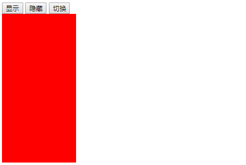
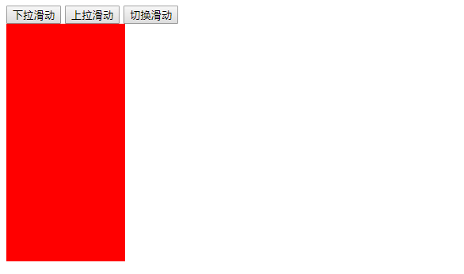
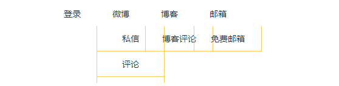
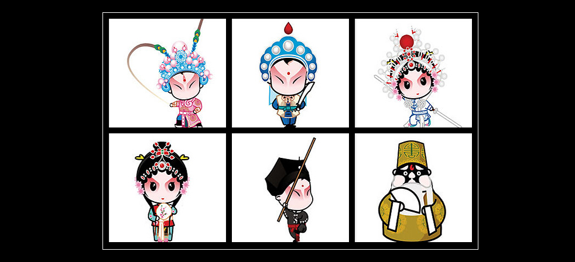
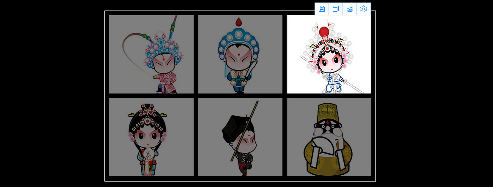
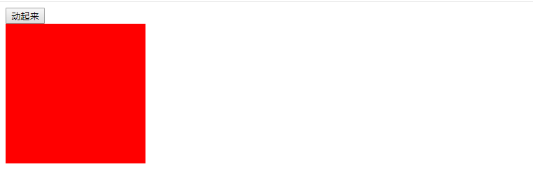
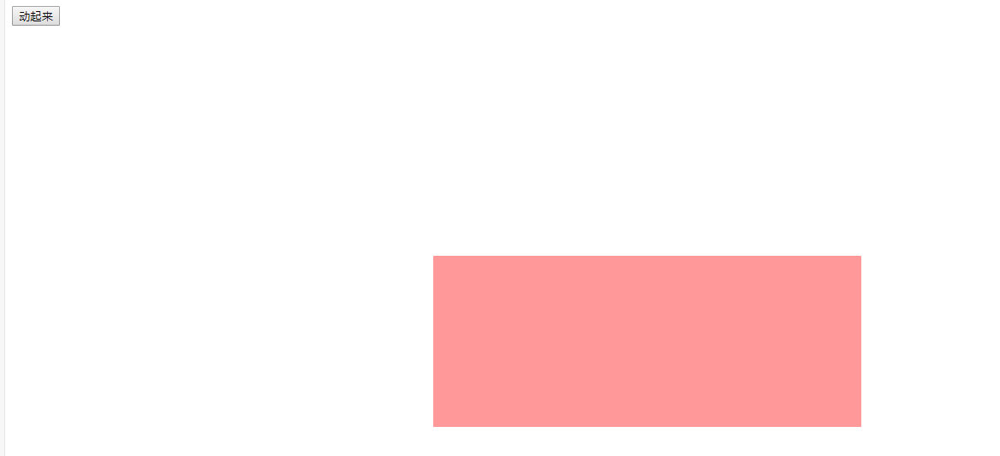
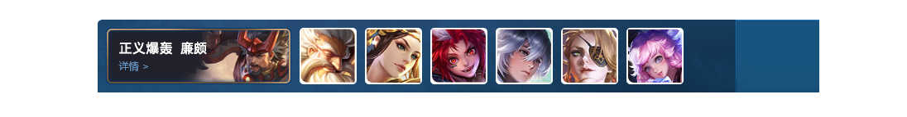

[TOC]

### jQuery 效果
jQuery 给我们封装了很多动画效果，最为常见的如下：

- 显示隐藏：`show()` / `hide()` / `toggle()`
- 滑入滑出：`slideDown()` / `slideUp()` / `slideToggle()`
- 淡入淡出：`fadeIn()` / `fadeOut()` / `fadeToggle()` / `fadeTo()`
- 自定义动画：`animate()`

**注释**
- 动画或者效果一旦触发就会执行，如果多次触发，就造成多个动画或者效果排队执行。
-  jQuery为我们提供另一个方法，可以停止动画排队：`stop()`
#### 1、显示隐藏：show() / hide() / toggle()
显示隐藏动画，常见有三个方法：`show()` / `hide()` / `toggle()`

**语法**
~~~js
  show([speed, [easing], [fn]])  // 显示
  hide([speed, [easing], [fn]])  // 隐藏
  toggle([speed, [easing], [fn]])  // 切换
~~~

**注释**
- 参数都可以省略，无动画直接显示
- speed：三种预定速度之一的字符串("slow", "normal", or "fast")或表示动画时长的毫秒数值(例如：1000)。
- easing：(Optional)用来指定切换效果，默认是"swing"，可用参数"linear"。
- fn：回调函数，在动画完成时执行的函数，每个函数执行一次。
- 平时一般不带参数，直接显示隐藏即可

**示例**
```js
<!DOCTYPE html>
<html lang="en">

<head>
    <meta charset="UTF-8">
    <meta name="viewport" content="width=device-width, initial-scale=1.0">
    <meta http-equiv="X-UA-Compatible" content="ie=edge">
    <title>Document</title>
    <style>
        div {
            width: 150px;
            height: 300px;
            background-color: red;
        }
    </style>
    <script src="jquery.min.js"></script>
</head>

<body>
    <button>显示</button>
    <button>隐藏</button>
    <button>切换</button>
    <div></div>
    <script>
        $(function () {
            $("button").eq(0).click(function () {
                $("div").show(1000, function () {
                    alert(1);
                });
            })
            $("button").eq(1).click(function () {
                $("div").hide(1000, function () {
                    alert(1);
                });
            })
            $("button").eq(2).click(function () {
                $("div").toggle(1000);
            })
            // 一般情况下，我们都不加参数直接显示隐藏就可以了
        });
    </script>
</body>

</html>
```



#### 2、滑入滑出
滑入滑出动画，常见有三个方法：`slideDown()` / `slideUp()` / `slideToggle()`

**语法**
~~~js
  slideDown([speed, [easing], [fn]])  // 下滑
  slideUp([speed, [easing], [fn]])  // 上滑
  slideToggle([speed, [easing], [fn]])  // 切换滑动
~~~

**注释**
- 参数都可以省略，无动画直接显示
- speed：三种预定速度之一的字符串("slow", "normal", or "fast")或表示动画时长的毫秒数值(例如：1000)。
- easing：(Optional)用来指定切换效果，默认是"swing"，可用参数"linear"。
- fn：回调函数，在动画完成时执行的函数，每个函数执行一次。

**示例**
```js
    <script>
        $(function () {
            $("button").eq(0).click(function () {
                // 下滑动 slideDown()
                $("div").slideDown();
            })
            $("button").eq(1).click(function () {
                // 上滑动 slideUp()
                $("div").slideUp(500);
            })
            $("button").eq(2).click(function () {
                // 滑动切换 slideToggle()
                $("div").slideToggle(500);
            });
        });
    </script>
```



##### 案例：仿新浪下拉菜单
其他代码参考：[https://blog.csdn.net/qq_45645902/article/details/105984458](https://blog.csdn.net/qq_45645902/article/details/105984458)
~~~js
    // 此代码有问题，下面会介绍解决方法
    <script>
        $(function () {
            // 鼠标经过
            $(".nav>li").mouseover(function () {
                // show() 显示元素  hide() 隐藏元素
                $(this).children("ul").slideDown(200);
            });
            // 鼠标离开
            $(".nav>li").mouseout(function () {
                $(this).children("ul").slideUp(200);
            })
        })
    </script>
~~~
#### 3、事件切换
jQuery中为我们添加了一个新事件 hover() ; 功能类似 css 中的伪类 :hover 
~~~js
  hover([over,] out)
~~~

**注释**
- over：鼠标移到元素上要触发函数(相当于 mouseenter)
- out：鼠标移出元素要触发函数(相当于 mouseleave)
- 只写一个函数，鼠标经过和离开都会触发
##### 案例：仿新浪下拉菜单
其他代码参考：[https://blog.csdn.net/qq_45645902/article/details/105984458](https://blog.csdn.net/qq_45645902/article/details/105984458)
~~~js
    // 此代码有问题，下面会介绍解决方法
    <script>
        $(function () {
            // 事件切换 hover 鼠标经过和离开的复合写法
            $('.nav>li').hover(function () {
                $(this).children("ul").slideDown(200);
            }, function () {
                $(this).children("ul").slideUp(200);
            })
            // 事件切换 hover 只写一个函数，鼠标经过和离开都会触发
            $('.nav>li').hover(function () {
                $(this).children("ul").slideToggle(200);
            })
            // 以上两种方法等价，使用一个要注释另一个
        })
    </script>
~~~



#### 4、动画队列及其停止动画排队方法
动画或者效果一旦触发就会执行，如果多次触发，就造成多个动画或者效果排队执行。

**停止动画排队**
~~~js
  stop()
~~~

**注释**
- stop() 方法用于停止动画或效果。
- stop() 写到动画或者效果的前面， 相当于停止结束上一次的动画。
- 每次使用动画之前，先调用 stop()，再调用动画。
##### 案例：仿新浪下拉菜单
其他代码参考：[https://blog.csdn.net/qq_45645902/article/details/105984458](https://blog.csdn.net/qq_45645902/article/details/105984458)
~~~js
    // 问题已解决
    <script>
        $(function () {
            // 鼠标经过
            $(".nav>li").mouseover(function () {
                // show() 显示元素  hide() 隐藏元素
                $(this).children("ul").stop().slideDown(200);
            });
            // 鼠标离开
            $(".nav>li").mouseout(function () {
                $(this).children("ul").stop().slideUp(200);
            })

            // 事件切换 hover 鼠标经过和离开的复合写法
            $('.nav>li').hover(function () {
                $(this).children("ul").stop().slideDown(200);
            }, function () {
                $(this).children("ul").stop().slideUp(200);
            })
            // 事件切换 hover 只写一个函数，鼠标经过和离开都会触发
            $('.nav>li').hover(function () {
                $(this).children("ul").stop().slideToggle(200);
            })
        })
    </script>
~~~
#### 5、淡入淡出
淡入淡出动画，常见有四个方法：`fadeIn()` / `fadeOut()` / `fadeToggle()` / `fadeTo()`

**语法**
~~~js
  fadeIn([speed, [easing], [fn]])  // 淡入
  fadeOut([speed, [easing], [fn]])  // 淡出
  fadeToggle([speed, [easing], [fn]])  // 淡入淡出切换
  fadeTo([[speed], opacity, [easing], [fn]])  // 渐进方式调整到指定的不透明度
~~~

**注释**
- 除了fadeTo()的参数opacity不可以省略，其余的参数都可以省略，无动画直接显示
- speed：三种预定速度之一的字符串("slow", "normal", or "fast")或表示动画时长的毫秒数值(例如：1000)。
- easing：(Optional)用来指定切换效果，默认是"swing"，可用参数"linear"。
- fn：回调函数，在动画完成时执行的函数，每个函数执行一次。
- opacity：透明度，必须，取值0~1

**示例**
```js
<!DOCTYPE html>
<html lang="en">

<head>
    <meta charset="UTF-8">
    <meta name="viewport" content="width=device-width, initial-scale=1.0">
    <meta http-equiv="X-UA-Compatible" content="ie=edge">
    <title>Document</title>
    <style>
        div {
            width: 150px;
            height: 300px;
            background-color: red;
            display: none;
        }
    </style>
    <script src="jquery.min.js"></script>
</head>

<body>
    <button>淡入效果</button>
    <button>淡出效果</button>
    <button>淡入淡出切换</button>
    <button>修改透明度</button>
    <div></div>
    <script>
        $(function () {
            $("button").eq(0).click(function () {
                // 淡入 fadeIn()
                $("div").fadeIn(1000);
            })
            $("button").eq(1).click(function () {
                // 淡出 fadeOut()
                $("div").fadeOut(1000);
            })
            $("button").eq(2).click(function () {
                // 淡入淡出切换 fadeToggle()
                $("div").fadeToggle(1000);
            });
            $("button").eq(3).click(function () {
                // 修改透明度 fadeTo() 速度和透明度要必须写
                $("div").fadeTo(1000, 0.5);
            });
        });
    </script>
</body>

</html>
```
##### 案例：图片突出显示


&emsp;


- 代码参考 jQuery/2、jQuery常用的API/2.3、jQuery效果/图片突出显示.html

#### 6、自定义动画
自定义动画非常强大，通过参数的传递可以模拟以上所有动画，方法为：`animate()`

**语法**
~~~js
  animate(params,[speed],[easing],[fn])
~~~

**注释**
- params：想要更改的样式属性，以对象形式传递，必须。属性名可以不用带括号，如果是复合属性则需要采取驼峰命名法。
- speed：三种预定速度之一的字符串("slow", "normal", or "fast")或表示动画时长的毫秒数值(例如：1000)。
- easing：(Optional)用来指定切换效果，默认是"swing"，可用参数"linear"。
- fn：回调函数，在动画完成时执行的函数，每个函数执行一次。

**示例**
```js
<!DOCTYPE html>
<html lang="en">

<head>
    <meta charset="UTF-8">
    <meta name="viewport" content="width=device-width, initial-scale=1.0">
    <meta http-equiv="X-UA-Compatible" content="ie=edge">
    <title>Document</title>
    <script src="jquery.min.js"></script>
    <style>
        div {
            position: absolute;
            width: 200px;
            height: 200px;
            background-color: red;
        }
    </style>
</head>

<body>
    <button>动起来</button>
    <div></div>
    <script>
        $(function () {
            $("button").click(function () {
                $("div").animate({
                    left: 500,
                    top: 300,
                    opacity: .4,
                    width: 500
                }, 500);
            })
        })
    </script>
</body>

</html>
```

&emsp;


##### 案例：仿王者荣耀手风琴效果
**要求**
鼠标经过小图时，大图显示出来，其余图片皆是小图


&emsp;


**思路** 、
1.当前 li 宽度变为 224px， 同时里面的小图片淡出，大图片淡入
2.其余兄弟 li 宽度变为69px， 小图片淡入， 大图片淡出

- 代码参考 jQuery/2、jQuery常用的API/2.3、jQuery效果/仿王者荣耀手风琴效果.html