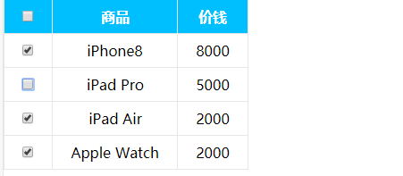

[TOC]

### jQuery 属性操作
jQuery 常用属性操作有三种：`prop()` / `attr()` / `data()`
#### 1、元素固有属性值 prop()
所谓元素固有属性就是元素本身自带的属性，比如`<a> `元素里面的`href`，比如`<input>`元素里面的`type`。

**语法**
* 获取属性值
~~~js
  element.prop('属性名')
~~~
* 设置属性值
~~~js
  element.prop('属性名','属性值')
~~~

**注释**
`prop()`除了普通属性操作，更适合操作表单属性：`disabled` / `checked` / `selected`等。

#### 2、元素自定义属性值 attr()
用户自己给元素添加的属性，我们称为自定义属性。 比如给`div`添加`index =“1”`。 

**语法**
* 获取属性值
~~~js
  element.attr('属性名')  // 类似原生 getAttribute()
~~~
* 设置属性值
~~~js
  element.attr('属性名','属性值')  // 类似原生 setAttribute()
~~~

**注释**
`attr()`除了普通属性操作，更适合操作自定义属性。（该方法也可以获取 H5 自定义属性）

#### 3、数据缓存 data()
`data()`方法可以在指定的元素上存取数据，并不会修改 DOM 元素结构。一旦页面刷新，之前存放的数据都将被移除。 
里面的数据是存放在元素的内存里面。

**语法**
* 附加数据
~~~js
  element.data('属性名')  // 向被选元素附加数据
~~~
* 获取数据
~~~js
  element.data('属性名','属性值')  // 向被选元素获取数据
~~~

**注释**
同时，还可以读取 HTML5 自定义属性`data-index`，得到的是数字型。

**示例**
```js
<!DOCTYPE html>
<html lang="en">

<head>
    <meta charset="UTF-8">
    <meta name="viewport" content="width=device-width, initial-scale=1.0">
    <meta http-equiv="X-UA-Compatible" content="ie=edge">
    <title>Document</title>
    <script src="jquery.min.js"></script>
</head>

<body>
    <a href="https://www.baidu.com/" title="百度网址">百度一下，你就知道</a>
    <input type="checkbox" name="" id="" checked>
    <div index="1" data-index="2">我是div</div>
    <span>123</span>
    <script>
        $(function () {
            // element.prop("属性名") 
            // 获取元素固有的属性值
            console.log($("a").prop("href"));
            // 设置属性值
            $("a").prop("title", "这就是百度网址");
            $("input").change(function () {
                console.log($(this).prop("checked"));
            });

            // 元素的自定义属性 attr()
            // 获取属性值
            console.log($("div").prop("index"));  // undefined 对于自定义属性不能使用 prop
            console.log($("div").attr("index"));
            console.log($("div").attr("data-index"));
            // 设置属性值
            $("div").attr("index", 4);

            // 数据缓存 data()，里面的数据是存放在元素的内存里面
            $("span").data("uname", "andy");
            console.log($("span").data("uname"));
            // 这个方法获取 data-index，h5自定义属性，第一个不用写data-，而且返回的是数字型
            console.log($("div").data("index"));
        })
    </script>
</body>

</html>
```


#### 4、购物车案例模块—全选

**要求**


点击全选按钮时下面的小复选框全部选中或者下面的小复选框全部选中时全选按钮选中


小复选框按钮未全部选中时，全选按钮不选中



**思路**
1.里面3个小的复选框按钮（j-checkbox）选中状态（checked）跟着全选按钮（checkall）走
2.因为 checked 是复选框的固有属性，此时我们需要利用 `prop()` 方法获取和设置该属性。
3.把全选按钮状态赋值给小复选框就可以了。
4.当我们每次点击小的复选框按钮，就来判断：
  (1).如果小复选框被选中的个数等于购物车商品的种类数，就应该把全选按钮选上，否则全选按钮不选。
  (2). `:checked`选择器 `:checked`查找被选中的表单元素

- jQuery/2、jQuery常用的API/模拟购物车