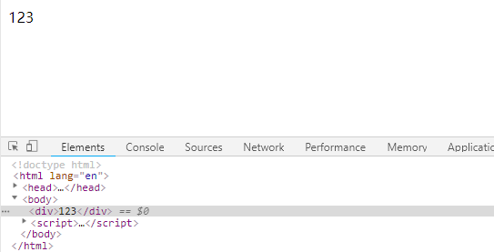
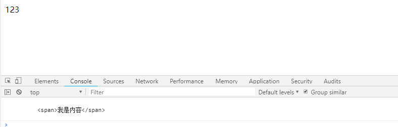
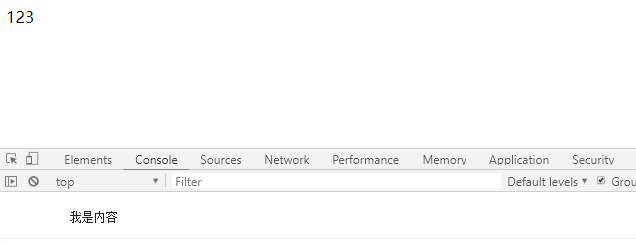
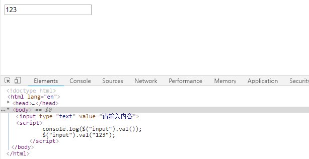
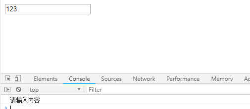
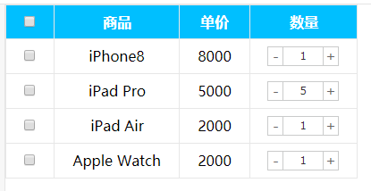
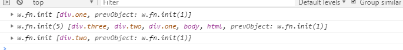

[TOC]

### jQuery 内容文本值
jQuery 的文本属性值常见操作有三种：`html()` / `text()` / `val()`
分别对应JS中的 `innerHTML` 、`innerText` 和 `value` 属性。
主要针对元素的内容还有表单的值操作

* **普通元素内容 `html()` (相当于原生`innerHTML`)**
**语法**
~~~js
  html()  // 获取元素的内容
  html('内容')  // 设置元素的内容
~~~

**示例**
```js
<body>
    <div>
        <span>我是内容</span>
    </div>
    <script>
        console.log($("div").html());
        $("div").html("123");
    </script>
</body>
```





* **普通元素文本内容 `text()` (相当于原生`innerText`)**
**语法**
~~~js
  text()  // 获取元素的文本内容
  text('文本内容')  // 设置元素的文本内容
~~~

**示例**
~~~js
<body>
    <div>
        <span>我是内容</span>
    </div>
    <script>
        console.log($("div").text());
        $("div").text("123");
    </script>
</body>
~~~




* **表单的值 `val()` (相当于原生`value`)**
**语法**
~~~js
  val()  // 获取表单的值
  val('内容')  // 设置表单的值
~~~

**示例**
~~~js
<body>
    <input type="text" value="请输入内容">
    <script>
        console.log($("input").val());
        $("input").val("123");
    </script>
</body>
~~~





**注释**
html() 可识别标签，text() 不识别标签。
#### 2、案例：购物车案例模块—增减商品数量



**思路**
1.首先声明一个变量，当我们点击+号（increment），就让这个值++，然后赋值给文本框。
2.注意1：只能增加本商品的数量， 就是当前+号的兄弟文本框（itxt）的值。 
3.修改表单的值是val()方法
4.注意2：这个变量初始值应该是这个文本框的值，在这个值的基础上++。要获取表单的值
5.减号（decrement）思路同理，但是如果文本框的值是1，就不能再减了。

- jQuery/2、jQuery常用的API/模拟购物车

#### 3、案例：购物车案例模块—修改商品小计

**思路**
1.每次点击+号或者-号，根据文本框的值 x 当前商品的价格 = 商品的小计
2.注意1：只能增加本商品的小计，就是当前商品的小计模块（p-sum）  
3.修改普通元素的内容是text()方法
4.注意2：当前商品的价格，要把￥符号去掉再相乘，截取字符串 substr(1)
5.parents(‘选择器’) 可以返回指定祖先元素
~~~js
<body>
    <div class="one">
        <div class="two">
            <div class="three">
                <div class="four">返回指定祖先元素</div>
            </div>
        </div>
    </div>
    <script>
        console.log($(".four").parent().parent().parent());
        console.log($(".four").parents());
        console.log($(".four").parents(".two"));
    </script>
</body>
~~~


6.最后计算的结果如果想要保留2位小数 通过 toFixed(2)  方法
7.用户也可以直接修改表单里面的值，同样要计算小计。 用表单change事件
8.用最新的表单内的值 x 单价 = 当前商品小计

- jQuery/2、jQuery常用的API/模拟购物车