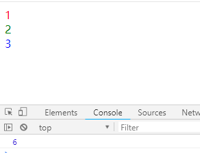
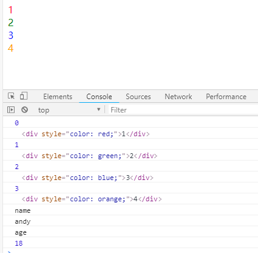
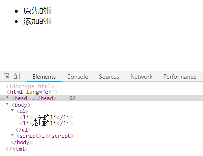
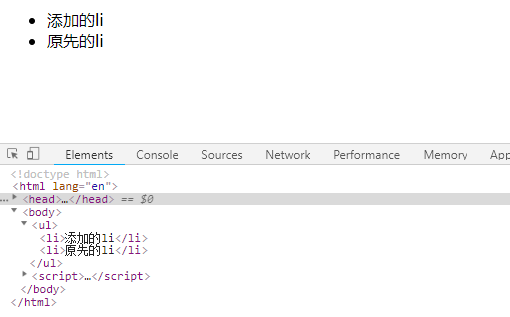
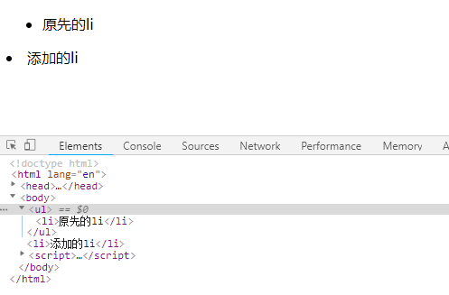
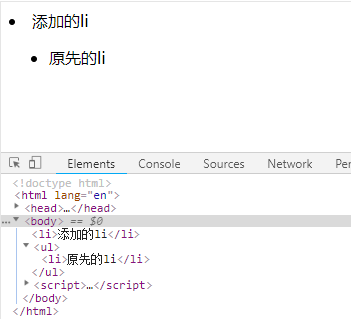

[TOC]

### jQuery 元素操作
jQuery 元素操作主要讲的是用jQuery方法，操作标签的遍历、创建、添加、删除等操作。
#### 1、遍历元素
jQuery 隐式迭代是对同一类元素做了同样的操作。 如果想要给同一类元素做不同操作，就需要用到遍历。

**语法1**
~~~js
  $('div').each(function (index, domEle) { xxx; })
~~~

**注释**
1.`each()`方法遍历匹配的每一个元素，主要用DOM处理，each每一个
2.里面的回调函数有2个参数：`index`是每个元素的索引号，可以修改索引号名称，即修改`index`为其它名称；`domEle`是每个DOM元素对象，不是jQuery对象，也可以自己命名
3.此方法用于遍历 jQuery 对象中的每一项，所以想使用jQuery方法，需要给这个dom元素转换为jQuery对象：`$(domEle)`

**示例**
~~~js
<body>
    <div>1</div>
    <div>2</div>
    <div>3</div>
    <script>
        $(function () {
            // 如果针对于同一类元素做不同操作，需要用到遍历元素（类似for，但是比for强大）
            var sum = 0;
            // each() 方法遍历元素 
            var arr = ["red", "green", "blue"];
            $("div").each(function (i, s) {
                // 回调函数第一个参数一定是索引号，可以自己指定索引号号名称；回调函数第二个参数一定是dom元素对象，也可以自己命名
                $(s).css("color", arr[i]);
                sum += parseInt($(s).text());
            })
            // 遍历的索引号之和：0+1+2+3=6
            console.log(sum);
        })
    </script>
</body>
~~~



**语法2**
~~~js
  $.each(object, function (index, element) { xxx; })
~~~

**注释**
1.`$.each()`方法可用于遍历任何对象，主要用于数据处理，比如数组、对象
2.里面的函数有2个参数：`index`是每个元素的索引号，可以修改索引号名称，即修改`index`为其它名称;`element`遍历内容，也可以自己命名
3.此方法用于遍历 jQuery 对象中的每一项，回调函数中元素为 DOM 对象，想要使用 jQuery 方法需要转换。

**示例**
```js
<body>
    <div>1</div>
    <div>2</div>
    <div>3</div>
    <div>4</div>
    <script>
        $(function () {
            // 如果针对于同一类元素做不同操作，需要用到遍历元素（类似for，但是比for强大）、
            // each() 方法遍历元素 
            var arr = ["red", "green", "blue", 'orange'];
            $.each($('div'), function (i, s) {
                console.log(i);
                console.log(s);
                $(s).css("color", arr[i]);
            })
            $.each({
                name: 'andy',
                age: 18
            }, function (i, s) {
                console.log(i);  //输出的是 name age 属性名
                console.log(s);  // 输出的是 andy 18 的属性值
            })
        })
    </script>
</body>
```



##### 案例：购物车案例模块—计算总计和总额
**思路**
1.把所有文本框里面的值相加就是总计数量。总额同理
2.文本框里面的值不相同，如果想要相加需要用到`each`遍历。声明一个变量,相加即可
3.点击+ -，会改变总计和总额，如果用户修改了文本框里面的值同样会改变总计和总额
4.因此可以封装一个函数求总计和总额的，以上2个操作调用这个函数即可。
5.总计是文本框里面的值相加用`val()`，总额是普通元素的内容用`text()`
6.要注意普通元素里面的内容要去掉￥并且转换为数字型才能相加

- jQuery/2、jQuery常用的API/模拟购物车

#### 2、创建、添加、删除
##### 创建
**语法**
~~~js
  $('<li></li>');  // 动态的创建一个<li>
~~~
##### 内部添加
> 内部添加元素，生成之后，它们是父子关系 

**语法**
~~~js
  element.append('内容');  // 把内容放入匹配元素内部最后面，类似原生 appendChild
  element.prepend('内容');  // 把内容放入匹配元素内部最前面
~~~
##### 外部添加
> 外部添加元素，生成之后，它们是兄弟关系 

**语法**
~~~js
  element.after('内容'); // 把内容放入目标元素后面
  element.before('内容'); // 把内容放入目标元素前面
~~~
##### 删除元素
**语法**
~~~js
  element.remove();  // 删除匹配的元素(本身)
  element.empty();  // 删除匹配的元素集合中所有的子节点
  element.html('');  // 清空匹配的元素内容
  // empty()和html('')作用等价，都可以删除元素里面的内容，只不过 html 还可以设置内容
~~~

> 其他方法请参详API

**示例**
```js
<body>
    <ul>
        <li>原先的li</li>
    </ul>
    <script>
        $(function () {
            // 创建元素
            var li = $('<li>添加的li</li>');

            // 内部添加
            // 内部添加元素，生成之后，它们是父子关系 
            $('ul').append(li);  // 图1
            $('ul').prepend(li);  // 图2

            // 外部添加
            // 外部添加元素，生成之后，它们是兄弟关系 
            $('ul').after(li);  // 图3
            $('ul').before(li);  // 图4
        })
    </script>
</body>
```

---


---


---


---


#### 3、案例：购物车案例模块-删除商品模块

**思路**
1.把商品`remove()` 删除元素即可
2.有三个地方需要删除： 1. 商品后面的删除按钮 2. 删除选中的商品 3. 清理购物车：将购物车内所有商品删除
3.商品后面的删除按钮： 一定是删除当前的商品，所以从 `$(this)` 出发
4.删除选中的商品： 先判断小的复选框按钮是否选中状态，如果是选中，则删除对应的商品
5.清理购物车： 则是把所有的商品全部删掉

- jQuery/2、jQuery常用的API/模拟购物车

#### 4、案例：购物车案例模块-选中的商品添加背景

**思路**
1.选中的商品添加背景，不选中移除背景即可
2.全选按钮点击：如果全选是选中的，则所有的商品添加背景，否则移除背景
3.小的复选框点击： 如果是选中状态，则当前商品添加背景，否则移除背景
4.背景可以通过类名修改，添加类和删除类

- jQuery/2、jQuery常用的API/模拟购物车