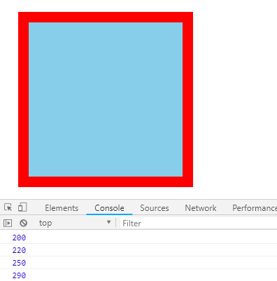
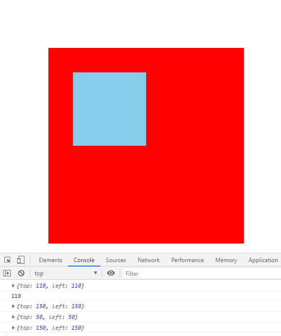

[TOC]

### jQuery 尺寸、位置操作
jQuery中分别为我们提供了两套快速获取和设置元素尺寸和位置的API，方便易用，内容如下。

#### 1、jQuery 尺寸操作
jQuery 尺寸操作包括元素宽高的获取和设置，且不一样的API对应不一样的盒子模型。

|语法|用法
|--|--
width() / height()|取得匹配元素宽度和高度值，只算 width / height
innerWidth() / innerHeight()|取得匹配元素宽度和高度值，包含 padding
outerWidth() / outerHeight()|取得匹配元素宽度和高度值，包含 padding、border
outerWidth(true) / outerHeight(true)|取得匹配元素宽度和高度值，包含 padding、border、margin

**注释**
1.以上参数为空，则是获取相应值，返回的是数字型
2.如果参数为数字，则是修改相应的值
3.此参数可以不必写单位
4.有了这套 API 我们将可以快速获取盒子的宽高，至于其它属性想要获取和设置，还要使用`css()`等方法配合

**示例**
```javascript
<!DOCTYPE html>
<html lang="en">

<head>
    <meta charset="UTF-8">
    <meta name="viewport" content="width=device-width, initial-scale=1.0">
    <meta http-equiv="X-UA-Compatible" content="ie=edge">
    <title>Document</title>
    <script src="jquery.min.js"></script>
    <style>
        div {
            width: 200px;
            height: 200px;
            background-color: skyblue;
            padding: 10px;
            border: 15px solid red;
            margin: 20px;
        }
    </style>
</head>

<body>
    <div></div>
    <script>
        $(function () {
            // width() / height() 获取设置元素 width和height大小 
            console.log($("div").width());
            // $("div").width(300);  // 修改盒子的宽为300px

            // innerWidth() / innerHeight()  获取设置元素 width和height + padding 大小 
            console.log($("div").innerWidth());

            // outerWidth()  / outerHeight()  获取设置元素 width和height + padding + border 大小 
            console.log($("div").outerWidth());

            // outerWidth(true) / outerHeight(true) 获取设置 width和height + padding + border + margin
            console.log($("div").outerWidth(true));
        })
    </script>
</body>

</html>
```



#### 2、jQuery 位置操作
jQuery的位置操作主要有三个：`offset()`、`position()`、`scrollTop()`/`scrollLeft()`

##### `offset()`设置或获取元素偏移
- `offset()`方法设置或返回被选元素相对于文档的偏移坐标，跟父级没有关系
- 该方法有两个属性：`left`、`top`。`offset().top`用于获取距离文档顶部的距离，`offset().left`用于获取距离文档左侧的距离
- 可以设置元素的偏移：`offset({ top: 10, left: 30 })`

##### `position()`获取元素偏移
- `position()`方法用于返回被选元素相对于带有定位的父级偏移坐标，如果父级都没有定位，则以文档为准
- 该方法有两个属性：`left`、`top`。`position().top`用于获取距离定位父级顶部的距离，`position().left`用于获取距离定位父级左侧的距离
- 该方法只能获取

**示例**
```js
<!DOCTYPE html>
<html lang="en">

<head>
    <meta charset="UTF-8">
    <meta name="viewport" content="width=device-width, initial-scale=1.0">
    <meta http-equiv="X-UA-Compatible" content="ie=edge">
    <title>Document</title>
    <script src="jquery.min.js"></script>
    <style>
        * {
            margin: 0;
            padding: 0;
        }

        .father {
            width: 400px;
            height: 400px;
            background-color: red;
            margin: 100px;
            overflow: hidden;
            position: relative;
        }

        .son {
            width: 150px;
            height: 150px;
            background-color: skyblue;
            position: absolute;
            left: 10px;
            top: 10px;
        }
    </style>
</head>

<body>
    <div class="father">
        <div class="son"></div>
    </div>
    <script>
        $(function () {
            // 获取设置距离文档的位置（偏移） offset
            console.log($(".son").offset());
            console.log($(".son").offset().top);
            $(".son").offset({
                top: 150,
                left: 150
            });
            console.log($(".son").offset());
            // 获取距离带有定位父级位置（偏移） position   如果没有带有定位的父级，则以文档为准
            // 这个方法只能获取不能设置偏移
            console.log($(".son").position());
            $(".son").position({
                top: 300,
                left: 300
            });
            console.log($(".son").offset());
        })
    </script>
</body>

</html>
```



##### `scrollTop()`/`scrollLeft()`设置或获取元素被卷去的头部和左侧
- `scrollTop()`方法设置或返回被选元素被卷去的头部
- 不跟参数是获取，参数为不带单位的数字则是设置被卷去的头部

#### 3、案例
##### 带有动画的返回顶部
**思路**
1.使用animate动画返回顶部
2.animate动画函数里面有个`scrollTop`属性，可以设置位置
3.但是是元素做动画(不是整个文档做动画)，因此`$("body, html").animate({ scrollTop: 0 })`


参考：jQuery/2、jQuery常用的API/2.7、jQuery尺寸、位置操作/goTop.html