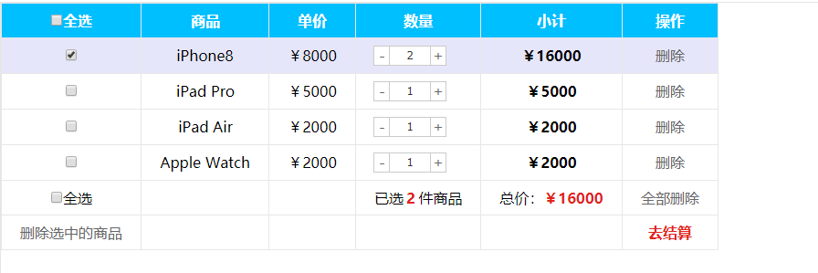
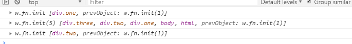

### 思路

#### 全选
1.里面3个小的复选框按钮（j-checkbox）选中状态（checked）跟着全选按钮（checkall）走
2.因为 checked 是复选框的固有属性，此时我们需要利用 `prop()` 方法获取和设置该属性。
3.把全选按钮状态赋值给小复选框就可以了。
4.当我们每次点击小的复选框按钮，就来判断：
  (1).如果小复选框被选中的个数等于购物车商品的种类数，就应该把全选按钮选上，否则全选按钮不选。
  (2). `:checked`选择器 `:checked`查找被选中的表单元素

#### 增减商品数量
1.首先声明一个变量，当我们点击+号（increment），就让这个值++，然后赋值给文本框。
2.注意1：只能增加本商品的数量， 就是当前+号的兄弟文本框（itxt）的值。 
3.修改表单的值是val()方法
4.注意2：这个变量初始值应该是这个文本框的值，在这个值的基础上++。要获取表单的值
5.减号（decrement）思路同理，但是如果文本框的值是1，就不能再减了。

#### 修改商品小计
1.每次点击+号或者-号，根据文本框的值 x 当前商品的价格 = 商品的小计
2.注意1：只能增加本商品的小计，就是当前商品的小计模块（p-sum）  
3.修改普通元素的内容是text()方法
4.注意2：当前商品的价格，要把￥符号去掉再相乘，截取字符串 substr(1)
5.parents(‘选择器’) 可以返回指定祖先元素
~~~js
<body>
    

        

            

                
返回指定祖先元素

            

        

    

    
</body>
~~~

6.最后计算的结果如果想要保留2位小数 通过 toFixed(2)  方法
7.用户也可以直接修改表单里面的值，同样要计算小计。 用表单change事件
8.用最新的表单内的值 x 单价 = 当前商品小计

#### 计算总计和总额
1.把所有文本框里面的值相加就是总计数量。总额同理
2.文本框里面的值不相同，如果想要相加需要用到`each`遍历。声明一个变量,相加即可
3.点击+ -，会改变总计和总额，如果用户修改了文本框里面的值同样会改变总计和总额
4.因此可以封装一个函数求总计和总额的，以上2个操作调用这个函数即可。
5.总计是文本框里面的值相加用`val()`，总额是普通元素的内容用`text()`
6.要注意普通元素里面的内容要去掉￥并且转换为数字型才能相加

#### 删除商品模块
1.把商品`remove()` 删除元素即可
2.有三个地方需要删除： 1. 商品后面的删除按钮 2. 删除选中的商品 3. 清理购物车：将购物车内所有商品删除
3.商品后面的删除按钮： 一定是删除当前的商品，所以从 `$(this)` 出发
4.删除选中的商品： 先判断小的复选框按钮是否选中状态，如果是选中，则删除对应的商品
5.清理购物车： 则是把所有的商品全部删掉

#### 选中的商品添加背景
1.选中的商品添加背景，不选中移除背景
2.全选按钮点击：如果全选是选中的，则所有的商品添加背景，否则移除背景
3.小的复选框点击： 如果是选中状态，则当前商品添加背景，否则移除背景
4.背景可以通过类名修改，添加类和删除类

### 代码
 - jQuery/2、jQuery常用的API/模拟购物车
