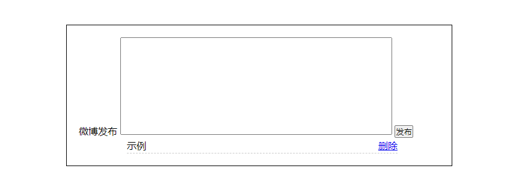

[TOC]

###  1、jQuery 事件注册
jQuery 为我们提供了方便的事件注册机制
- 优点: 操作简单，且不用担心事件覆盖等问题。
- 缺点: 普通的事件注册不能做事件委托，且无法实现事件解绑，需要借助其他方法。

#### 单个事件注册
**语法**
```js
  element.事件(function () {})
  $('div').click(function () { 事件处理程序 })
```

**注释**
- 其他事件和原生基本一致
- 如`mouseover`、`mouseout`、`blur`、`docus`、`change`、`keydown`、`keyup`、`resize`、`scroll`等

**示例**

```js
<!DOCTYPE html>
<html lang="en">

<head>
    <meta charset="UTF-8">
    <meta name="viewport" content="width=device-width, initial-scale=1.0">
    <meta http-equiv="X-UA-Compatible" content="ie=edge">
    <title>Document</title>
    <script src="jquery.min.js"></script>
    <style>
        div {
            width: 100px;
            height: 100px;
            /* 盒子本来颜色 红色 */
            background-color: red;
        }
    </style>
</head>

<body>
    <div></div>
    <script>
        $(function () {
            // 鼠标经过，盒子变成天蓝色
            $('div').mouseenter(function () {
                $(this).css('background', 'skyblue');
            })
            // 鼠标点击，盒子变成紫色
            $('div').click(function () {
                $(this).css('background', 'purple');
            });
        })
    </script>
</body>

</html>
```

### 2、jQuery 事件处理
因为普通注册事件方法的不足，jQuery又开发了多个处理方法，重点讲解如下：
- `on()`：用于事件绑定，目前最好用的事件绑定方法
- `off()`：事件解绑
- `trigger()` / `triggerHandler()`：事件触发

#### 2.1、事件处理`on()`绑定事件
因为普通注册事件方法的不足，jQuery又创建了多个新的事件绑定方法`bind()`/ `live()` / `delegate()` / `on()`等，其中最好用的是`on()`

> `on()`方法在匹配元素上绑定一个或多个事件的事件处理函数

**语法**
```js
  element.on(events, [selector], fn)
```

**注释**
- `events`：一个或多个用空格分隔的事件类型，如`click`或'keydown`
- `selector`：元素的子元素选择器
- `fn`：回调函数，即绑定在元素身上的侦听函数

**示例**
```js
<!DOCTYPE html>
<html lang="en">

<head>
    <meta charset="UTF-8">
    <meta name="viewport" content="width=device-width, initial-scale=1.0">
    <meta http-equiv="X-UA-Compatible" content="ie=edge">
    <title>Document</title>
    <script src="jquery.min.js"></script>
    <style>
        div {
            width: 100px;
            height: 100px;
            background-color: red;
        }
    </style>
</head>

<body>
    <div></div>
    <script>
        $(function () {
            // on可以绑定1个或者多个事件处理程序
            $("div").on({
                mouseenter: function () {
                    $(this).css("background", "skyblue");
                },
                click: function () {
                    $(this).css("background", "purple");
                },
                mouseleave: function () {
                    $(this).css("background", "blue");
                }
            });
        })
    </script>
</body>

</html>
```

##### 优势
**优势1**
> 可以绑定多个事件，多个事件处理程序

```js
  $("div").on({
      mouseenter: function () { },
      click: function () { },
      mouseleave: function () { }
  });
```

> 如果事件处理程序相同

```js
  $(function () {
      $('div').on('mouseover mouseout', function () {
          $(this).toggleClass('current');
      })
  })
```

**优势2**
> 可以事件委派操作。
> 事件委派：把原来加给子元素身上的事件绑定在父元素身上，就是把事件委派给父元素

> 在此之前有`bind()`、`live()`、`delegate()`等方法来处理事件绑定或事件委派，最新版本使用`on()`

```js
<body>
    <ul>
        <li>示例</li>
        <li>示例</li>
        <li>示例</li>
    </ul>
    <script>
        $(function () {
            // $("ul li").click();
            $("ul").on("click", "li", function () {
                alert(11);
            });
            // click是绑定在ul身上的，但是触发的对象是ul里面的li
        })
    </script>
</body>
```

**优势3**
> 动态创建元素，`click()`没有办法绑定事件，`on()`可以给动态生成的元素绑定事件

```js
<!-- 不可行 -->
<body>
    <ol></ol>
    <script>
        $(function () {
            $("ol li").click(function () {
                alert(11);
            })
            var li = $("<li>我是后来创建的</li>");
            $("ol").append(li);
        })
    </script>
</body>

<!-- 可行 -->
<body>
    <ol></ol>
    <script>
        $(function () {
            var li = $("<li>我是后来创建的</li>");
            $("ol").append(li);

            $("ol li").click(function () {
                alert(11);
            })
        })
    </script>
</body>

<body>
    <ol></ol>
    <script>
        $(function () {
            $("ol").on("click", "li", function () {
                alert(11);
            })
            var li = $("<li>我是后来创建的</li>");
            $("ol").append(li);
        })
    </script>
</body>
```

#### 2.2、案例：发布微博案例
1.点击发布按钮，动态创建一个`li`，放入文本框的内容和删除按钮， 并且添加到`ul`中。
2.点击删除按钮，可以删除当前的微博留言。

```js
<!DOCTYPE html>
<html lang="en">

<head>
    <meta charset="UTF-8">
    <meta name="viewport" content="width=device-width, initial-scale=1.0">
    <title>Document</title>
    <script src="jquery.min.js"></script>
    <style>
        * {
            margin: 0;
            padding: 0
        }

        .box {
            width: 600px;
            margin: 100px auto;
            border: 1px solid #000;
            padding: 20px;
        }

        textarea {
            width: 450px;
            height: 160px;
            outline: none;
            resize: none;
        }

        ul {
            list-style: none;
            width: 450px;
            padding-left: 80px;
        }

        ul li {
            line-height: 25px;
            border-bottom: 1px dashed #cccccc;
            display: none;
        }

        ul li a {
            float: right;
        }

        input {
            float: right;
        }
    </style>
    <script>
        $(function () {
            // 点击发布按钮，动态创建一个li，放入文本框的内容和删除按钮， 并且添加到ul中
            $('.btn').on('click', function () {
                var li = $('<li></li>');
                li.html($('.txt').val() + '<a href="javascript:;">删除</a>');
                $('ul').prepend(li);
                li.slideDown();
                $('.txt').val('');  // 发布内容后，文本框内的文字自动清除
            })

            // 点击删除按钮，可以删除当前的微博留言
            $('ul').on('click', 'a', function () {
                $(this).parent().slideUp(function () {
                    $(this).remove();
                })
            })
        })
    </script>
</head>

<body>
    <div class="box" id="weibo">
        <span>微博发布</span>
        <textarea name="" class="txt" cols="30" rows="10"></textarea>
        <button class="btn">发布</button>
        <ul>
        </ul>
    </div>
</body>

</html>
```



#### 2.3、 事件处理`off()`解绑事件
> 当某个事件上面的逻辑，在特定需求下不需要的时候，可以把该事件上的逻辑移除，这个过程我们称为事件解绑。
> jQuery 为我们提供了多种事件解绑方法：`die()` / `undelegate()` / `off()`等，甚至还有只触发一次的事件绑定方法`one()`

> `off()`方法可以移除通过`on()`方法添加的事件处理程序

**语法**
```js
  $('p').off()  // 解绑p元素所有事件处理程序
  $('p').off('click')  // 解绑p元素上面的点击事件
  $('p').off('click', 'li')  // 解绑事件委托
```

**示例**
```js
<!DOCTYPE html>
<html lang="en">

<head>
    <meta charset="UTF-8">
    <meta name="viewport" content="width=device-width, initial-scale=1.0">
    <meta http-equiv="X-UA-Compatible" content="ie=edge">
    <title>Document</title>
    <script src="jquery.min.js"></script>
    <style>
        div {
            width: 100px;
            height: 100px;
            background-color: red;
        }
    </style>
    <script>
        $(function () {
            $("div").on({
                click: function () {
                    console.log("我点击了");
                },
                mouseover: function () {
                    console.log('我鼠标经过了');
                }
            });
            $("ul").on("click", "li", function () {
                alert(11);
            });
            // 事件解绑 off 
            $("div").off();  // 解除了div身上的所有事件
            $("div").off("click"); // 解除了div身上的点击事件
            $("ul").off("click", "li");
            // one() 它只能触发事件一次
            $("p").one("click", function () {
                alert(11);
            })
        })
    </script>
</head>

<body>
    <div></div>
    <ul>
        <li>示例</li>
        <li>示例</li>
        <li>示例</li>
    </ul>
    <p>我是p</p>
</body>

</html>
```

#### 2.4、事件处理`trigger()`自动触发事件
有些时候，在某些特定的条件下，我们希望某些事件能够自动触发，比如轮播图自动播放功能跟点击右侧按钮一致。可以利用定时器自动触发右侧按钮点击事件，不必鼠标点击触发。由此 jQuery 为我们提供了两个自动触发事件 `trigger()` 和 `triggerHandler()` 

**语法**
```js
  element.click()  // 简写形式，会触发元素的默认行为
  element.trigger('type')  // 第二种自动触发模式，会触发元素的默认行为
  element.triggerHandler(type)  // 第三种自动触发模式，不会触发元素的默认行为
```

**示例**
```js
<!DOCTYPE html>
<html lang="en">

<head>
    <meta charset="UTF-8">
    <meta name="viewport" content="width=device-width, initial-scale=1.0">
    <meta http-equiv="X-UA-Compatible" content="ie=edge">
    <title>Document</title>
    <script src="jquery.min.js"></script>
    <style>
        div {
            width: 100px;
            height: 100px;
            background-color: red;
        }
    </style>
    <script>
        $(function () {
            $("div").on("click", function () {
                alert(11);
            });
          
            $("div").click();  // 简写形式
            $("input").focus();  // 会触发元素的默认行为(简写形式)
            
            $("div").trigger("click");  // 第二种自动触发模式
            $("input").trigger("focus");  // 会触发元素的默认行为(第二种自动触发模式)
            
            $("div").triggerHandler("click");  // 第三种自动触发模式
            $("input").triggerHandler("focus");  // 无反应(不会触发元素的默认行为)
            // 可行
            $("input").on("focus", function () {
                $(this).val("你好吗");
            });
            $("input").triggerHandler("focus");
        });
    </script>
</head>

<body>
    <div></div>
    <input type="text">
</body>

</html>
```

### 3、jQuery 事件对象
jQuery 对DOM中的事件对象 event 进行了封装，兼容性更好，获取更方便，使用变化不大。
>事件被触发，就会有事件对象的产生。

**语法**
```js
  element.on(events, [selector], function(event) {} )
```

**注释**
- 阻止默认行为：`event.preventDefault()` 或 `return false`
- 阻止冒泡：`event.stopPropagation()`

**示例**

```js
<body>
    <div></div>
    <script>
        $(function () {
            $(document).on("click", function () {
                console.log("点击了document");  // 点击了document
            })
            $("div").on("click", function (event) {
                console.log(event);
                console.log("点击了div");  // 正常冒泡来叔，应为 点击了document 点击了div
                event.stopPropagation();  // 阻止冒泡，即为 点击了div
            })
        })
    </script>
</body>
```

**注释**
jQuery中的 event 对象使用，可以参考 API 和 DOM 中的 event