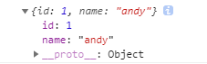
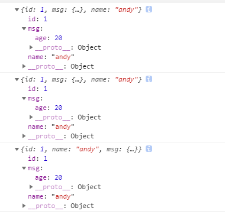
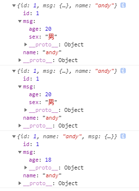

### jQuery 拷贝对象
> 如果想要把某个对象拷贝(合并)给另外一个对象使用，此时可以使用`$.extend()`方法

**语法**
```js
  $.extend([deep], target, object, [objectN])
```

**注释**
- `deep`：如果设为`true` 深拷贝，默认为`false` 浅拷贝
- `target`：要拷贝的目标对象
- `object`：待拷贝到第一个对象的对象
- `objectN`：待拷贝到第N个对象的对象
- 浅拷贝目标对象引用的被拷贝对象的地址，修改目标对象会影响被拷贝对象
- 深拷贝，前面加`true`，完全克隆，修改目标对象不会影响被拷贝对象

**示例**
```js
    <script>
        $(function () {
            var targetObj = {};
            var obj = {
                id: 1,
                name: "andy"
            };
            // $.extend(target, obj);
            $.extend(targetObj, obj);
            console.log(targetObj);
        })
    </script>
```


```js
    <script>
        $(function () {
            var targetObj = {
                id: 0
            };
            var obj = {
                id: 1,
                name: "andy"
            };
            // $.extend(target, obj);
            $.extend(targetObj, obj);
            console.log(targetObj); // 会覆盖targetObj 里面原来的数据
        })
    </script>
```


<br/>

- 浅拷贝
```js
    <script>
        $(function () {
            var targetObj = {
                id: 0,
                msg: {
                    sex: '男'
                }
            };
            var obj = {
                id: 1,
                name: "andy",
                msg: {
                    age: 18
                }
            };
            // $.extend(target, obj);
            $.extend(targetObj, obj);
            console.log(targetObj); // 会覆盖targetObj 里面原来的数据
            // 浅拷贝把原来对象里面的复杂数据类型地址拷贝给目标对象
            targetObj.msg.age = 20;
            console.log(targetObj);
            console.log(obj);
        })
    </script>
```



<br/>

- 深拷贝
```js
    <script>
        $(function () {
            var targetObj = {
                id: 0,
                msg: {
                    sex: '男'
                }
            };
            var obj = {
                id: 1,
                name: "andy",
                msg: {
                    age: 18
                }
            };
            // 深拷贝把里面的数据完全复制一份给目标对象 如果里面有不冲突的属性,会合并到一起 
            $.extend(true, targetObj, obj);
            console.log(targetObj); // 会覆盖targetObj 里面原来的数据
            targetObj.msg.age = 20;
            console.log(targetObj); // msg :{sex: "男", age: 20}
            console.log(obj);
        })
    </script>
```
