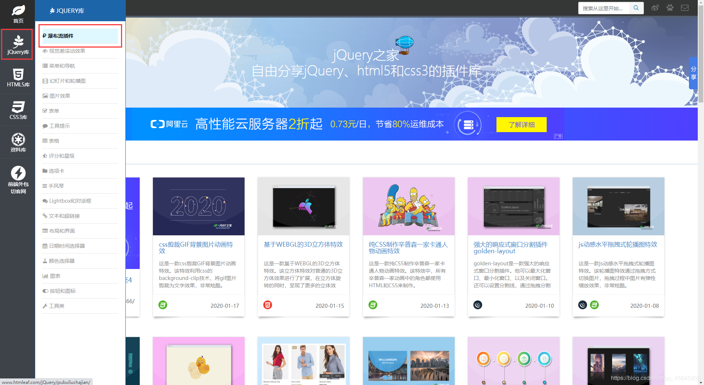
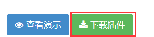
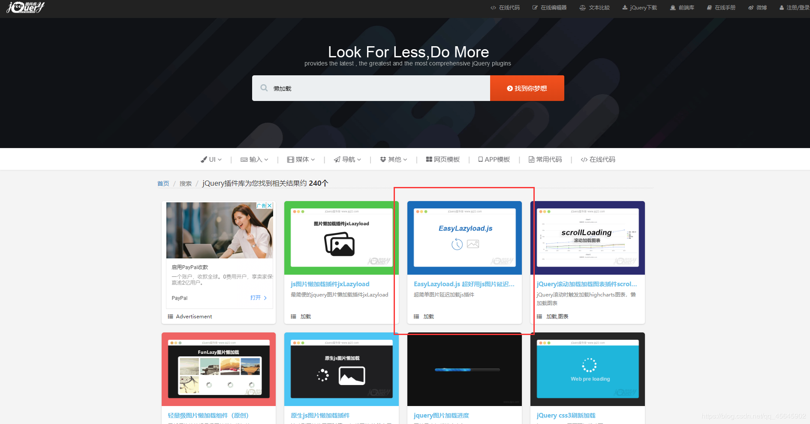
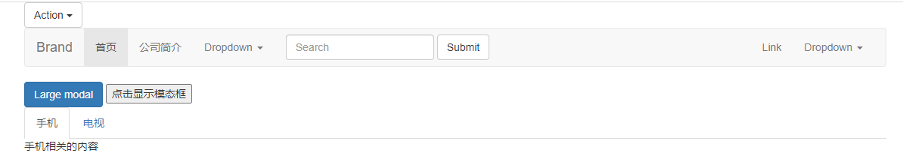

### jQuery 插件
jQuery 功能比较有限，想要更复杂的特效效果，可以借助于 jQuery 插件完成。 这些插件也是依赖于jQuery来完成的，所以必须要先引入jQuery文件，因此也称为 jQuery 插件。

#### 1、​jQuery 插件常用的网站
- jQuery 插件库：[http://www.jq22.com/](http://www.jq22.com/)  
- jQuery 之家：[http://www.htmleaf.com/](http://www.htmleaf.com/)

#### 2、jQuery 插件使用步骤
- 引入相关文件（jQuery 文件和插件文件）    
- 复制相关html、css、js (调用插件)（有时也可以只引入一部分，读懂后也可以修改部分内容）

##### 2.1、瀑布流插件（重点讲解）
> 瀑布流插件是jQuery之家的开源插件





- 代码参考：jQuery/6、jQuery插件/瀑布流插件

##### 2.2、 图片懒加载插件
> 当页面滑动到可视区，图片才进行加载，用以提升页面打开的速度及用户体验，减轻服务器负载

以此为例：


**代码演示**
懒加载只需引入html 和 js操作即可，此插件不涉及css，且js引入文件和js调用文件必须写到DOM元素(图片)最后面

- 1.将图片`src`替换为`data-lazy-src`
```js
  
```

- 2.引入js
```js
<script src="js/EasyLazyload.min.js"></script>
<script>
   	lazyLoadInit({
   		showTime: 666,
   		onLoadBackEnd: function(i, e) {
     		console.log("onLoadBackEnd:" + i);
   		},
   		onLoadBackStart: function(i, e) {
     		console.log("onLoadBackStart:" + i);
   		}
 	});
</script>
```

- 代码参考：jQuery/6、jQuery插件/EasyLazyload

##### 2.3、全屏滚动插件`fullPage.js`
全屏滚动插件比较大，所以，一般大型插件都会有帮助文档，或者网站。

- GitHub：[https://github.com/alvarotrigo/fullPage.js](https://github.com/alvarotrigo/fullPage.js)
- 中文翻译网站：[http://www.dowebok.com/demo/2014/77/](http://www.dowebok.com/demo/2014/77/)

**代码演示**
全屏滚动因为有多重形式，所以不一样的风格html和css也不一样，但是 js 变化不大。所以下面只演示js的引入，html和css引入根据自己实际的项目需要使用哪种风格引入对应的HTML和CSS。

- 引入文件
```js
<link rel="stylesheet" href="css/jquery.fullPage.css">
<script src="js/jquery.min.js"></script>

<!-- jquery.easings.min.js 用于 easing 参数，也可以使用完整的 jQuery UI 代替，如果不需要设置 easing 参数，可去掉改文件 -->
<script src="js/jquery.easings.min.js"></script>

<!-- 如果 scrollOverflow 设置为 true，则需要引入 jquery.slimscroll.min.js，一般情况下不需要 -->
<script src="js/jquery.slimscroll.min.js"></script>

<script src="js/jquery.fullPage.js"></script>
<script>
  	$(function() {
  		$('#dowebok').fullpage({
    		sectionsColor: ['red', '#4BBFC3', '#7BAABE', '#f90'],
    		navigation: true
  		});
	});
</script>
```

注意：实际开发，一般复制文件，然后在文件中进行修改和添加功能。

- 代码参考：jQuery/6、jQuery插件/全屏滚动插件使用示例
- 代码参考：jQuery/6、jQuery插件/fullPage.js-master

##### 2.4、bootstrap组件
Bootstrap是 Twitter 公司设计的基于HTML、CSS、JavaScript开发的简洁、直观、强悍的前端开发框架，它依靠jQuery实现，且支持响应式布局，使得 Web 开发更加方便快捷。

> 凡是在软件开发中用到了软件的复用，被复用的部分都可以称为组件，凡是在应用程序中已经预留接口的组件就是插件

Bootstrap中文文档官网：[https://v3.bootcss.com/](https://v3.bootcss.com/)

Bootstrap组件使用方法：
- 1.引入bootstrap相关css和js
- 2.去官网复制html的功能模块
  - https://v3.bootcss.com/components/#btn-dropdowns 单按钮下拉菜单
  - https://v3.bootcss.com/components/#navbar 默认样式的导航条
- 3.复制js代码，启动js插件
  - https://v3.bootcss.com/javascript/#modals 模态框——可选尺寸——大模态框
  - https://v3.bootcss.com/javascript/#modals 模态框——静态实例
  - https://v3.bootcss.com/javascript/#tabs 标签页

- 代码参考：jQuery/6、jQuery插件/bootstrap使用示例



#### 3、综合案例: toDoList案例

- 代码参考：jQuery/6、jQuery插件/toDoList
