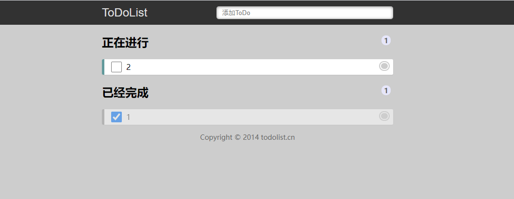
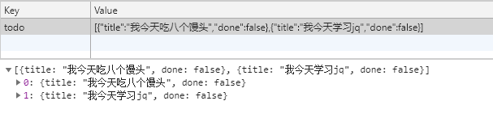
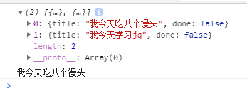

[TOC]

### 1、案例介绍
1. 文本框里面输入内容，按下回车，就可以生成待办事项。
2. 点击待办事项复选框，就可以把当前数据添加到已完成事项里面。
3. 点击已完成事项复选框，就可以把当前数据添加到待办事项里面。
4. 点击右侧小圆圈可以删除事项
5. 但是本页面内容刷新页面不会丢失



### 2、分析
1. 刷新页面不会丢失数据，因此需要用到本地存储`localStorage`
2. 不管按下回车，还是点击复选框，都是把本地存储的数据加载到页面中，这样保证刷新关闭页面不会丢失数据
3. 存储的数据格式：`var todolist =  [{ title : ‘xxx’, done: false}]`
4. 注意点1： 本地存储`localStorage`里面只能存储字符串格式 ，因此需要把对象转换为字符串 `JSON.stringify(data)`
5. 注意点2： 获取本地存储数据，需要把里面的字符串转换为对象格式`JSON.parse()`我们才能使用里面的数据

**示例**
```js
<!DOCTYPE html>
<html lang="en">

<head>
    <meta charset="UTF-8">
    <meta name="viewport" content="width=device-width, initial-scale=1.0">
    <meta http-equiv="X-UA-Compatible" content="ie=edge">
    <title>Document</title>
    <script src="js/jquery.min.js"></script>
</head>

<body>
    <script>
        var todolist = [{
            title: '我今天吃八个馒头',
            done: false
        }, {
            title: '我今天学习jq',
            done: false
        },];
        // 本地存储里面只能存储字符串的数据格式 把我们的数组对象转换为字符串格式 JSON.stringify()
        localStorage.setItem("todo", JSON.stringify(todolist));
        var data = localStorage.getItem("todo");
        // 获取本地存储的数据 我们需要把里面的字符串数据转换为 对象格式 JSON.parse()
        data = JSON.parse(data);
        console.log(data);
        console.log(data[0].title);
    </script>
</body>

</html>
```





### 3、按下回车把新数据添加到本地存储里面
1.页面中的数据，都要从本地存储里面获取，这样刷新页面不会丢失数据，所以先要把数据保存到本地存储里面。
2.利用`事件对象.keyCode`判断用户按下回车键（13）。
3.声明一个数组，保存数据。
4.先要读取本地存储原来的数据（声明函数`getData()`），放到这个数组里面。
5.之后把最新从表单获取过来的数据，追加到数组里面。
6.最后把数组存储给本地存储 (声明函数`savaDate()`)

### 4、本地存储数据渲染加载到页面
1.因为后面也会经常渲染加载操作，所以声明一个函数`load`，方便后面调用
2.先要读取本地存储数据（数据不要忘记转换为对象格式）
3.之后遍历这个数据（`$.each()`），有几条数据，就生成几个`li`添加到`ol`里面。
4.每次渲染之前，先把原先里面`ol`的内容清空，然后渲染加载最新的数据。

### 5、删除操作
1.点击里面的`a`链接，不是删除的`li`，而是删除本地存储对应的数据。
2.先获取本地存储数据，删除对应的数据，保存给本地存储，重新渲染列表`li`
3.我们可以给链接自定义属性记录当前的索引号
4.根据这个索引号删除相关的数据----数组的`splice(i, 1)`方法
5.存储修改后的数据，然后存储给本地存储
6.重新渲染加载数据列表
7.因为`a`是动态创建的，我们使用`on`方法绑定事件

### 6、正在进行和已完成选项操作
1.当我们点击了小的复选框，修改本地存储数据，再重新渲染数据列表。
2.点击之后，获取本地存储数据。
3.修改对应数据属性`done`为当前复选框的`checked`状态。
4.之后保存数据到本地存储
5.重新渲染加载数据列表
6.`load`加载函数里面，新增一个条件，如果当前数据的`done`为`true`就是已经完成的，就把列表渲染加载到`ul`里面
7.如果当前数据的`done`为`false`， 则是待办事项，就把列表渲染加载到`ol`里面

### 7、统计正在进行个数和已经完成个数
1.在我们`load`函数里面操作
2.声明2个变量：`todoCount` 待办个数  `doneCount` 已完成个数   
3.当进行遍历本地存储数据的时候， 如果数据`done`为`false`， 则`todoCount++`, 否则`doneCount++`
4.最后修改相应的元素`text()`