### 1. 微信小程序介绍
微信小程序,简称⼩程序，英⽂名 Mini Program，是⼀种不需要下载安装即可使⽤的应⽤，它实现了应⽤“触⼿可及”的梦想，用户扫⼀扫或搜⼀下即可打开应⽤。

#### 1.1 为什么是微信小程序
1. 微信有海量用户，⽽且粘性很⾼，在微信里开发产品更容易触达⽤⼾；
2. 推⼴app或公众号的成本太⾼。
3. 开发适配成本低。
4. 容易⼩规模试错，然后快速迭代。
5. 跨平台。

#### 1.2 微信小程序历史
- 2016年1月11日，微信之父张小龙时隔多年的公开亮相，解读了微信的四大价值观。张小龙指出，越来越多产品通过公众号来做，因为这里开发、获取用户和传播成本更低。拆分出来的服务号并没有提供更好的服务，所以微信内部正在研究新的形态，叫「微信小程序」需要注意的是，之前是叫做应用号
- 2016年9月21日，微信小程序正式开启内测。在微信生态下，触手可及、用完即走的微信小程序引起广泛关注。腾讯云正式上线微信小程序解决方案，提供小程序在云端服务器的技术方案。
- 2017年1月9日，微信推出的“小程序”正式上线。“小程序”是一种无需安装，即可使用的手机“应用”。不需要像往常一样下载App，用户在微信中“用完即走”。

#### 1.3 疯狂的微信小程序
1. 微信月活已经达到10.82亿。其中55岁以上的用户也达到6300万
2. 信息传达数达到450亿,较去年增长18%;视频通话4.1亿次,增长100%
3. 小程序覆盖超过200+行业，交易额增长超过6倍，服务1000亿+人次,创造出了5000亿+的商业价值。

#### 1.4 其它的小程序
1. 支付宝小程序
2. 百度小程序
3. QQ小程序
4. 今日头条+抖音小程序

#### 1.5 官方微信小程序体验


### 2. 环境准备
开发微信⼩程序之前，必须要准备好相应的环境

#### 2.1 注册帐号
> 要使用未被微信公众平台注册，未被微信开放平台注册，未被个人微信号绑定的邮箱

- 注册页面：[https://mp.weixin.qq.com/wxopen/waregister?action=step1](https://mp.weixin.qq.com/wxopen/waregister?action=step1)
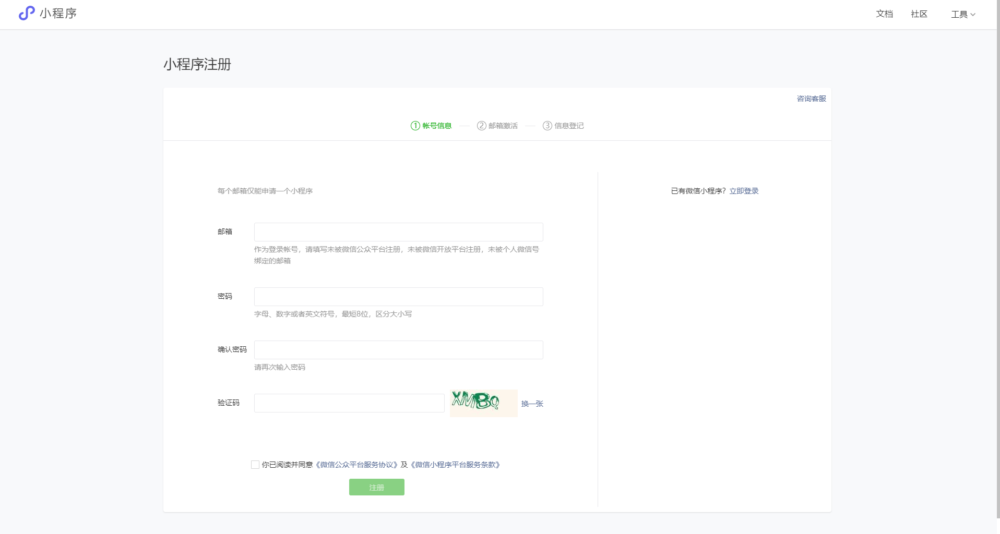

- 填写完邮箱密码后，进行邮箱激活
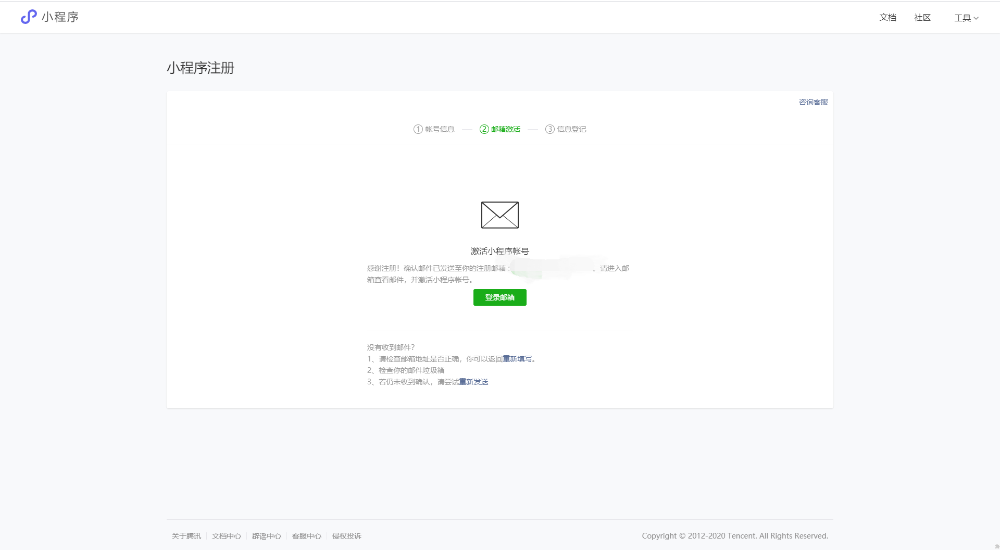

- 按提示激活邮箱后，进行信息登记
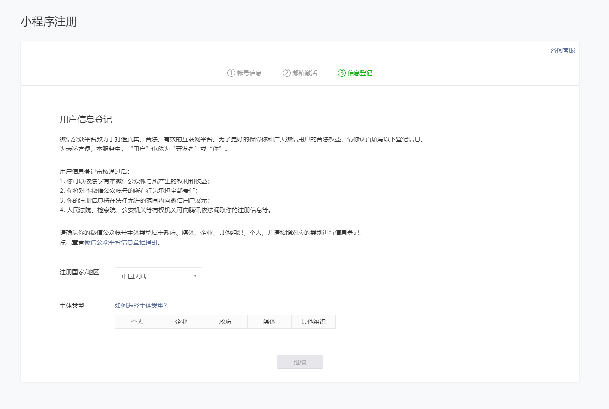

- 根据要求进行信息登记，然后就注册完成啦
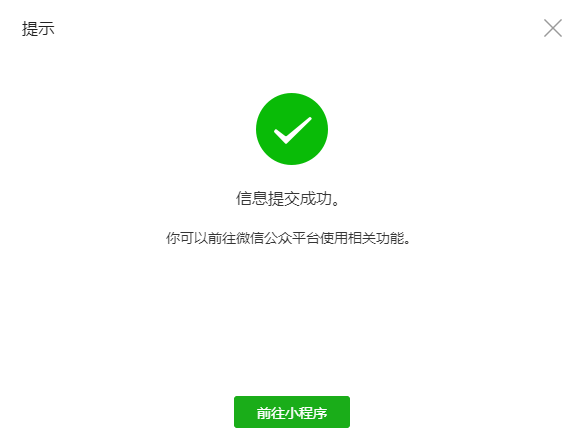

#### 2.2 获取APPID
- 由于后期调用微信小程序的接口等功能，需要索取开发者的小程序中的APPID，所以在注册成功后,可登录，然后获取APPID。
- [登录](https://mp.weixin.qq.com/)，成功后可看到如下界面
- 然后复制你的APPID（悄悄的保存起来,不要给别人看到）

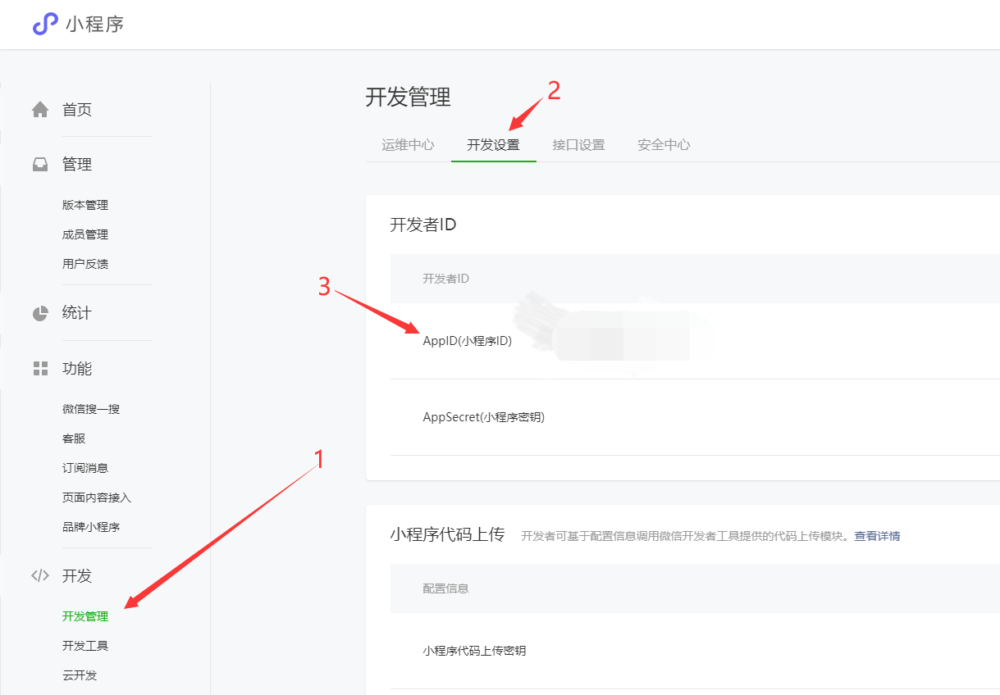

#### 2.3 开发工具
下载地址：[https://developers.weixin.qq.com/miniprogram/dev/devtools/download.html](https://developers.weixin.qq.com/miniprogram/dev/devtools/download.html)

> 我下载的是：开发版 Nightly Build (1.05.2012242)

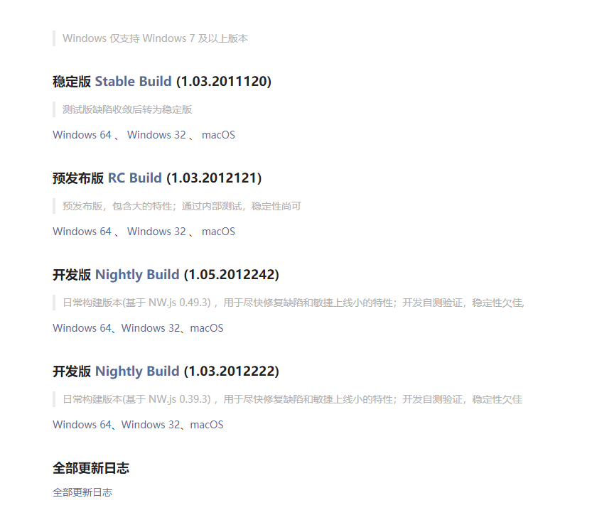

- 微信小程序自带开发者工具，集开发预览调试发布于一身的完整环境。
- 但是由于编码的体验不算好，因此建议使用`vsCode`+`微信小程序编辑工具`来实现编码`vsCode`负责敲代码，`微信小程序编辑工具`负责预览


### 3. 第一个微信小程序
#### 3.1 打开微信开发者小程序
> 第一次登录需要扫码登陆


<br/>
登陆成功~
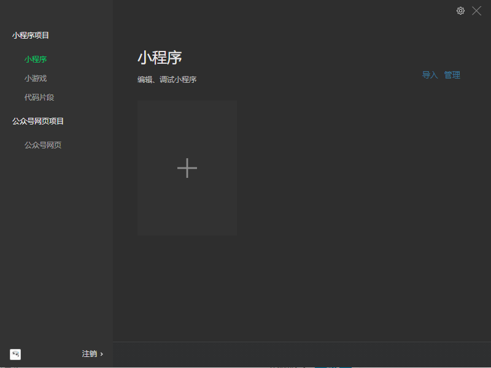

#### 3.2 新建小程序项目
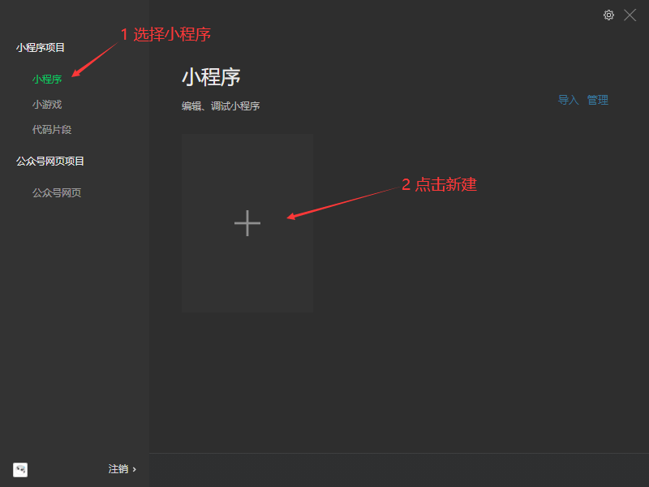

#### 3.3 填写项目信息
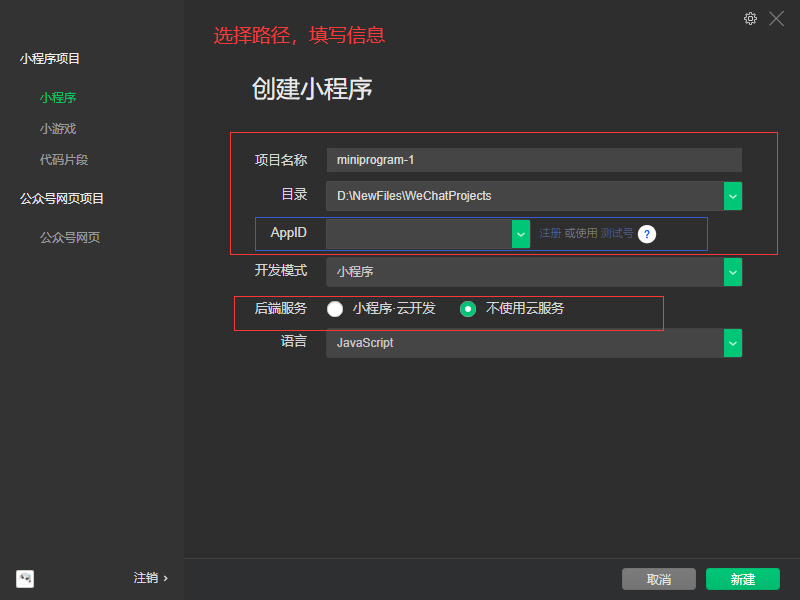

#### 3.4 成功
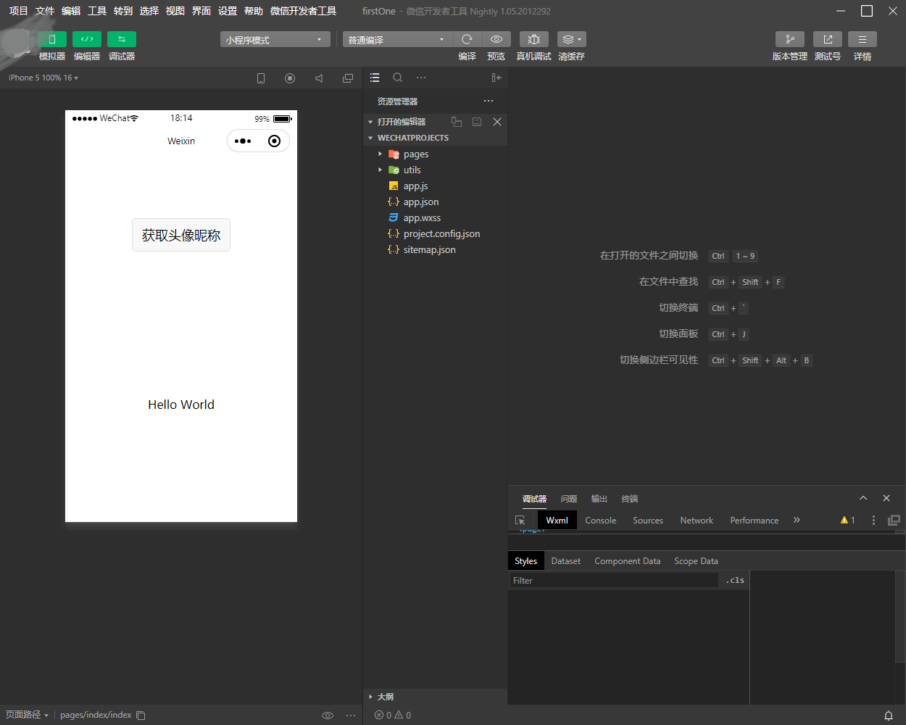

#### 3.5 介绍
> 详情的使用，可以查看官网：[https://developers.weixin.qq.com/miniprogram/dev/devtools/devtools.html](https://developers.weixin.qq.com/miniprogram/dev/devtools/devtools.html)

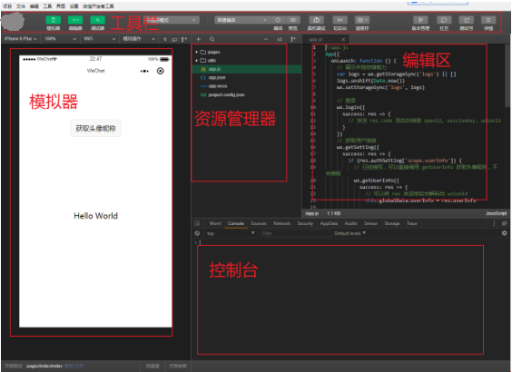


#### 3.6 上传
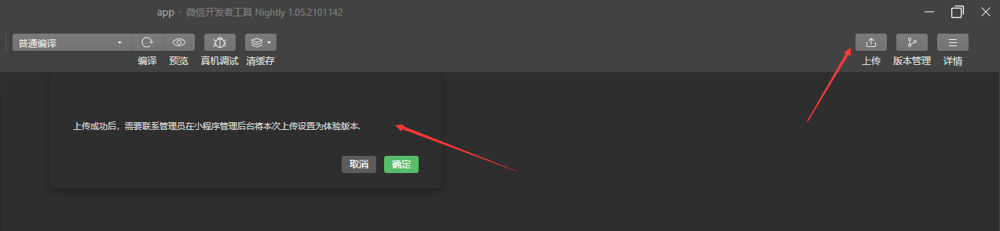
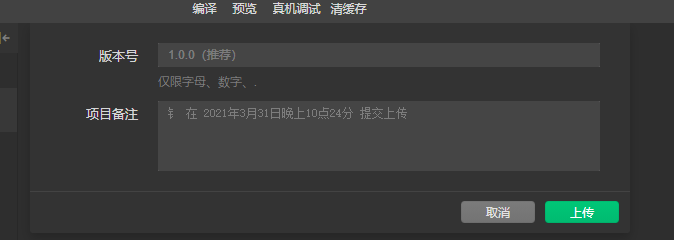
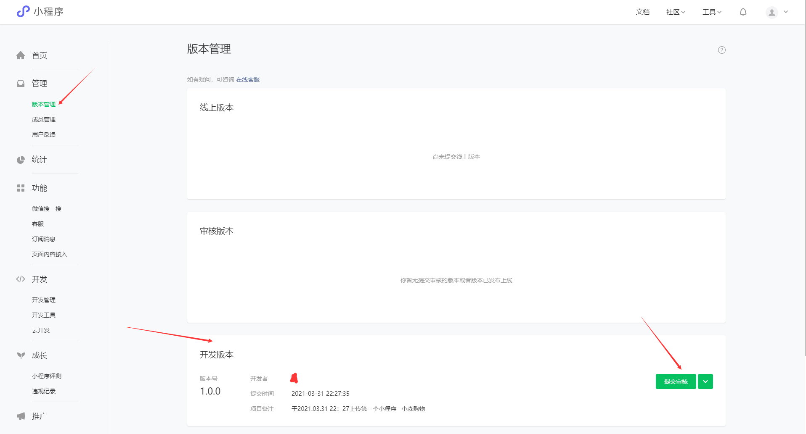
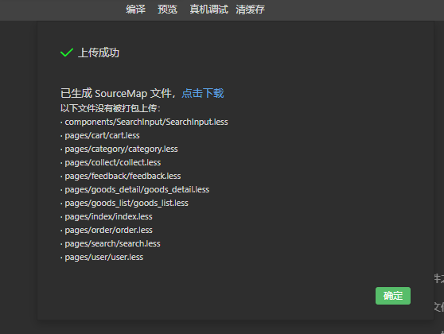


### 4. 小程序结构目录
[小程序框架](https://developers.weixin.qq.com/miniprogram/dev/framework/MINA.html)的目标是通过尽可能简单、高效的方式让开发者可以在微信中开发具有原生APP体验的服务。<br/>
小程序框架提供了自己的视图层描述语言`WXML`和`WXSS`，以及`JavaScript`，并在视图层与逻辑层间提供了数据传输和事件系统,让开发者能够专注于数据与逻辑。

#### 4.1 小程序文件结构和传统web对比
| 结构 | 传统web | 微信小程序
|--|--|--|
结构 | HTML | WXML |
样式 | CSS | WXSS |
逻辑 | JavaScript | JavaScript |
配置 | 无 | JSON |

> 通过以上对比得出，传统web是三层结构。而微信小程序是四层结构，多了一层配置.json

#### 4.2 基本的项目目录
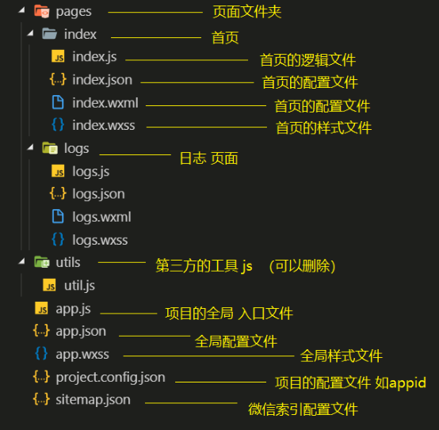


### 5. 小程序配置文件
> 一个小程序应用程序会包括最基本的两种配置文件。一种是全局的`app.json`和页面自己的`page.json`
> 注意:配置文件中不能出现注释

#### 5.1 [全局配置`app.json`](https://developers.weixin.qq.com/miniprogram/dev/framework/config.html)
`app.json`是当前小程序的全局配置，包括了小程序的所有页面路径、界面表现、网络超时时间、底部tab等。

- 普通快速启动项目里面的`app.json`配置
```json
{
  "pages":[
    "pages/index/index",
    "pages/logs/logs"
  ],
  "window":{
    "backgroundTextStyle":"light",
    "navigationBarBackgroundColor": "#fff",
    "navigationBarTitleText": "Weixin",
    "navigationBarTextStyle":"black"
  },
  "style": "v2",
  "sitemapLocation": "sitemap.json"
}
```

- 字段的含义
1. `pages`字段：用于描述当前小程序所有页面路径，这是为了让微信客户端知道当前你的小程序页面定义在哪个目录。
2. `window`字段：定义小程序所有页面的顶部背景颜色，文字颜色定义等。
3.完整的配置信息请参考[`app.json`配置](https://developers.weixin.qq.com/miniprogram/dev/reference/configuration/app.html)

##### 5.1.1 `tabbar`
[tabbar](https://developers.weixin.qq.com/miniprogram/dev/reference/configuration/app.html)
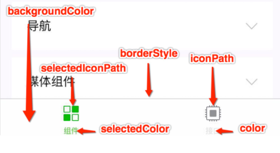

#### 5.2 [页面配置`page.json`](https://developers.weixin.qq.com/miniprogram/dev/reference/configuration/page.html)
- 这里的`page.json`其实用来表示页面目录下的`page.json`这类和小程序页面相关的配置。开发者可以独立定义每个页面的一些属性，如顶部颜色、是否允许下拉刷新等等。
- 页面的配置只能设置`app.json`中部分`window`配置项的内容，页面中配置项会覆盖`app. json`的`window`中相同的配置项。

|属性|类型|默认值|描述|
|--|--|--|--|
| navigationBarBackgroundColor | HexColor | #000000 | 导航栏背景颜色 |
| navigationBarTextStyle | String | white |导航栏标题颜色，仅支持`black`、`white` |
| navigationBarTitleText | String | | 导航栏标题文字内容 |
| backgroundColor | HexColor | #ffffff | 窗口的背景色 |
| backgroundTextStyle | String | dark | 下拉loading的样式，仅支持`dark`、`light` |
| enablePullDownRefresh | Boolean | false | 是否全局开启下拉刷新，详见[Page.onPullDownRefresh](https://developers.weixin.qq.com/miniprogram/dev/framework/app-service/page.html#onpulldownrefresh) |
| onReachBottomDistance | Number | 50 | 页面上拉触底事件触发时距页面底部距离，单位为px，详见[Page.onReachBottom](https://developers.weixin.qq.com/miniprogram/dev/framework/app-service/page.html#onreachbottom) |
| disableScroll | Boolean | false | 设置为`true`则页面整体不能上下滚动；只在页面配置中有效，无法在`app.json`中设置该项 |

#### 5.3 [sitemap配置-了解](https://developers.weixin.qq.com/miniprogram/dev/reference/configuration/sitemap.html)
小程序根目录下的`sitemap.json`文件用于配置小程序及其页面是否允许被微信索引。

```json
// app.json
{
  "pages":[
    "pages/index/index",
    "pages/img/img",
    "pages/mine/mine",
    "pages/logs/logs"
  ],
  "window":{
    "backgroundTextStyle":"dark",
    "navigationBarBackgroundColor": "#00ffff",
    "navigationBarTitleText": "我的应用",
    "navigationBarTextStyle":"black",
    "enablePullDownRefresh":true,
    "backgroundColor": "#eee"
  },
  "tabBar": {
    "list": [{
      "pagePath": "pages/index/index",
      "text":"首页",
      "iconPath": ""
    },
    {
      "pagePath": "pages/img/img",
      "text":"图片",
      "iconPath": ""
    },
    {
      "pagePath": "pages/mine/mine",
      "text":"我的",
      "iconPath": ""
    }],
    "position": "top"
  },
  "style": "v2",
  "sitemapLocation": "sitemap.json"
}
```

### 6. 模板语法
> WXML (WeiXin Markup Language)是框架设计的一套标签语言，结合基础组件、事件系统，可以构建出页面的结构。

#### 6.1 数据绑定
> text相当于web中的span标签，行内元素，不会换行
> view相当于web中的div标签，块级元素，会换行

```wxml
<text>1</text>
<view>2</view>
```

##### 6.1.1 普通写法
```wxml
  <!-- 写在wxml文件内 -->
  <view> {{ message }} </view>
```

```js
  // 写在js文件内
  Page({
    data: {
      message: 'Hello WeChat!'
    }
  })
```

示例
```wxml
  <!-- 字符串 -->
  <view> {{msg}}</view>
  <!-- 数字类型 -->
  <view> {{num}}</view>
  <!-- bool类型 -->
  <view> 学废了吗?{{yORn}} </view>
  <!-- object类型 -->
  <view> {{person.name}} </view>
  <view> {{person.age}} </view>
  <view> {{person.weight}} </view>
  <view> {{person.height}} </view>
```

```js
  data: {
    msg: 'Hello WeChat',
    num: 100,
    yORn: true,
    person: {
      name: 'LiLy',
      age: 12,
      weight: 85,
      height: 165
    }
  }
```

##### 6.1.2 组件属性
```wxml
  <view id="{{id}}"> </view>
```

```js
  Page({
    data: {
      id: 0
    }
  })
```

##### 6.1.3 bool类型
使用bool类型充当属性checked
> 不要直接写`checked="false"`，其计算结果是一个字符串：`<checkbox checked="false"> </checked>`

```wxml
  <view>
  <!-- 字符串和花括号之间不要存在空格，会导致识别失败：<checkbox checked="   {{isChecked}}"> </checkbox> -->
    <checkbox checked="{{isChecked}}"> </checkbox>
  </view>
```

```js
  Page({
    data: {
      isChecked: false
    }
  })
```

#### 6.2 运算
##### 6.2.1 三元运算
```wxml
  <view hidden="{{flag > true : false}}"> Hidden </view>
```

##### 6.2.2 算数运算
```wxml
  <view> {{a + b}} + {{c}} </view>
```

```js
  Page({
    data: {
      a: 1,
      b: 2,
      c: 3
    }
  })
```

##### 6.2.3 逻辑判断
```wxml
  <view wx:if="{{length > 5}}> </view>
```

##### 6.2.4 字符串运算
```wxml
  <view>{{"hello, " + name}}</view>
```

```js
  Page({
    data:{
      name: 'Lily'
    }
  })
```

##### 6.2.5 注意
花括号和引号之间如果有空格，将最终被解析成为字符串

#### 6.3 渲染
##### 6.3.1 wx:for
###### 6.3.1.1 列表循环
> `wx:for="{{数组或对象}}" wx:for-item="循环项的名称" wx:for-index="循环项的索引"`
- 项的变量名默认为 `item` `wx:for-item`可以指定数组当前元素的变量名
- 下表的变量名默认为`index` `wx:for-index`可以指定数组当前下标的变量名
- `wx:key="唯一的值"`用来提高数组渲染的性能
- `wx:key`绑定的值有如下选择：
1. `string`类型，表示循环项中的唯一属性，如：
```wxml
  list:[{id:0, name:"炒饭"},{id:1,name:"炒面}]
  wx:key="id"
```

2. 保留字`*this`,它的意思是`item`本身，`*this`代表的必须是唯一的字符串和数组，保证每个项的唯一性
```wxml
  list:[1,2,3,4,5]
  wx:key="*this"
```

3. 当出现数组的嵌套循环的时候，要注意以下绑定的名称不要重名
  `wx:for-item="item" wx:for-index="index"`

4. 默认情况下不写`wx:for-item="item" wx:for-index="index"`。小程序也会把循环项的名称和索引的名称叫做`item`和`index`，只有一层循环的话，`wx:for-item="item" wx:for-index="index"`可以省略

示例
```wxml
  <view wx:for="{{array}}" wx:key="id">
      {{index}}: {{item.message}}
  </view>
```
```js
  Page({
    data: {
      array: [{
        id:0,
        message:'foo'
      }, {
        id: 1,
        message: 'bar'
      }]
    }
  })
```

###### 6.3.1.1 对象循环
> `wx:for="{{对象}}" wx:for-item="对象的值" wx:for-index="对象的属性"`
- 循环对象的时候，最好把`item`和`index`的名称改一下
  `wx:for-item="value" wx:for-index="key"`

```wxml
  <view wx:for="{{person}}" wx:for-item="value" wx:for-index="key" wx:key="age">
    属性：{{key}} -- 值：{{value}}
  </view>
```

```js
  Page({
    data: {
      person: {
        name: 'LiLy',
        age: 1,
        weight: 85,
        height: 165
      }
    }
  })
```

##### 6.3.2 block
> 占位符标签
> 页面渲染：渲染一个包含多节点的结构块，block最终不会变成真正的dom元素
```wxml
  <block wx:for="{{[1,2,3]}}" wx:key="*this" >
    <view> {{index}}: </view>
    <view> {{item}} </view>
  </block>
```

#### 6.4 条件渲染
##### 6.4.1 wx:if
在框架中，使用`wx:if="{{true/false}}"`来判断是否需要渲染该代码块：
```wxml
  <view wx:if="{{true}}">显示</view>
  <view wx:if="{{false}}">隐藏</view>
  <view wx:if="{{false}}">1</view>
  <view wx:if="{{true}}">2</view>
  <view wx:else>3</view>
  <view wx:if="{{false}}">4</view>
  <view wx:if="{{false}}">5</view>
  <view wx:else>6</view>
```
输出：显示 2 6

##### 6.4.2 hidden
1. 在标签内直接加属性hidden
2. `hidden="{{true/false}}"`，true表示hidden开启，隐藏；false表示hidden关闭，显示
```wxml
  <view hidden="{{true}}"> True </view>
```

> `hidden`类似`wx:if`
> 频繁切换用`hidden`，通过添加样式的方式来切换显示
> 不常使用用`wx:if`，直接把标签从页面结构给移除掉

- `hidden`注意不要和样式`display`一起使用
```wxml
  <view hidden style="display: flex;"> 显示隐藏 </view>
  <!-- 结果是显示出来，因为行内样式优先级高，将hidden覆盖掉了 -->
```