### 7.小程序事件的绑定
> 小程序中绑定事件，通过bind关键字来实现。如`bindtap`、`bindinput`、`bindchange`等
> 不同的组件支持不同的事件，具体看组件的说明即可

#### 7.1 `bindinput`
```wxml
  <input bindinput="handleInput">
```

#### 7.2 Page
```js
  Page({
    // 输入框的input事件的执行逻辑
    // 绑定的事件
    handleInput: function(e) {
      console.log(e);
      concole.log("1");
    }
  })
```

#### 7.3 特别注意
1. 绑定事件时不能带参数，不能带括号，以下为错误写法：
  `<input bindinput="handleInput(100)" />`

2. 事件传值：通过标签自定义属性的方式和value
  `<input bindinput="handleInput" data-item="100" />`

3. 事件触发时获取数据
```wxml
  <input bindinput="handleInput">
```

```js
  Page({
    handleInput: function(e) {
      // {item:100}
      console.log(e.currentTarget.dataset);
  
      // 获取输入框的值--通过事件源对象来获取
      console.log(e.detail.value);
    }
  })
```

4. 把输入框的值赋值到data中
> 不能直接`this.data.num=e.detail.value`或`this.num=e.detail.value`
> 应该
> this.setData({
>    num:e.detail.value
> })

```wxml
<!-- 此时num的值随着输入框中的值而改变 -->
  <input bindinput="handleInput">
  <view>{{num}}</view>
```

```js
  Page({
    data: {
      num: 10
    },
    handleInput: function(e) {
      this.setData({
        num: e.detail.value
      })
    }
  })
```

#### 7.4 点击事件`bindtap`
> 无法在小程序事件中直接传参
> 可以通过自定义属性的方式来传递参数，事件源中获取自定义属性

```wxml
  <input type="text" bindinput="handleInput" />
  <button bindtap="handleTap" data-operation="{{1}}">+</button>
  <button bindtap="handleTap" data-operation="{{-1}}">-</button>
  <view>{{num}}</view>
```

```js
  Page({
    data: {
      num: 10
    },
    // 输入框的input事件的执行逻辑
    handleInput(e) {
      console.log("哈哈");
      console.log(e);
      console.log(e.detail.value);
      console.log(e.currentTarget.dataset);
      this.setData({
        num: e.detail.value
      })
    },
    // 加减按钮事件
    handleTap(e) {
      console.log(e);
      // 获取自定义属性operation
      console.log(e.currentTarget.dataset.operation);
      var operation = e.currentTarget.dataset.operation;
      this.setData({
        // 别忘了使用Number()
        num: Number(this.data.num) + Number(operation)
      })
    }
  })
```


### 8.[样式WXSS](https://developers.weixin.qq.com/miniprogram/dev/framework/view/wxss.html)
> WXSS(WeiXin Style Sheets)是一套样式语言，用于描述WXML的组件样式。
> 小程序中不需要主动引入样式文件

与CSS相比，WXSS扩展的特性有：
- 响应式长度单位`rpx`
- 样式导入

#### 8.1 尺寸单位
`rpx`(responsive pixel)：可以根据屏幕宽度进行自适应。规定屏幕宽为`750px`。如在iPhone6上，屏幕宽度为`375px`，共有750个物理像素，则`750rpx=375px=750物理像素`，`2rpx=1px=2物理像素`。

| 设备 | rpx换算px(屏幕宽度/750) | px换算rpx(750/屏幕宽度) |
|--|--|--|
| iPhone5 | 1rpx=0.42px | 1px=2.34rpx |
| iPhone6 | 1rpx=0.5px | 1px=2rpx |
| iPhone6 Plus | 1rpx=0.552px | 1px=1.81rpx |

> 建议：开发微信小程序时设计师可以用iPhone6作为视觉稿的标准。

使用步骤：
1. 确定设计稿宽度pageWidth
2. 计算比例`750rpx=pageWidth px`，因此`1px=750rpx/pageWidth`
3. 在less文件中，只要把设计稿中的`px`=>`750 rpx/pageWidt`即可

```wxml
<view class="box"> haha </view>
```

```wxss
.box {
  /* 使用iPhone6机型来测试 */
  /* width: 200rpx; */
  /* calc属性 css和wxss都支持 */
  width: calc(750rpx / 375 * 100);
  height: 200rpx;
  background-color: red;
}
```

#### 8.2 样式导入
> wxss中直接就支持样式导入功能，也可以和less中的导入混用。
> 使用`@import`语句可以导入外联样式，只支持相对路径

```wxml
<!-- demo.wxml -->
<view class="box"> haha </view>
```

```wxss
/** common.wxss **/
view {
  color: aqua;
}

/** demo.wxss **/
@import "../../utils/style/common.wxss";

.box {
  /* 使用iPhone6机型来测试 */
  /* width: 200rpx; */
  /* calc属性 css和wxss都支持 */
  width: calc(750rpx / 375 * 100);
  height: 200rpx;
  background-color: red;
}
```

#### 8.3 选择器
特别需要注意的是小程序不支持通配符`*`，因此以下代码无效！
```wxss
  * {
    margin: 0;
    padding: 0;
    box-sizing: border-box;
  }
```

目前支持的选择器有：
| 选择器 | 样例 | 样例描述 |
|--|--|--|
| .class | .intro | 选择所有拥有class="intro"的组件 |
| #id | #firstname | 选择拥有id="firstname"的组件 |
| element | view | 选择所有view组件 |
| element,element | view,checkbox | 选择所有文档的view组件和所有checkbox组件 |
| nth-child(n) | view:nth-child(n) | 选择某个索引的标签 |
| ::after | view::after | 在view组件后边插入内容 |
 ::before | view::before | 在view组件前边插入内容 |

#### 8.4 小程序中使用less
原生小程序不支持less，其他基于小程序的框架大体都支持，如`wepy`,`mpvue`,`taro`等。但是仅仅因为一个less功能，而去引入一个框架，肯定是不可取的，因此可以用以下方式来实现：
1. 编辑器是`vscode`
2. 安装插件 `easy less`
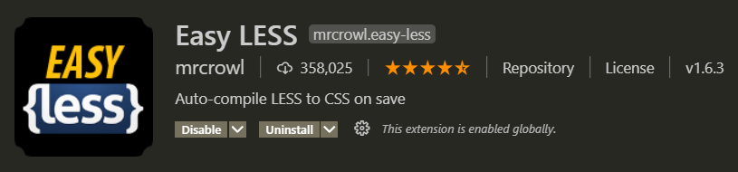

3. 在vscode的设置中加入如下配置：
```
  "less.compile": {
      "outExt": ".wxss"
  }
```

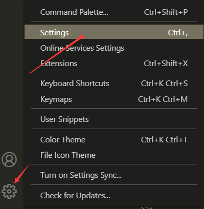
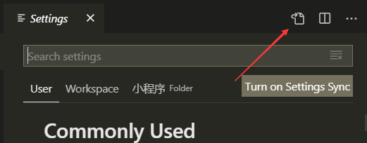
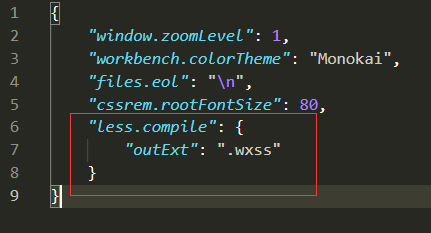

4. 在要编写样式的地方，新建less文件，如`index.less`，然后正常编辑即可。

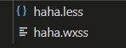
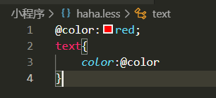
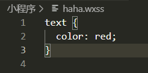

### 9.[常见组件](https://developers.weixin.qq.com/miniprogram/dev/component/)
#### 9.1 [view](https://developers.weixin.qq.com/miniprogram/dev/component/view.html)
> 代替原来的div标签

```wxml
  <view> ceshi </view>
```

#### 9.2 [text](https://developers.weixin.qq.com/miniprogram/dev/component/text.html)
1. 文本标签
2. 只能嵌套text
3. 长按文字可以复制（只有该标签有此功能）
4. 可以对空格、回车进行编码

| 属性名 | 类型 | 默认值 | 说明 |
|--|--|--|--|
| selectable | Boolean | false | 文本是否可选(已废弃) |
|user-select|	boolean|	false	|文本是否可选，该属性会使文本节点显示为`inline-block`	|
|space	|string	|	|显示连续空格|
| decode | Boolean | false | 是否解码 |

```wxml
  <text decode="{{false}}"> 普&nbsp;通 </text>
```

#### 9.3 [image](https://developers.weixin.qq.com/miniprogram/dev/component/image.html)
1. 图片标签，image组件默认宽度320px、高度240px
2. 支持懒加载(当图片出现在视口、上下三屏的高度之内时自己开始加载图片)

| 属性名 | 类型 | 默认值 | 说明 |
|--|--|--|--|
| src | String | | 图片资源地址 |
| mode | String | scaleToFill | 图片裁剪、缩放的模式 |
| lazy-load | Boolean | false | 图片懒加载 |

- mode有效值：
mode有13种模式，其中4种是缩放模式，9种是裁剪模式

| 模式 | 值 |说明 |
|--|--|--|
| 缩放 | scaleToFill | 不保持纵横比缩放图片，使图片的宽高完全拉伸填满image元素 |
| 缩放 | aspectFit | 保持纵横比缩放图片，使图片的长边能完全显示出来(轮播图常用) |
| 缩放 | aspectFill | 保持纵横比缩放图片，只保证图片的短边能完全显示出来(少用) |
| 缩放 | widthFix | 宽度不变，高度自动变化，保持原图宽高比不变 |
| 裁剪 | top | 不缩放图片，只显示图片的顶部区域 |
| 裁剪 | bottom | 不缩放图片，只显示图片的底部区域 |
| 裁剪 | center | 不缩放图片，只显示图片的中间区域 |
| 裁剪 | left | 不缩放图片，只显示图片的左边区域 |
| 裁剪 | right | 不缩放图片，只显示图片的右边区域 |
| 裁剪 | top left | 不缩放图片，只显示图片的左上边区域 |
| 裁剪 | top right | 不缩放图片，只显示图片的右上边区域 |
| 裁剪 | bottom left | 不缩放图片，只显示图片的左下边区域 |
| 裁剪 | bottom right | 不缩放图片，只显示图片的右下边区域 |

#### 9.4 [swiper](https://developers.weixin.qq.com/miniprogram/dev/component/swiper.html)
> 微信内置轮播图组件
> 默认宽度100%、高度150px
> swiper 轮播图外层容器
> swiper-item 每一个轮播项

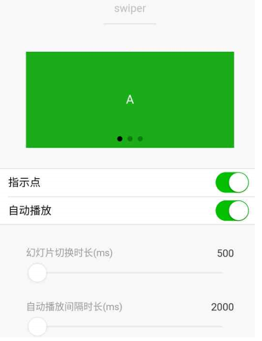

| 属性名 | 类型 | 默认值 | 说明 |
|--|--|--|--|
| indicator-dots | Boolean | false | 是否显示面板指示点 |
| indicator-color | Color | rgba(0,0,0,3) | 指示点颜色 |
| indicator-active-color | Color | #000000 | 当前选中的指示点颜色 |
| autoplay |Boolean | false | 是否自动切换|
| interval |Number|5000|自动切换时间|
|circular| Boolean|false|是否循环轮播|

由于swiper标签默认宽度100%、高度150px，而image默认宽度320px、高度240px，所以swiper盒子高度无法实现由内容撑开，解决方法如下：
1. 先找出来原图的宽度和高度
2. 等比例给swiper定宽度和高度
3. swiper宽度 / swiper高度 = 原图宽度 / 原图高度

```wxml
 <!-- lunbo.wxml -->
<swiper class="box" autoplay indicator-dots indicator-color="red" indicator-active-color="blue" circular="true" interval="2500">
    <swiper-item> <image mode="widthFix" src="//gw.alicdn.com/imgextra/i1/44/O1CN013zKZP11CCByG5bAeF_!!44-0-lubanu.jpg" /> </swiper-item>
    <swiper-item> <image mode="widthFix" src="//aecpm.alicdn.com/simba/img/TB1CWf9KpXXXXbuXpXXSutbFXXX.jpg_q50.jpg" /> </swiper-item>
    <swiper-item> <image mode="widthFix" src="//gw.alicdn.com/imgextra/i2/37/O1CN01syHZxs1C8zCFJj97b_!!37-0-lubanu.jpg" /> </swiper-item>
</swiper>
```
```wxss
/* pages/lunbo/lunbo.wxss */
swiper {
  width: 100%;
  /* height: calc(100vw * 352 /  1125); */
  height: 31.28vw;
}
swiper image {
  width: 100%;
}
```

#### 9.5 [navigator](https://developers.weixin.qq.com/miniprogram/dev/component/navigator.html)
> 导航组件，类似超链接标签

| 属性名 | 类型 | 默认值 |说明 |
|--|--|--|--|
|target | String |self |在哪个目标上发生跳转(当前的小程序还是其他小程序)，默认当前小程序，可选值`self/miniProgram`|
| url | String | | 当前小程序内的跳转链接 |
| open-type | String|navigate|跳转方式|

- open-type有效值：
|值|说明|
|--|--|
|navigate|默认值。保留当前页面，跳转到应用内的某个页面，但是不能跳到tabbar页面，跳转后左上角有返回箭头|
|redirect|关闭当前页面，跳转到应用内的某个页面，但是不能跳到tabbar页面|
|switchTab|跳转到tabBar页面，并关闭其他所有非tabBar页面|
|reLaunch|关闭所有页面，打开到应用内的某个页面|
|navigateBack|关闭当前页面，返回上一页面或多级页面。可通过[getCurrentPages()](https://developers.weixin.qq.com/miniprogram/dev/framework/app-service/route.html#getcurrentpages)获取当前的页面栈，决定需要返回几层|
|exit|退出小程序，`target="miniProgram"时生效|

```wxml
<!-- 相对路径：pages\lunbo\lunbo.wxml -->
<navigator url="/pages/lunbo/lunbo">轮播图页面</navigator>
<navigator url="/pages/lunbo/lunbo" open-type="redirect">轮播图页面(open-type="redirect")</navigator>
<!-- 如果无法跳转注意检查路径：
1. 路径复制过来后需要修改斜杠，"\" -> "/"，并将.wxml删掉
2. 如果仍无法跳转就检查一下是否为跳转到tabBar页面，如果是，就添加open-type="switchTab" -->

<navigator url="/pages/index/index" open-type="switchTab">首页</navigator>
```

#### 9.6 [rich-text](https://developers.weixin.qq.com/miniprogram/dev/component/rich-text.html)
> 富文本标签

可以将字符串解析成对应标签，类似vue中`v-html`功能

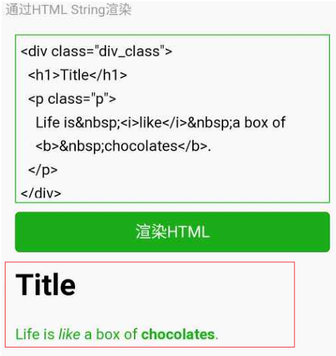

##### 9.6.1 nodes属性
> `nodes`属性支持标签字符串和对象数组

|属性|说明|类型|必填|备注|
|--|--|--|--|--|
|name|标签名|string|是|支持部分受信任的html节点|
|attrs|属性|object|否|支持部分受信任的属性，遵循Pascal命名法|
|children|子节点列表|array|否|结构和nodes一致|

**文本节点：type=text**
|属性|说明|类型|必填|备注|
|--|--|--|--|--|
|text|文本|string|是|支持entities|

- `nodes`不推荐使用`String`类型，性能会有所下降
- `rich-text`组件内屏蔽所有节点的事件
- `attrs`属性不支持`id`，支持`class`。
- `name`属性大小写不敏感。
- 如果使用了不受信任的`HTML`节点，该节点及其所有子节点将会被移除。
- `img`标签仅支持网络图片。

```wxml
<rich-text nodes="{{html}}"></rich-text>
<rich-text nodes="{{nodes}}"></rich-text>
```
```js
Page({
  data: {
    // F12，找到网页中需要copy的那部分代码，右键，copy，copy outerHtml
    // 标签字符串
    // html:'<div class="sc-bxivhb ALWfo"><div class="sc-ifAKCX iLINIY"><a class="sc-EHOje jXFKFG" href="https://www.tmall.com/wow/z/heybox/heyboxrax/heybox?utparam=%7B%22ranger_buckets_native%22%3A%22tsp2584_31920%22%7D&amp;spm=a2141.1.iconsv5.1&amp;scm=1007.home_icon.tmallxp.d&amp;wh_biz=tm&amp;disableNav=YES"><p class="sc-gzVnrw hKaypx">天猫新品</p></a><a class="sc-EHOje hrPgER" href="https://huodong.m.taobao.com/act/snipcode.html?utparam=%7B%22ranger_buckets_native%22%3A%22tsp2584_31920%22%7D&amp;spm=a2141.1.iconsv5.6&amp;scm=1007.home_icon.chongzzx.d&amp;_wml_code=Vfw8V4IdfflvFcsPv2fKDCLgFlhCoOQ406ZO9WKS70zNVh2FhuClrYZQHV%2BUj8rweMrPJgOrvqON3zeUHJMIALqc03AQZnf3hmtKmJM2g5PuR9UuzwivVDM%2Bil4nBDGBPXlfSqZZA3CdATGQpVOeZMO8SbyJvaZdoC89%2B2Gg8FZsD4wqDUKs7VcgTjZxbgdE&amp;subSource=stcz_1"><p class="sc-gzVnrw hKaypx">充值中心</p></a></div><div class="sc-ifAKCX iLINIY"><a class="sc-EHOje jXFKFG" href="https://huodong.m.taobao.com/act/snipcode.html?utparam=%7B%22ranger_buckets_native%22%3A%22tsp2584_31920%22%7D&amp;spm=a2141.1.iconsv5.2&amp;scm=1007.home_icon.juhs.d&amp;_wml_code=9XZq%2Bt%2FxdGk2vxtkbZvNtxIRr1Fl5o%2F4JYkxzjiABZCkN0X4ug9ejN%2FEA0XumFdlCJmui3oZzrfxu2OjRTO%2FUldTSbERTDFnNVuaq4bGXYarnsLycd1U6o4btoe8H%2FSSeBk5iibFKlpytcA4vdUvH%2BU%2BttvWBrsoV0Txewchwr8%3D"><p class="sc-gzVnrw hKaypx">今日爆款</p></a><a class="sc-EHOje hrPgER" href="https://h5.m.taobao.com/trip/home/index.html?utparam=%7B%22ranger_buckets_native%22%3A%22tsp2584_31920%22%7D&amp;spm=a2141.1.iconsv5.7&amp;scm=1007.home_icon.lvx.d&amp;_wx_tpl=http%3A%2F%2Fh5.m.taobao.com%2Fapp%2Ftriprxhome%2Fpages%2Fhome%2Findex.weex.js&amp;wx_navbar_hidden=true&amp;ttid=12mtb0000155"><p class="sc-gzVnrw hKaypx">机票酒店</p></a></div><div class="sc-ifAKCX iLINIY"><a class="sc-EHOje jXFKFG" href="https://pages.tmall.com/wow/z/import/tmg-rax-home/tmallimportHomewupr-index?utparam=%7B%22ranger_buckets_native%22%3A%22tsp2584_31920%22%7D&amp;spm=a2141.1.iconsv5.3&amp;scm=1007.home_icon.tmallgj.d&amp;wh_biz=tm&amp;wh_pid=tmg-rax-home%2FtmallimportHome&amp;disableNav=YES"><p class="sc-gzVnrw hKaypx">天猫国际</p></a><a class="sc-EHOje hrPgER" href="https://market.m.taobao.com/app/tmall-wireless/tjb-2018/index/index.html?utparam=%7B%22ranger_buckets_native%22%3A%22tsp2584_31920%22%7D&amp;spm=a2141.1.iconsv5.8&amp;scm=1007.home_icon.lingjb.d&amp;disableNav=YES#/tjb"><p class="sc-gzVnrw hKaypx">金币庄园</p></a></div><div class="sc-ifAKCX iLINIY"><a class="sc-EHOje jXFKFG" href="https://h5.ele.me/msite/taobaomsiterouter?utparam=%7B%22ranger_buckets_native%22%3A%22tsp2584_31920%22%7D&amp;spm=a2141.1.iconsv5.4&amp;scm=1007.home_icon.elm.d"><p class="sc-gzVnrw hKaypx">饿了么</p></a><a class="sc-EHOje hrPgER" href="https://market.m.taobao.com/app/pm/rax-tesla/pages/index-tao?utparam=%7B%22ranger_buckets_native%22%3A%22tsp2584_31920%22%7D&amp;spm=a2141.1.iconsv5.9&amp;scm=1007.home_icon.paim.d&amp;wh_weex=true&amp;wx_navbar_transparent=true&amp;data_prefetch=true&amp;wx_navbar_hidden=true"><p class="sc-gzVnrw hKaypx">阿里拍卖</p></a></div><div class="sc-ifAKCX iLINIY"><a class="sc-EHOje jXFKFG" href="https://chaoshi.m.tmall.com/?utparam=%7B%22ranger_buckets_native%22%3A%22tsp2584_31920%22%7D&amp;spm=a2141.1.iconsv5.5&amp;scm=1007.home_icon.tmallcs.d2&amp;_ig=shoutao"><p class="sc-gzVnrw hKaypx">天猫超市</p></a><a class="sc-EHOje hrPgER" href="https://huodong.m.taobao.com/act/snipcode.html?utparam=%7B%22ranger_buckets_native%22%3A%22tsp2584_31920%22%7D&amp;spm=a2141.1.iconsv5.10&amp;scm=1007.home_icon.taobch.d&amp;_wml_code=6WHamsDC%2B8ca9ElMubUiQjsRC0O2j4yGgKPCJIKXglo%3D"><p class="sc-gzVnrw hKaypx">淘宝吃货</p></a></div><div class="sc-ifAKCX iLINIY"><a class="sc-EHOje jXFKFG" href="https://market.m.taobao.com/app/tbsearchwireless-pages/new-catemap/p/s-nx-categories?utparam=%7B%22ranger_buckets_native%22%3A%22tsp2584_31920%22%7D&amp;spm=a2141.1.iconsv5.11&amp;scm=1007.home_icon.fenl.d&amp;wh_weex=true"><p class="sc-gzVnrw hKaypx">分类</p></a><a class="sc-EHOje hrPgER" href="https://huodong.m.taobao.com/act/snipcode.html?utparam=%7B%22ranger_buckets_native%22%3A%22tsp2584_31920%22%7D&amp;spm=a2141.1.iconsv5.12&amp;scm=1007.home_icon.xiany.d&amp;_wml_code=2RLfNbB12QpISV%2BL7aiHZwm5noZrOPbYmjwLhlOAmgeK3XKiEERT7ZdlL5lwWrfH8vrxje8x3wcjpFnTBn2bZuI6VIVmz1Ww1SxKMPNxdKnSxkM02klo1Wq1PvanB8MPDB7%2Fxfoi8vf2ert4z%2BOYjJBMsIILVspKvgSN8SN%2BsCg%3D"><p class="sc-gzVnrw hKaypx">闲鱼</p></a></div><div class="sc-ifAKCX iLINIY"><a class="sc-EHOje jXFKFG" href="https://huodong.m.taobao.com/act/snipcode.html?utparam=%7B%22ranger_buckets_native%22%3A%22tsp2584_31920%22%7D&amp;spm=a2141.1.iconsv5.13&amp;scm=1007.home_icon.tmallsx.d&amp;_wml_code=uxMdTqOeZt4IfBD8ssl15zR25nV9irif72OvYZHv66PlUxWwFw7AI3Y4j1t%2FGJXQYDZlDvAssH0HSvvBn2twyr3u7MVHWWGQZIVPwerViJM0j60YHvZMcG3JG1ZCBQswmg48wSD9%2BC%2FgFzZX0JcgQenoXJca%2B2FpGgRDcldUh%2F4mrO0cKrXo5rF%2Fsyo7cH7G"><p class="sc-gzVnrw hKaypx">天猫美食</p></a><a class="sc-EHOje hrPgER" href="https://pages.tmall.com/wow/a/act/tmall/dailygroup/18/wupr?utparam=%7B%22ranger_buckets_native%22%3A%22tsp2584_31920%22%7D&amp;spm=a2141.1.iconsv5.14&amp;scm=1007.home_icon.88vip.d&amp;wh_pid=daily-186355&amp;disableNav=YES"><p class="sc-gzVnrw hKaypx">会员中心</p></a></div><div class="sc-ifAKCX iLINIY"><a class="sc-EHOje jXFKFG" href="https://pages.tmall.com/wow/yao/20485/aljkmh?utparam=%7B%22ranger_buckets_native%22%3A%22tsp2584_31920%22%7D&amp;spm=a2141.1.iconsv5.15&amp;scm=1007.home_icon.alijk.d&amp;wh_biz=tm"><p class="sc-gzVnrw hKaypx">阿里健康</p></a><a class="sc-EHOje hrPgER" href="https://m.duanqu.com?utparam=%7B%22ranger_buckets_native%22%3A%22tsp2584_31920%22%7D&amp;spm=a2141.1.iconsv5.16&amp;scm=1007.home_icon.zdxh.d&amp;_ariver_appid=6158543"><p class="sc-gzVnrw hKaypx">造点新货</p></a></div><div class="sc-ifAKCX iLINIY"><a class="sc-EHOje jXFKFG" href="https://huodong.m.taobao.com/act/snipcode.html?utparam=%7B%22ranger_buckets_native%22%3A%22tsp2584_31920%22%7D&amp;spm=a2141.1.iconsv5.17&amp;scm=1007.home_icon.koubsh.d&amp;_wml_code=qeLJPHY5ySO3lef1quOfGhXh%2B8UW1yf1hl95h8wZUjlFlGFkyop3K4Hb%2B95myeqeJT4BYa03LO60S6xd8wO18LZ3%2FVvg2pTGoYLZvdSZu8bbze9cO%2FiQDU%2F6LiQkOXRW6f4DA%2FMN2L81ERi%2Bbsad%2Fk%2BxIGTGkv98p4M7sIG2SpI%3D"><p class="sc-gzVnrw hKaypx">口碑生活</p></a><a class="sc-EHOje hrPgER" href="https://m.duanqu.com?utparam=%7B%22ranger_buckets_native%22%3A%22tsp2584_31920%22%7D&amp;spm=a2141.1.iconsv5.18&amp;scm=1007.home_icon.tuhuo.d&amp;_ariver_appid=17570832"><p class="sc-gzVnrw hKaypx">土货鲜食</p></a></div></div>'
    // 对象数组
    html: [{
      // div标签 name属性来指定
      name: 'div',
      attrs: {
        // 标签上的属性class styles
        class: 'my_div',
        style: 'color: red;'
      },
      // 子节点 children 要接收的数据类型和nodes第二种渲染方式的数据类型一致
      children: [{
        name: "p",
        attrs:{},
        // 放文本
        children: [{
          type: "text",
          text: "hello"
        }]
      }]
    }],
    nodes: [{
      name: 'div',
      attrs: {
        class: 'div_class',
        style: 'line-height: 60px; color: red;'
      },
      children: [{
        type: 'text',
        text: 'Hello&nbsp;World!'
      }]
    }]
  },
  tap() {
    console.log('tap')
  },
```

#### 9.7 [button](https://developers.weixin.qq.com/miniprogram/dev/component/button.html)
##### 9.7.1 button的外观样式
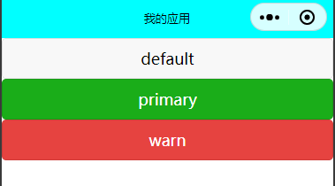
```wxml
<button
  type="default"
  size="mini"
  >mini按钮</button>
  
<button 
  type="default"
  size="{{defaultSize}}"
  loading="{{loading}}"
  plain="{{plain}}"
>default</button>

<button 
  type="primary"
  size="{{defaultSize}}"
  loading="{{loading}}"
  plain="{{plain}}"
>primary</button>

<button 
  type="warn"
  size="{{defaultSize}}"
  loading="{{loading}}"
>warn</button>

<button 
  type="warn"
  size="{{defaultSize}}"
  loading="{{loading}}"
  plain="{{true}}"
>镂空warn</button>
```

|属性|类型|默认值|必填|说明|
|--|--|--|--|--|
|size|string|default|否|按钮的大小|
|type|string|default|否|按钮的样式类型|
|plain|boolean|false|否|按钮是否镂空，背景色透明|
|disabled|boolean|false|否|是否禁用|
|loading|boolean|false|否|名称前是否带loading的图标|
|form-type|string| |否|用于` `` `组件，点击分别会触发` `` `组件的submit/reset事件|
|open-type|string| |否|微信开放能力|

- size的合法值

|值|说明|
|--|--|
|default|默认大小|
|mini|小尺寸|

- type的合法值

|值|说明|
|--|--|
|primary|绿色|
|default|白色|
|warn|红色|

- form-type的合法值

|值|说明|
|--|--|
|submit|提交表单|
|reset|重置表单|

##### 9.7.2 button的开放能力
- open-type的合法值

|值|说明|
|--|--|
|contact|打开客服会话，需要在微信小程序的后台配置，如果用户在会话中点击消息卡片后返回小程序，可以从bindcontact回调中获得具体信息，[具体说明：https://developers.weixin.qq.com/miniprogram/dev/framework/open-ability/customer-message/customer-message.html](https://developers.weixin.qq.com/miniprogram/dev/framework/open-ability/customer-message/customer-message.html)|
|share|触发用户转发，不能把小程序分享到朋友圈，使用前建议先阅读[使用指引:https://developers.weixin.qq.com/miniprogram/dev/framework/open-ability/share.html#%E4%BD%BF%E7%94%A8%E6%8C%87%E5%BC%95](https://developers.weixin.qq.com/miniprogram/dev/framework/open-ability/share.html#%E4%BD%BF%E7%94%A8%E6%8C%87%E5%BC%95)|
|getPhoneNumber|获取用户手机号，结合一个事件来使用，如果不是企业的小程序账号，就没有权限获取用户的手机号码，可以从bindgetphonenumber回调中获取到用户信息，[具体说明：https://developers.weixin.qq.com/miniprogram/dev/framework/open-ability/getPhoneNumber.html](https://developers.weixin.qq.com/miniprogram/dev/framework/open-ability/getPhoneNumber.html)|
|getUserInfo|获取用户信息，可以从bindgetuserinfo回调中获取到用户信息|
|launchApp|打开app，可以通过app-parameter属性设定向app传的参数，[具体说明:https://developers.weixin.qq.com/miniprogram/dev/framework/open-ability/launchApp.html](https://developers.weixin.qq.com/miniprogram/dev/framework/open-ability/launchApp.html)|
|openSetting|打开授权设置页|
|feedback|打开“意见反馈”页面，用户可提交反馈内容并上传[日志](https://developers.weixin.qq.com/miniprogram/dev/api/base/debug/wx.getLogManager.html)，开发者可以登录[小程序管理后台](https://mp.weixin.qq.com/)后进入左侧菜单“客服反馈”页面获取到反馈内容|

> getPhoneNumber 获取用户手机号，结合一个事件来使用，如果不是企业的小程序账号，就没有权限获取用户的手机号码，可以从bindgetphonenumber回调中获取到用户信息
> 绑定一个

- open-type的contact的实现流程
1. 将小程序的`appid`由测试号改为自己的`appid`
2. 登录[微信小程序官网](https://mp.weixin.qq.com/)，添加`客服-微信`

#### 9.8 [icon](https://developers.weixin.qq.com/miniprogram/dev/component/icon.html)
| 属性 | 类型 | 默认值 | 必填 |说明|
|--|--|--|--|--|
|type|string| | 是| icon的类型，有效值：success, success_no_circle, info, warn, waiting, cancel, download, search, clear|
|size|number/string|23|否|icon的大小|
|color|string| | 否|icon的颜色，同css的color|

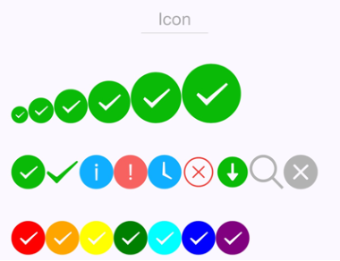

```js
  data: {
    iconSize: [20, 30, 40, 50, 60, 70],
    iconType: [
      'success', 'success_no_circle', 'info', 'warn', 'waiting', 'cancel', 'download', 'search', 'clear'
    ],
    iconColor: [
        'red', 'orange', 'yellow', 'green', 'rgb(0,255,255)', 'blue', 'purple'
      ]
  },
```

```wxml
<view class="group">
  <block wx:for="{{iconSize}}">
    <icon type="success" size="{{item}}"></icon>
  </block>
</view>

<view class="group">
  <block wx:for="{{iconType}}">
    <icon type="{{item}}" size="40"></icon>
  </block>
</view>

<view class="group">
  <block wx:for="{{iconColor}}">
    <icon type="success" size="40" color="{{item}}"></icon>
  </block>
</view>
```

#### 9.9 [radio](https://developers.weixin.qq.com/miniprogram/dev/component/radio.html)
> 可以通过color属性来修改颜色
> 需要搭配[radio-group](https://developers.weixin.qq.com/miniprogram/dev/component/radio-group.html)一起使用

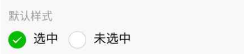

#### 9.10 [checkbox](https://developers.weixin.qq.com/miniprogram/dev/component/checkbox.html)
> 可以通过color属性来修改颜色
> 需要搭配[checkbox-group](https://developers.weixin.qq.com/miniprogram/dev/component/checkbox-group.html)

