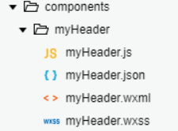

### 10.[自定义组件](https://developers.weixin.qq.com/miniprogram/dev/framework/custom-component/)
> 类似vue或react中的自定义组件
小程序允许我们使用自定义组件的方式来构建页面

#### 10.1 创建自定义组件
> 类似于页面，一个自定义组件由json、wxml、wxss、js 4个文件组成
可以在微信开发者工具中快速创建组件的文件结构


在文件夹内`components/myHeader`，创建组件名为`myHeader`



##### 10.1.1 声明组件
首先需要在组件的`json`文件中进行自定义组件声明

```json
{
// myHeader.json
  "component": true
}
```

##### 10.1.2 编辑组件
同时，还要在组件的`wxml`文件中编写组件模板，在`wxss`文件中加入组件样式
```wxml
<!-- myHeader.wxml -->
<view class="myHeader">
  <view class="myHeader_title">
    <view class="title_item">首页</view>
    <view class="title_item">原创</view>
    <view class="title_item">分类</view>
    <view class="title_item">关于</view>
  </view>
  <view class="myHeader_content">内容</view>
</view>
```

> 在组件wxss中不应使用id选择器、属性选择器、标签名选择器

```wxss
/* myHeader.wxss */
.myHeader{}
.myHeader_title{
  display: flex;
  padding: 10rpx;
}
.title_item{
  flex: 1;
  display: flex;
  justify-content: center;
  align-items: center;
}
.active{
  color: red;
  border-bottom: 10rpx solid currentColor;
}
.myHeader_content{}
```

#### 10.2 声明引用组件
在页面json文件中声明，提供对应的组件名和组件路径
```json
{
  "usingComponents": {
    "myHeader": "../../components/myHeader/myHeader"
  }
}
```

#### 10.3 在页面中使用自定义组件
```wxml
<myHeader></myHeader>
```

#### 10.4 示例
```wxml
<!-- myHeader.wxml -->
<view class="myHeader">
  <view class="myHeader_title">
    <!-- <view class="title_item active">首页</view>
    <view class="title_item">原创</view>
    <view class="title_item">分类</view>
    <view class="title_item">关于</view> -->

    <view
    wx:for="{{myHeader}}"
    wx:key="id"
    class="title_item {{item.isActive?'active':''}}"
    bindtap="handleItemTap"
    data-index="{{index}}"
    > {{item.name}} </view>

  </view>
  <view class="myHeader_content">内容</view>
</view>
```

```wxss
/* myHeader.wxss */
.myHeader{}
.myHeader_title{
  display: flex;
  padding: 10rpx;
}
.title_item{
  flex: 1;
  display: flex;
  justify-content: center;
  align-items: center;
}
.active{
  color: red;
  border-bottom: 10rpx solid currentColor;
}
.myHeader_content{}
```

```js
// myHeader.js
// components/myHeader/myHeader.js
Component({
  /**
   * 组件的属性列表
   */
  properties: {

  },

  /**
   * 组件的初始数据
   */
  data: {
    myHeader: [
      {
        id: 0,
        name: "首页",
        isActive: true
      },
      {
        id: 1,
        name: "原创",
        isActive: false
      },
      {
        id: 2,
        name: "分类",
        isActive: false
      },
      {
        id: 3,
        name: "关于",
        isActive: false
      }
    ]
  },

  /**
   * 1. 页面js文件中存放事件回调函数的时候，存放在data同层级下！！
   * 2. 组件js文件中存放事件回调函数的时候，存放在methods中！！
   */

  /**
   * 组件的方法列表
   * 
   */
  methods: {
    handleItemTap(e){
      /**
       * 1. 绑定点击事件，需要在methods中绑定
       * 2. 获取被点击的索引
       * 3. 获取原数组
       * 4. 对数组循环
       *   1. 给每一个循环性选中属性，改为false
       *   2. 给当前的索引的项添加激活选中效果
      */
      //  console.log("点击了");
      
      // 获取索引
      const {index} = e.currentTarget.dataset;
      // 获取data中的数组
      // 解构  对 复杂类型进行结构的时候 复制了一份 变量的引用而已
      // 最严谨的做法 重新拷贝一份 数组，再对这个数组的备份进行处理，
      // let myHeader=JSON.parse(JSON.stringify(this.data.myHeader));
      // 不要直接修改 this.data.数据 
      let {myHeader}=this.data;
      // let tabs=this.data;
      // 4 循环数组
      // [].forEach 遍历数组 遍历数组的时候 修改了 v ，也会导致源数组被修改
      myHeader.forEach((v,i)=>i===index?v.isActive=true:v.isActive=false);
  
      this.setData({
        myHeader
      })
    }
  }
})

```

#### 10.5 定义段与示例方法
Component 构造器可用于定义组件，调用Component构造器时可以指定组件的属性、数据、方法等。


#### 10.6 组件-自定义组件传参
1. 父组件通过属性的方式给子组件传递参数
2. 子组件通过事件的方式向父组件传递参数

##### 10.6.1 父传子
```wxml
<!-- 父组件 demo05.wxml -->
<!-- 
  父组件(页面)向子组件传递数据通过标签属性的方式来传递
    在子组件上进行接收
    把这个数据当成是data中的数据直接使用即可
 -->

<myHeader aa="123"></myHeader>
```

```js
// 子组件 myHeader.js
  /**
   * 存放从父组件中接收的数据
   */
  properties: {
    // 要接收的数据的名称
    aa: {
      // type要接收的数据的类型
      type: String,
      // value 默认值
      vaue: ""
    }
  },
```

```wxml
<!-- 子组件 myHeader.wxml -->
<view>
  {{aa}}
</view>
```

##### 10.6.1 过程
1. `父组件`把数据`{{tabs}}`传递到子组件的`tabItems`属性中
2. `父组件`监听`onMyTab`事件
3. `子组件`触发`bindmytap`中的`mytap`事件
4. 自定义组件触发事件时，需要使用`triggerEvent`方法，指定`事件名`、`detail`对象
5. 父->子动态传值`this.selectComponent("#tabs");`

#### 10.7 小结
- 标签名是中划线的方式
- 属性的方式也是要中划线的方式
- 其他情况可以使用驼峰命名
  - 组件的文件名如myHeader.js的等
  - 组件内的要接收的属性名如innerText
- [更多。。](https://developers.weixin.qq.com/miniprogram/dev/framework/custom-component/component.html)


### 11. 小程序生命周期
#### 11.1 [应用生命周期](https://developers.weixin.qq.com/miniprogram/dev/reference/api/App.html)


#### 11.2 [页面生命周期](https://developers.weixin.qq.com/miniprogram/dev/reference/api/Page.html)


#### 11.3 ⻚⾯⽣命周期图解


### <p style="color: red;">基础完结撒花~~</p>